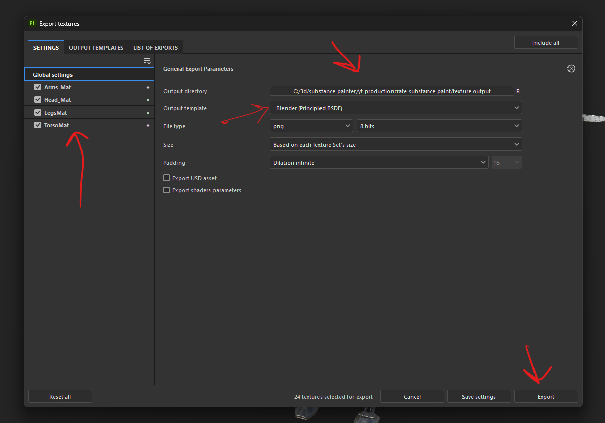

# Substance Painter

basically like a photo shop, where we put layers onto each other and mask it
 

- delete the layers to clear that paint

# Project

## Create

- 
    - select fbx file
    - select texture to 4k
    - if there are texture, select it using import baked maps
    - press okay

## remove paint

- delete the layer from `Layers`

## export

- file -> export textures
- 

# Viewport

- 
    - drag and expand the penel to see the all asset option instead of filter

# shortcuts

## viewport

- f1, f2, f3

## move, rotate, zoom

- rotate - alt + left click and move
- zoom - alt + right click and move
- move - ctrl + alt + left click and move

## adjust light

- shift + right click

## bake

- press b to cycle through maps
- press m for material map

# texture

- 
