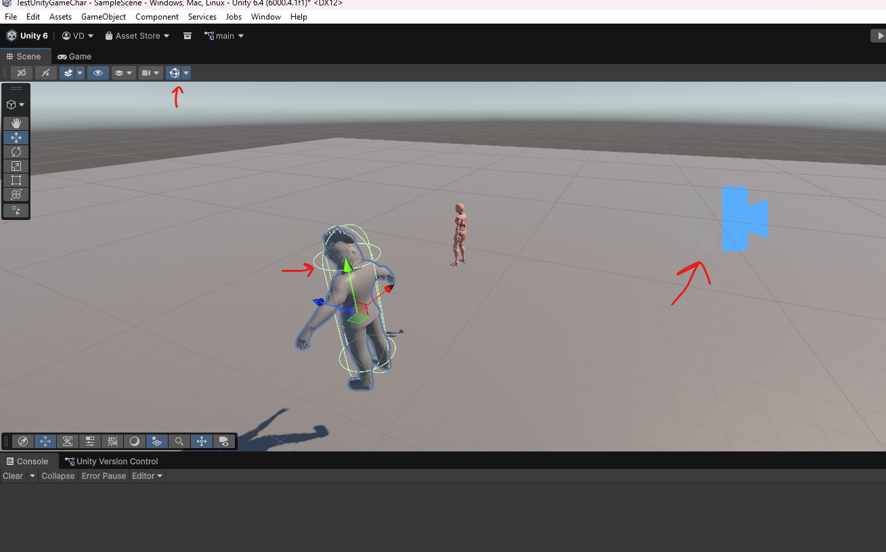

# **Unity**

# Packages

## Install Extra packages

- window -> Package mangement -> Package Manager
- unity registry -> search ex `CineMachine`
- 

# Viewport

- enable gizmos in the viewport to see all objects metadata
- 
