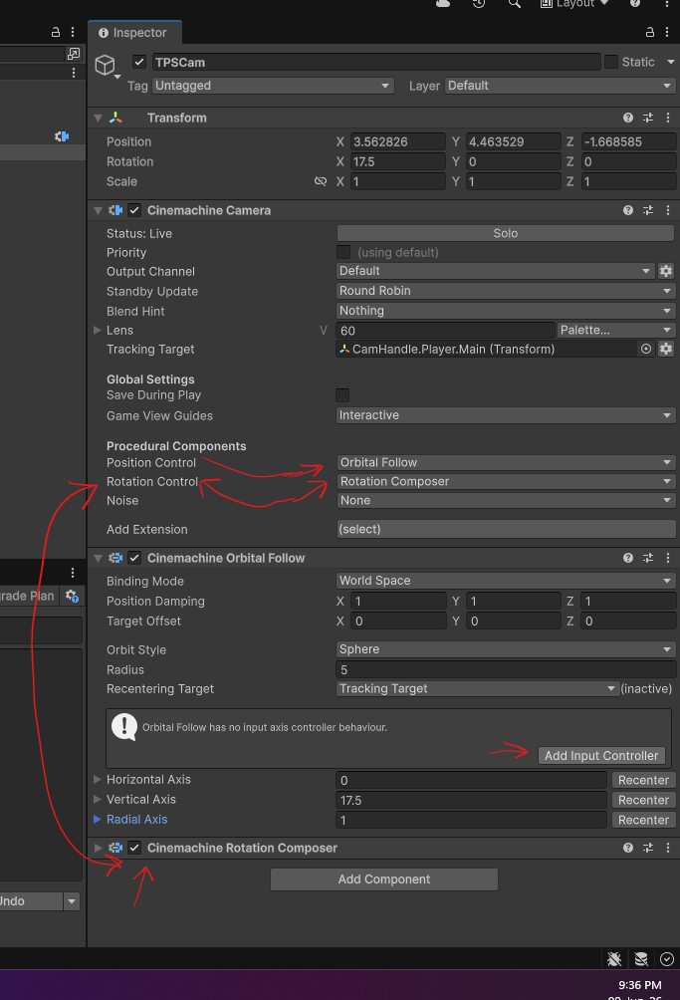
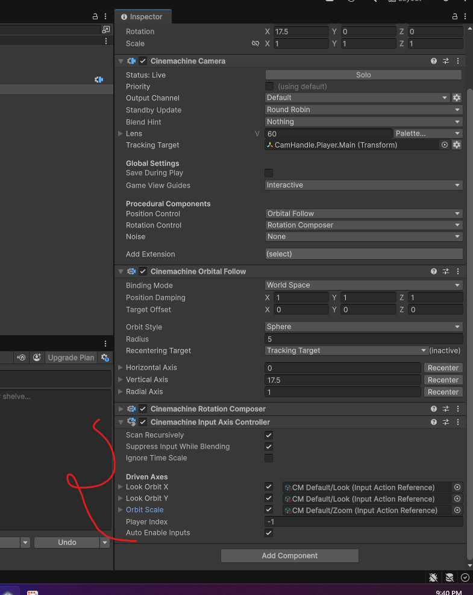

# **Player**

## import

- configure the avatar

## Character Controller

- select the Unity player object (top most object)
- in details panel -> add component -> character controller

### Add movement script

- add script as a component
- refer `./scripts/MovementScript.cs`

## add camera

### follow camera

- install cinemachine in the extentions
- in the viewport -> right click -> cinemachine -> cinemachine camera
  - this add the cinemachine brain to main camera
- select the cinemachine camera -> in the details panal
- 
    - Position Control - Orbital Follow
    - Rotation control - Rotation composer
    - click on "Add Input Controller"
- this add the rotation controller based on the mouse
- 

## Add Animation

### setup the baked animation from FBX file

- Rig Settings
  - select the rig as humanoid and copy from existing avatar
- under the animation tab
  - 
  - 
      - make sure the Transform Position (Y) is Based Upon - Feet

### Animation controller

- add or create animation controller under projects
- 
- add the animation clips from the imported
- add the controller as component to `unity's player 3d object`
- 

### Script animator

```cs
private Animator animator;

[RequireComponent(typeof(CharacterController))]
public class MovementScript : MonoBehaviour
{
    void Start()
    {
        // find animator if not assigned
        if (animator == null)
        {
            animator = GetComponent<Animator>();
            if (animator == null)
                Debug.LogWarning("No Animator found. Assign an Animator or add one as a child.");
        }
    }
}
```
