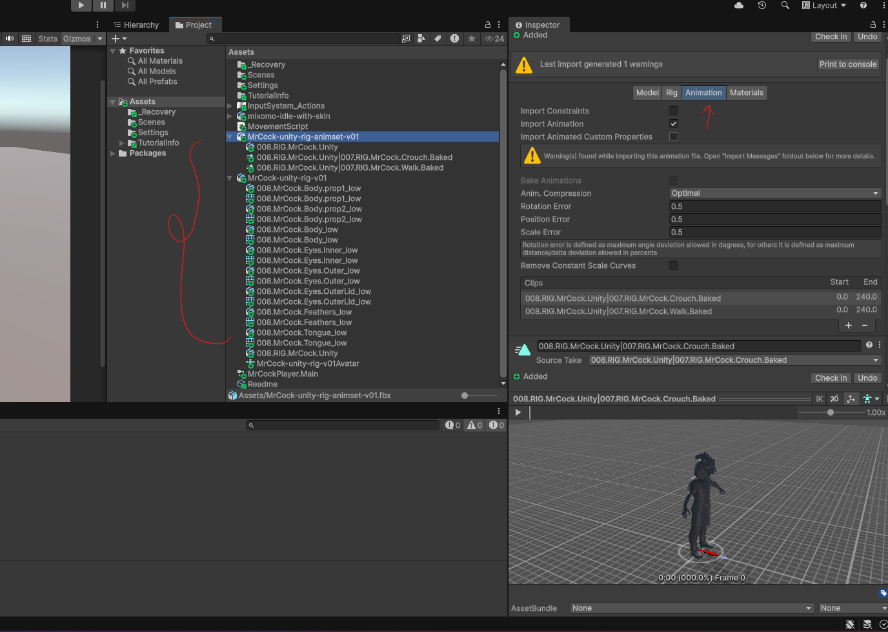
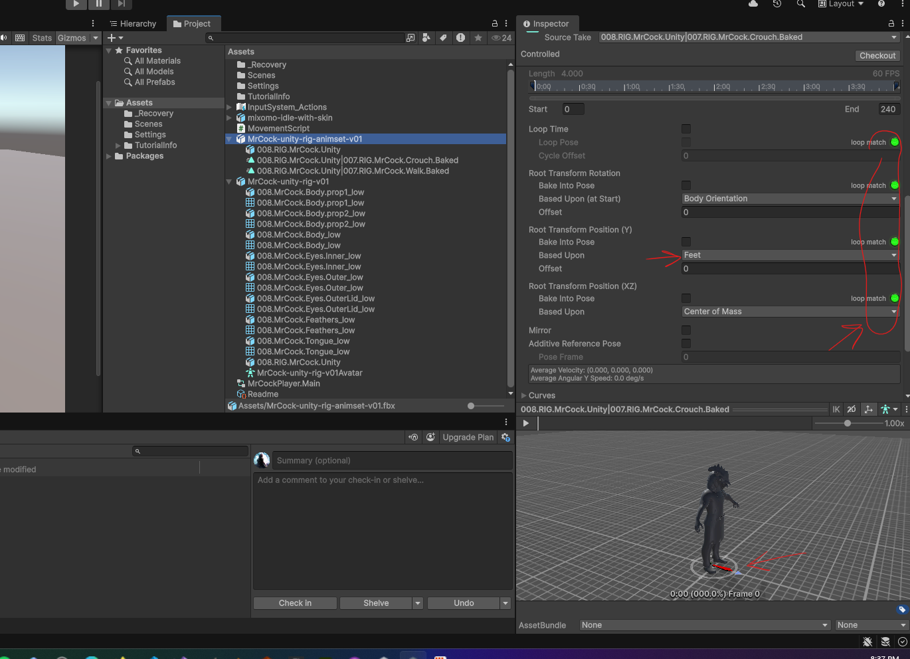
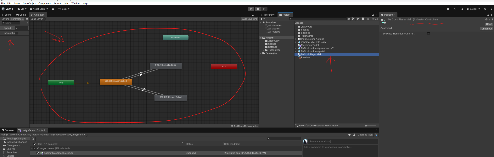
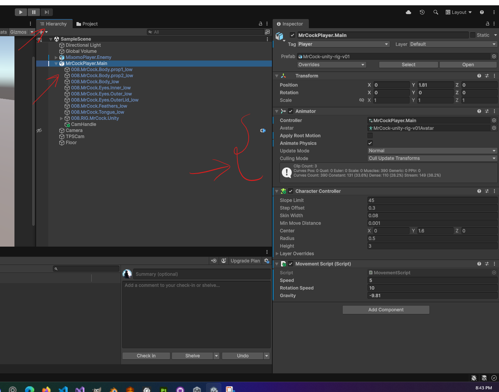

# **Player**

## import

- configure the avatar

### Add movement script

- refer `./scripts/MovementScript.cs`

## Add Animation

### setup the baked animation from FBX file

- Rig Settings
  - select the rig as humanoid and copy from existing avatar
- under the animation tab
  - 
  - 
      - make sure the Transform Position (Y) is Based Upon - Feet

### Animation controller

- add or create animation controller under projects
- 
- add the animation clips from the imported
- add the controller as component to `unity's player 3d object`
- 

### Script animator

```cs
private Animator animator;

[RequireComponent(typeof(CharacterController))]
public class MovementScript : MonoBehaviour
{
    void Start()
    {
        // find animator if not assigned
        if (animator == null)
        {
            animator = GetComponent<Animator>();
            if (animator == null)
                Debug.LogWarning("No Animator found. Assign an Animator or add one as a child.");
        }
    }
}
```
