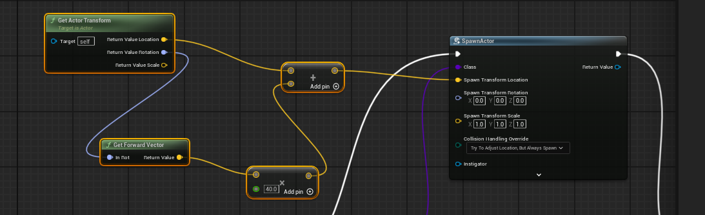

# transform location

- in third person character -> event graph
- add get actor transform
- split the reture value
  - connect location to add operator
  - rotation to forward vertor
    - multiply operator (with
      - right click on it and change input to float
        - add value to it
- 
