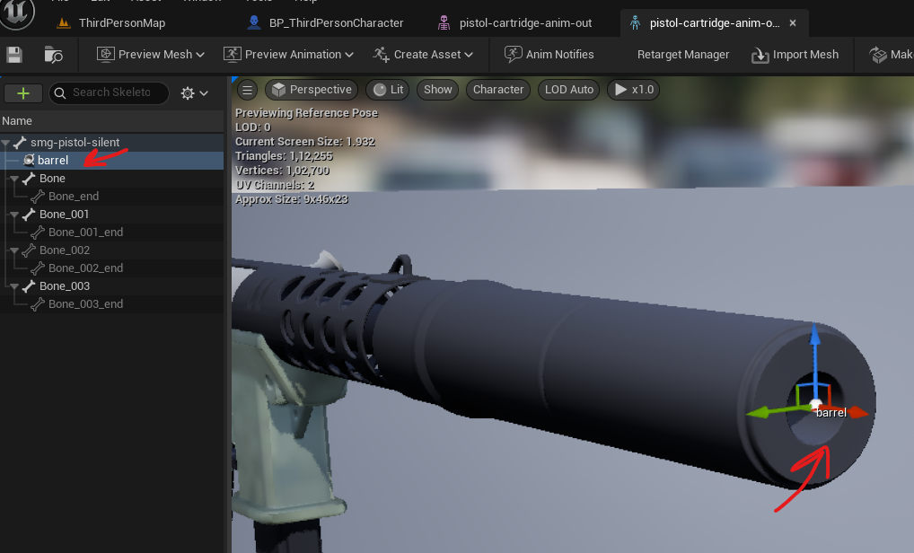
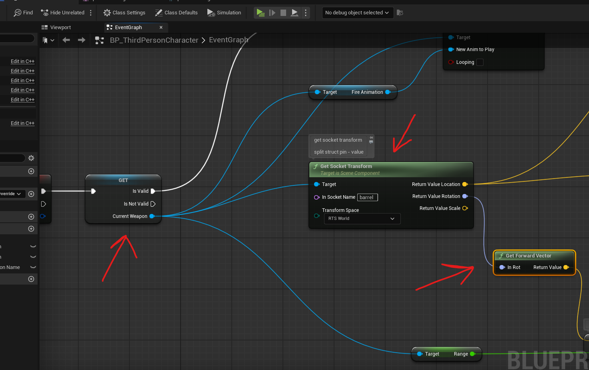
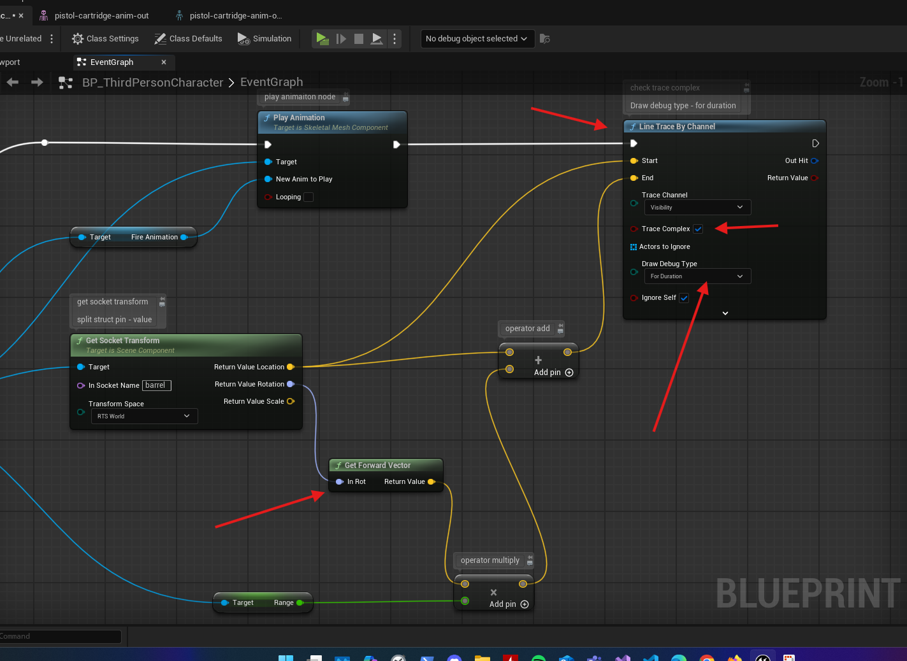

# transform location

- in third person character -> event graph
- add get actor transform
- split the reture value
  - connect location to add operator
  - rotation to forward vertor
    - multiply operator (with
      - right click on it and change input to float
        - add value to it
- 

# traces

## line traces from a socket

- add socket to a skeletal mesh
- 
- adjust it
- open the `BP_ThirdPersonCharacter`
- load the charactor class somehow
- 
- add the get socket transform
  - add the socket name (ex. barrel)
  - split the `value` pin and use the 2 pins (location and rotation)
- add the line trace by channel
- 
  - check trace complex
  - set Draw debug type - for duration
