Animation

# basics

## locate parent class

- open the Animation Blueprint (ex. ABP_Quinn)
- 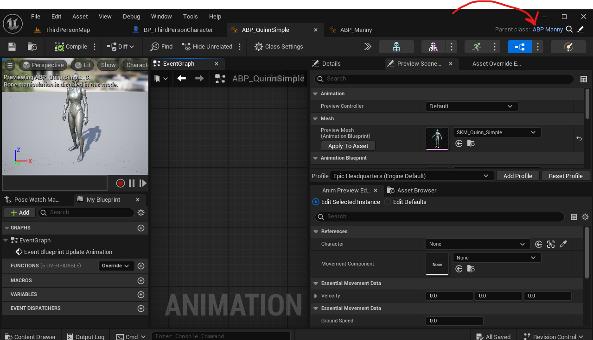
- click on the parent class

## create variable with type animation sequence
- create variable and set the type as anim sequence -> object ref

# retarget animations

- retarget to a different skeletal mesh
- locate and right click on animation sequence -> retarget animations
- 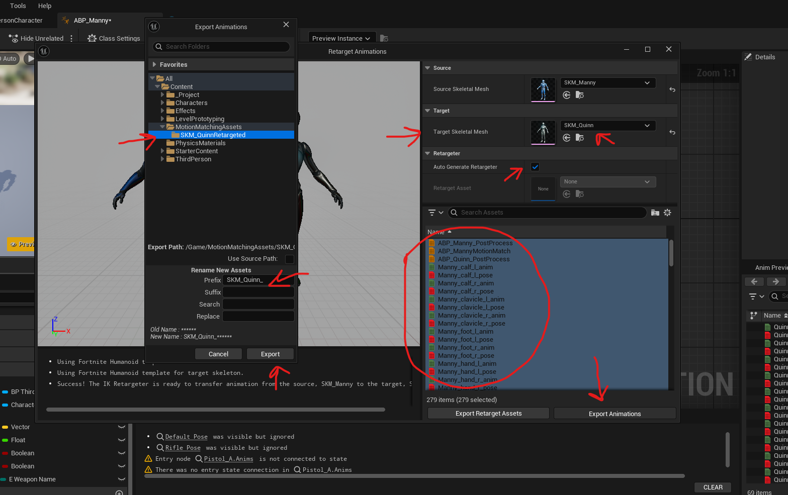

# blend multiple animation

- step 1 - from animation point to `BP_ThirdPersonCharacter`
  - go to parent most animation blueprint (ABP_Manny)
  - remove cast to character
  - add the cast to `BP_ThirdPersonCharacter` (i.e. use class instead of instance)
  - In set of Character change the variable type to `BP_ThirdPersonCharacter` -> object reference
  - accept change variable type
  - changing the variable type, changes the character reference to point to `BP_ThirdPersonCharacter`
  - 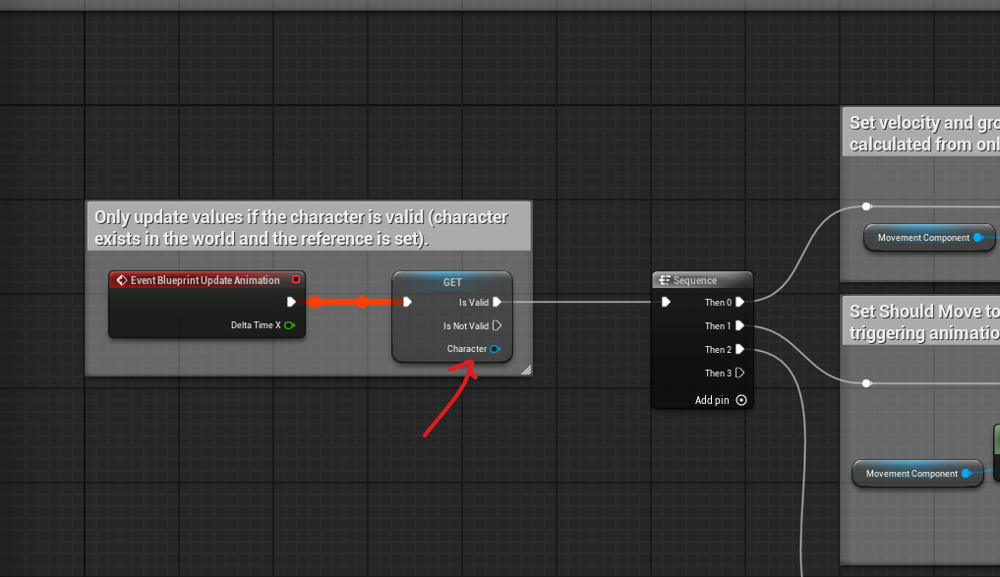
  - reference and set the same `CurrentWeaponName` variable from `BP_ThirdPersonCharacter` in the parent animation class
  - 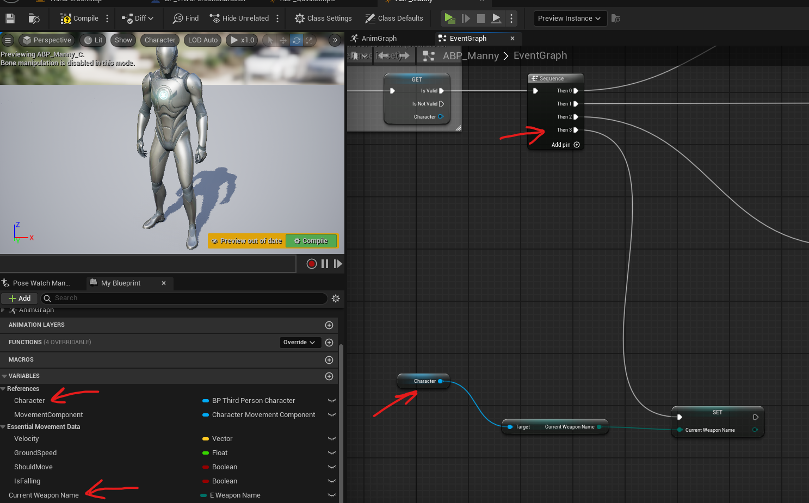
- step 2 -
  - go into the parents `anim graph`
  - 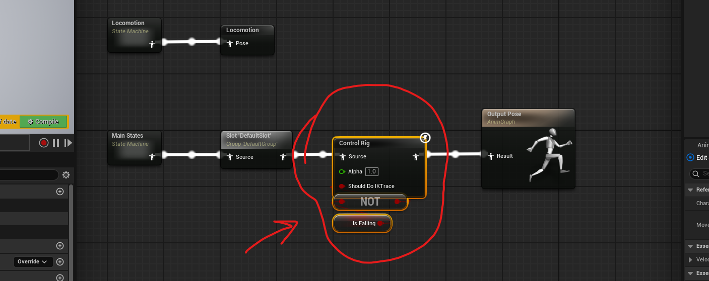
  - detach the foot IK nodes and between Main states and `slot 'DefaultSlot'`
  - add more state machines and attach `new save cached pose`, rename them to same text
  - add use cache pose and drag blend poses enum that you have (ex. E_WeaponName)
    - right click and add pins
    - set the active enum value with value from the enum (from the reference created in `BP_ThirdPersonCharacter` as above)
  - 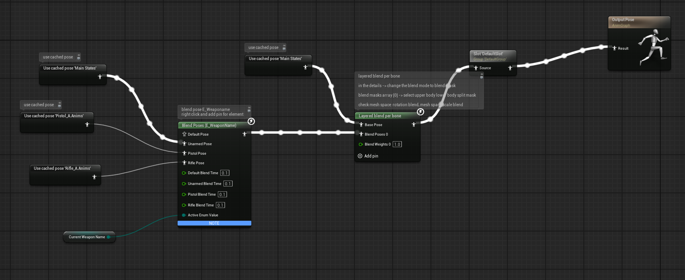
- step 3
  - double click on the state machine -> drag the arrow and add state, name it Base
  - double click on Base
  - add the `animation sequeunce` and connect to `output animation pose`

# motion matching

## Add trajectory

- 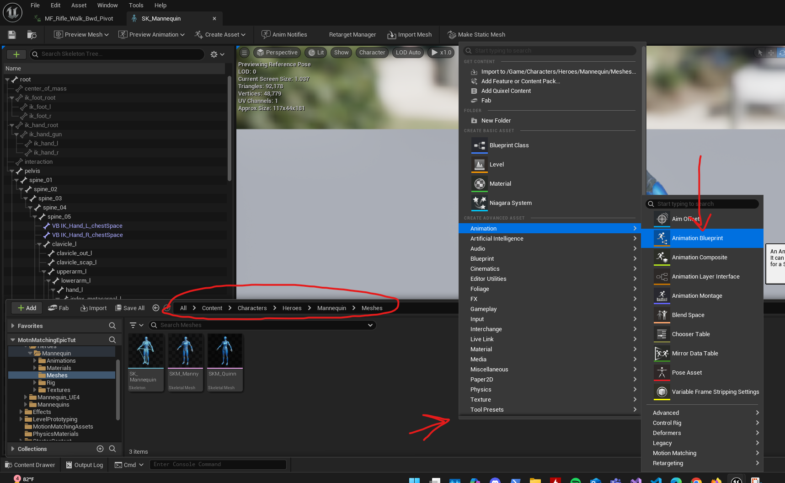
- add the skeletal mesh
- open it and add nodes
- 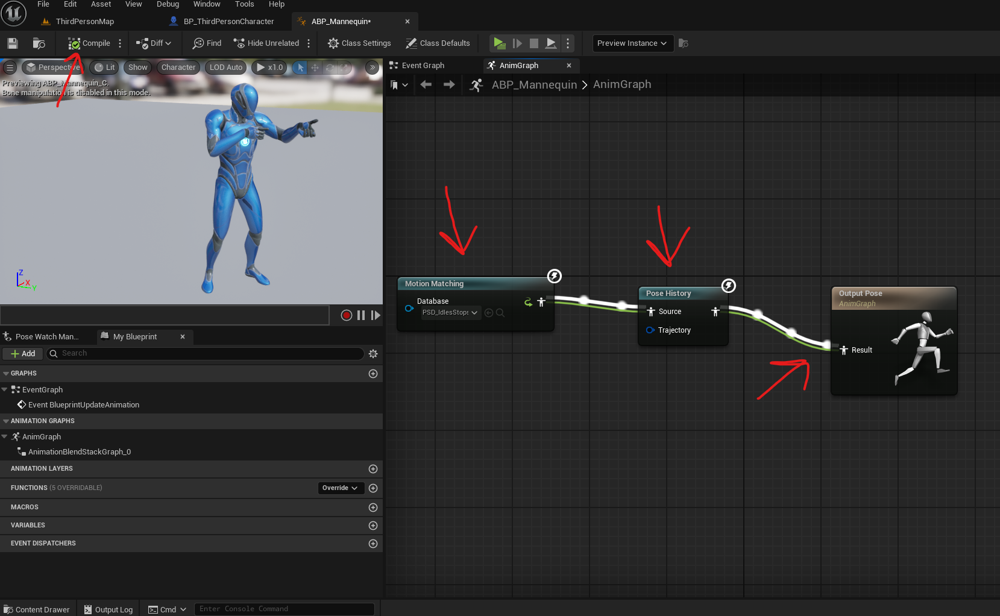
- press "Compile"
- add the animation blueprint to the charactor blueprint

# Inverse kinematics

## Fix Foot IK (foot position)

- locate the Control rig for the mesh
  - like CR_Mannequin_FootPlant
- open it -> in the "Rig Hierarchy" -> select all bones and right click -> refresh -> select the new mesh
- go to the Anim Graph of the animation blueprint
- between pose history and output pose add the control rig (right click -> misc -> control rig)
- 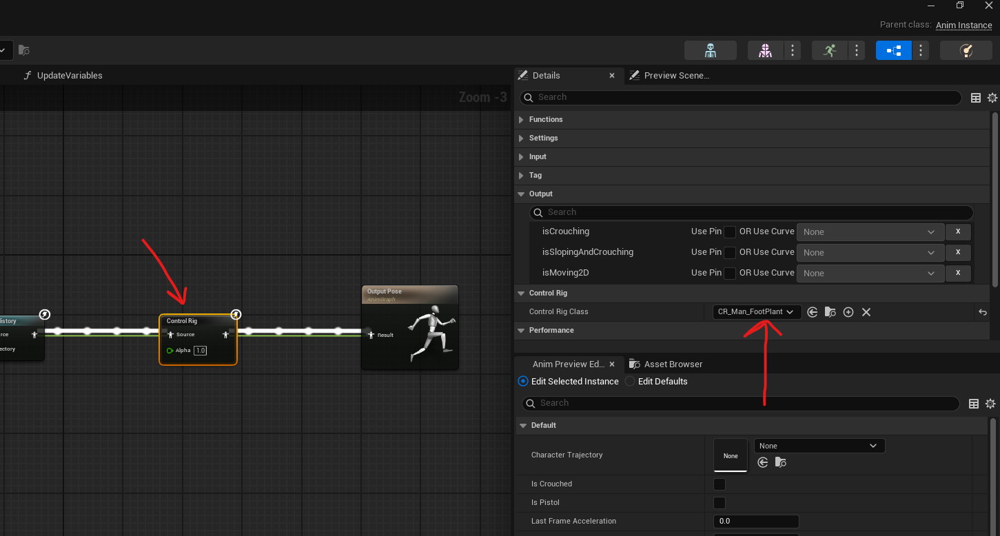

# Animation Sequence

## Edit

- open the animation sequence
- 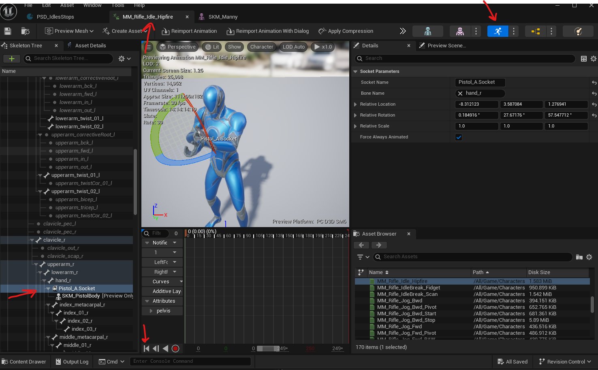
- reset the animation to first frame
- edit the bones for rotation
- select all the bones in the "Skeletal Tree"
- 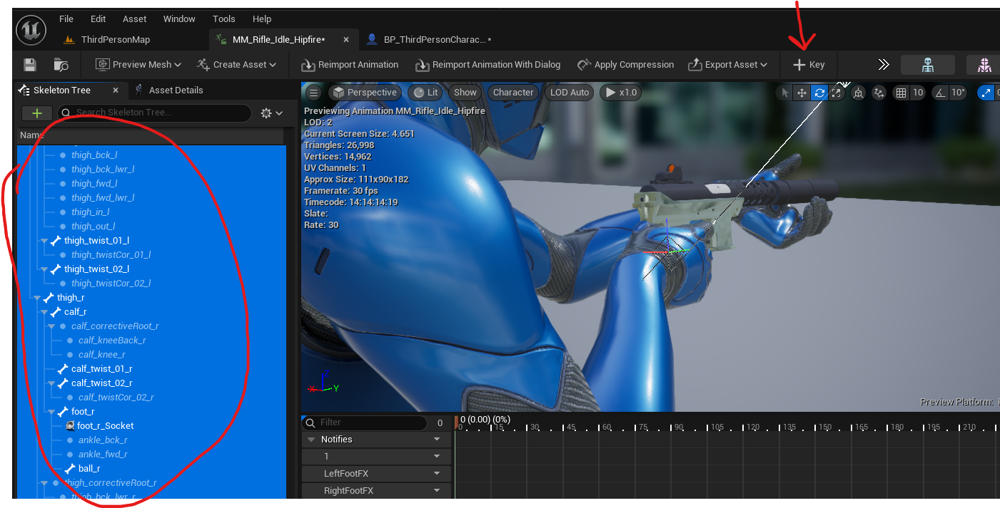
- add key

### show hide bones

- 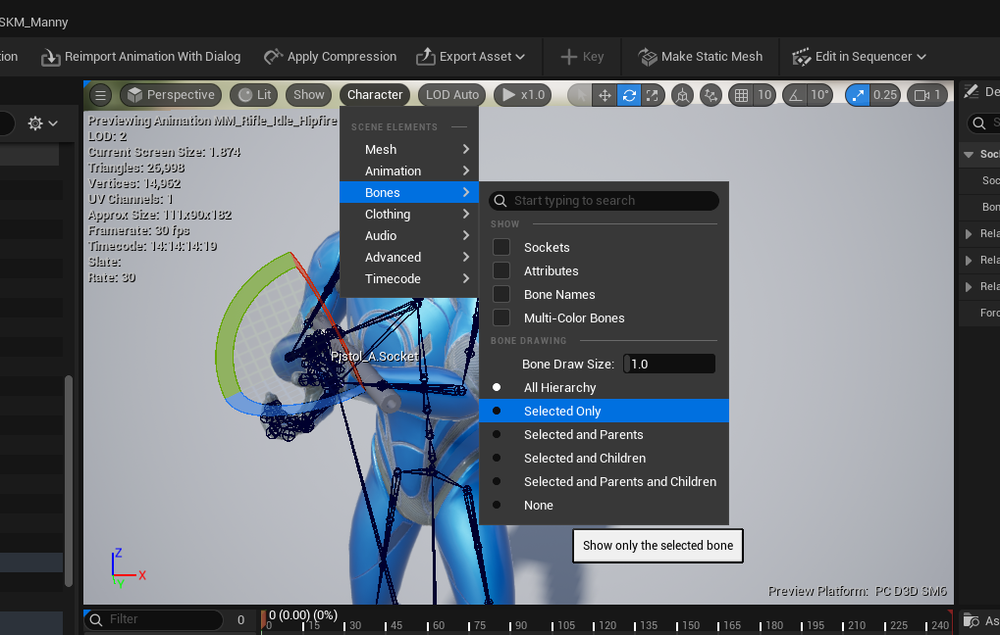
