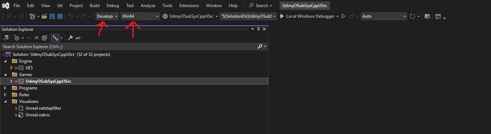

# Visual studio

## cannot create file in temp folder, please `cl : Command line error D8037 : cannot create temporary il file; clean temp directory of old il files`

- do not install intelliBuild for game development
- intelliBuild is okay for c++ development

## unreal project clean up

- delete Intermediate, Saved, DerivedDataCache, build, binaries, .vs
- Right-click on the <project-name>.uproject file.
- Select "Generate Visual Studio project files" to ensure all references are updated.
- open the solution in Visual studio
- set the solution configuration to Development Editor and solution platform to win64
- 
- start build and wait till the editor is up and running
