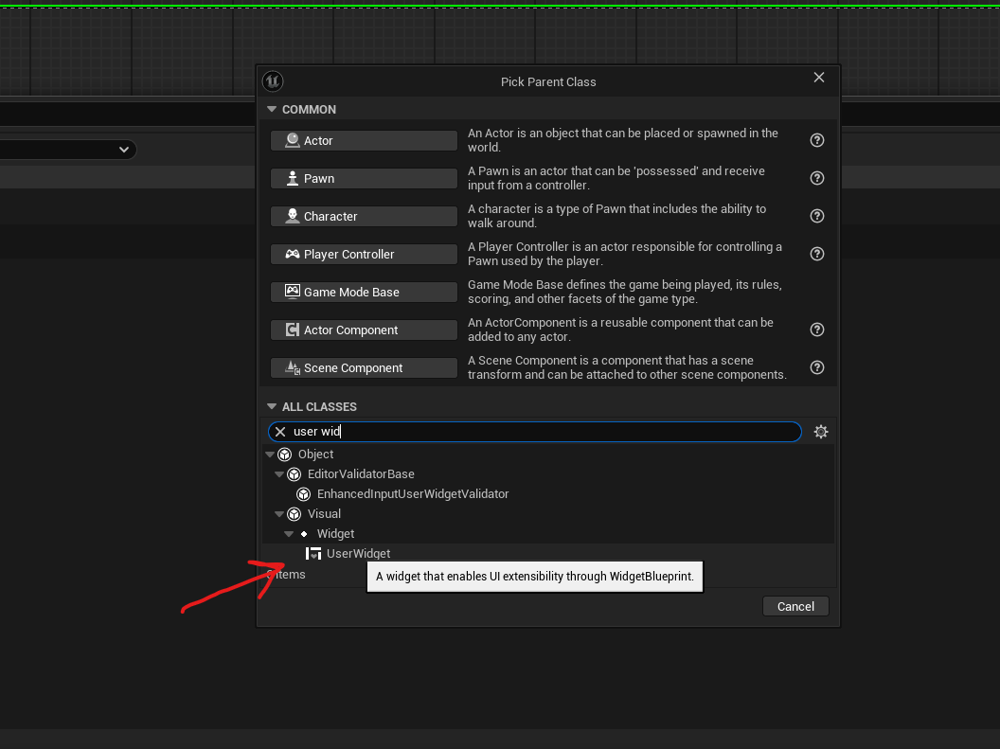
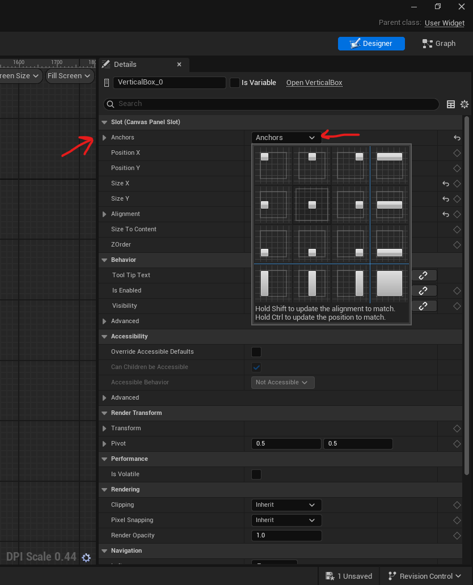
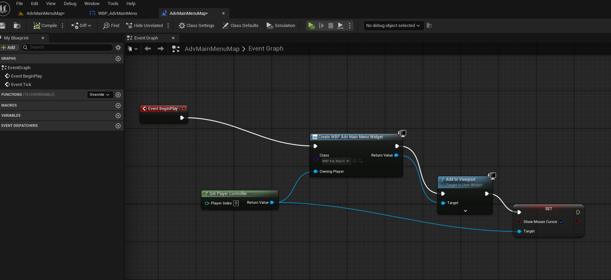

# user interface

# create widget

- in the content browser -> right click -> user interface -> widget blueprint -> user widget or UserWidget
- 

# widget customizations

## vertical box

### add vertical box

- first put your elements in the canvas
- select any elements
  - in the hierarchy tab (Bottom left corner of the screen)
  - select the primary elements (not the childrens)
  - right click -> Wrap with -> vertical box

### align the vertical box

- shift + ctrl + select the alignment

### manual movement of vertical box

- click on the vertical box
- drag the flower and press ctrl to snap the element inside it

# add widget to map

- 
- in event graph
  - create widget -> add to viewport
  - attach "get player controller" to create widget node
