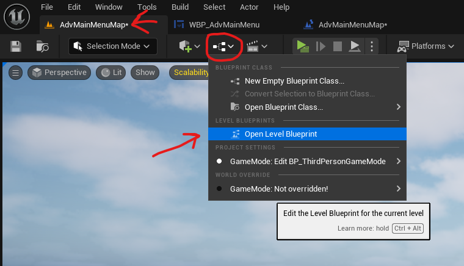

Blueprint

# Blueprint Editor

- 
- add dot by double clicking on the edge

## interface

### add interface

- in content browser -> right click -> Blueprint -> Blueprint Interface
- rename it
- add function or rename existing

### add interface to other blueprint class

- open the blueprint
- click on class defaults
- 
- under "implemented interfaces"

## class

### actor class

- if game mode's default pawn is `BP_ThirdPersonCharacter` then any blueprint actor class will have access to public functions in it (`BP_ThirdPersonCharacter`)

## Variables

- expose the variable so that it can be used in "Event graphs"
  - 
- after exposing the variable will be available in the nodes
  - 

### Control settings with variables

- create and group the variables, set as "Instance Editable" and "Expose on spawn"
- 
  - this makes the varible get / set public
- once grouped and exposed (Instance Editable or Expose on Spawn)they will appear in the details of the object
- 

### null variable check

- after adding the variable to "Construction Script" or "Event Graph"
- right click on the variable and select "Convert to Validated GET"

### struct pin combine/spilt

- disconnect the pins
- right click on the variable and recombine pins (example a vector 2d into float `x` and `y`)
- 
- right click on the variable and split pins (example float `x` and `y` into a vector 2d)
- 

### get or bind variable property access

- right click and search "Property Access" (shall be under `Variables`)
- 

## functions (function nodes)

### input binding

- 
- right click on the input variable and set binding
  - only variable of type `Pose Search Query Trajectory` and `Character Trajectory Component` will show

## event graph

- to open the blueprints event graph
- 

## Node editor

### destroy or disconnect edge

- alt + click

### add or create

- right click and add nodes

### extra zoom

- press ctrl and scroll in

### operators (add, subtract, multiply etc)

- 
- right click on the value and select the datatype

#### boolean

- right click
  - and boolean
  - or boolean

### timer

- 
- in node editor -> right click -> search for "set timer by event"
  - manually or set a Time (value in seconds i.e. 1 for 1 second)
  - bind event to "Custom event"

### custom event

- 
- add a custom event
  - right click in "Event Graph"
    - search for "Custom event"
      - the name that u give will be the name of event function that can be called on any event dispatched in the system
        - exmple here is `OnKeyPressFoo`

### key press

- search key `<any charactor>`
  - ex. key k
- mouse
  - search
    - mouse right button

# component

- content drawer -> right click -> blueprints -> search or select any (ex. Actor Component)

## Macros

to have multiple if/else conditions

- default value for exec "Then"
  - 

## event dispatcher

- to create and add event dispatcher to the bleuprint component
  - 
- add the event to the player -> Event Graph
  - 

# widget (UI for Menu etc)

right click in content drawer -> Widget Blueprint -> User Widget

## canvas panel

- kind of like a container

## progress bar

