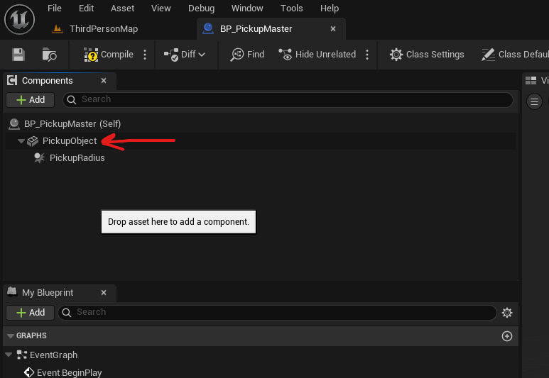

# Collisions

## simplied collision to a static mesh
- open asset -> top menu -> collitions -> simplified collision

## actor class
- add a static mesh 
- move it to the root
- 
- add a sphere collision if required under it
- select root object (static mesh that we just added)
    - enable "Simulate Physics"