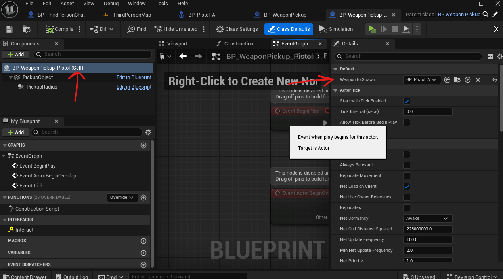
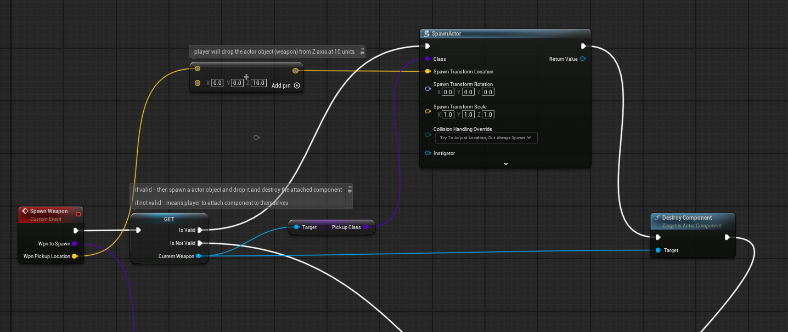
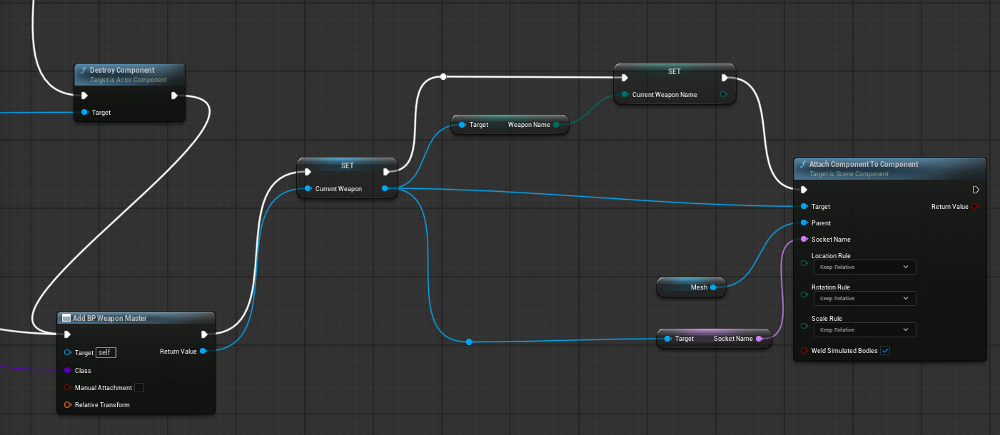

# Weapon System [Tutorial Link](https://www.youtube.com/watch?v=vbvD0kuSCDs)

## Weapons functionality

- add blueprint class (right click in content browser)
  - add enums
    - `E_FireMode`
    - `E_WeaponNames`
    - `E_WeaponTypes`
  - of type `SkeletalMeshComponent` under `ActorComponent`
    - rename it to `BP_WeaponMaster`

## Pickup Functionality

- add a blueprint actor class -> rename it to `BP_PickupMaster`
- open its blueprint and add a static mesh
- drag the mesh onto the `DefaultSceneRoot` to replace the root with mesh (otherwise collision wont work)
- add sphere collision (a transparent sphere)
  - set its radius to 100
- select the new root element
- 
- in details
  - under static mesh add any mesh so that we can select this root element by clicking on this selected mesh
  - enable `simulate physics`
  - under `component tick`
    - disable `Start with tick enabled`
  - set mass 60kg
  - under physics
    - liner damping 0.25
    - angular damping 0.25
- craete a blueprint interface
  - rename `BPI_Interact`
  - rename its function to `Interact`
  - add input `CharacterPickingUp` and type in `BP_ThirdPersonCharacter`
- add `BPI_Interact` blueprint interface to `BP_PickupMaster`
- create a child class from `BP_PickupMaster`
  - right click -> Create Child Blueprint class -> rename `BP_WeaponPickup`
  - create a variable `WeaponToSpawn` and add type as `BP_WeaponMaster` as class reference
    - compile
    - in details set default value to `BP_WeaponMaster` reference
- create a child class from `BP_WeaponPickup`
  - rename it to `BP_WeaponPickup_Pistol`
  - add Pistol Static Mesh with simple collision to its static mesh (inherited `PickupObject`)

### Add `Spawn Weapon` event from third person character

- create a custom event in `BP_ThirdPersonCharacter` called `Spawn Weapon`
  - it should take input
    - `WeaponToSpawn` - type is BP Weapon Master class reference
    - `CharacterLocation` - vector
- go to `BP_WeaponMaster` event graph
- drop the `Interact event` and attach the `Spawn Weapon` to it
- 
- connect `WeaponToSpawn` and `Get Actor location` and `Destroy Actor`

## Player Interaction

- goto - `/Game/ThirdPerson/Inputs`
- add Inputs -> Input Action
- rename it to - `IA_Interact`
- add trigger on `HOLD` with `in one shot` checked
  - [refer](./player.md#trigger)
- Add this to `IMC_default`
- call this from `BP_ThirdPersonCharacter`
  - 
  - search for IA_Interact and add the EnhancedInputAction IA_Interact
  - add `get Overlapping actors`
    - class filter -> `BP_PickupMaster`
    - get (a copy)
  - search `Interact` and connect triggered to it
    - attach target to Target and Get array from `get Overlapping actors`

## add variables to `BP_WeaponMaster` SkeletalMeshComponent

- float `Damage` and `Range`
- Enum above for `E_WeaponTypes`, `E_WeaponName`
- PickupClass - BP Weapon Pickup `BP_WeaponPickup`
- Socket Name - Name (for adding the socket to the players skeletal mesh ex. `SK_Mannequin`)
- create a child blueprint class from `BP_WeaponMaster` called `BP_SKMPistol`
  - go to class defaults
  - <b style="color:red;">IMPORTANT</b> - set the variables that we just created
    - damage - 20
    - range 15000
    - type - pistol (from `E_WeaponTypes`)
    - name - pistol (from `E_WeaponName`)
    - pickup class - `BP_WeaponPickup_Pistol`
    - socket - `Pistol_A.Socket`
- add the socket to `hand_r` of players skeletal mesh (ex. `SK_Mannequin`)
  - to locate the correct mesh follow [foo](./player.md#skeleton)
- create a skeletal mesh from the pistol mesh
- attach the preview of pistol skeletal mesh to the socket
- open `BP_WeaponPickup_Pistol` and attach this `BP_SKMPistol` to the `WeaponToSpawn` or `Weapon to spawn`
  - 

## Add event from third person character

- create `CurrentWeapon` of type `BP_WeaponMaster`
- drop it and convert it to validated get (so no need of null check)
  - if valid (means detach the component) then spawn actor -> drop it and destroy component
    - weapon pickup location is `Add` operator
      - instead we can use a actor transform also [refer](./actor.md#transform-location)
    - attach `get pickup class` to spawn actor class input (purple pickup class)
  - 
  - if not valid (means attach the component i.e. weapon to the player)
  - 
    - class comes from `WpnToSpawn` input to custom event `Spawn Weapon`
      - i.e. the `BP_WeaponPickup` -> `WeaponToSpawn`
    - mesh comes from third person character mesh
    - get socket name from current weapon (i.e. `BP_WeaponMaster`)
- create variable `CurrentWeaponName` of type `E_WeaponName`
- add it in between the SET `CurrentWeapon` and `Attach component to component`
