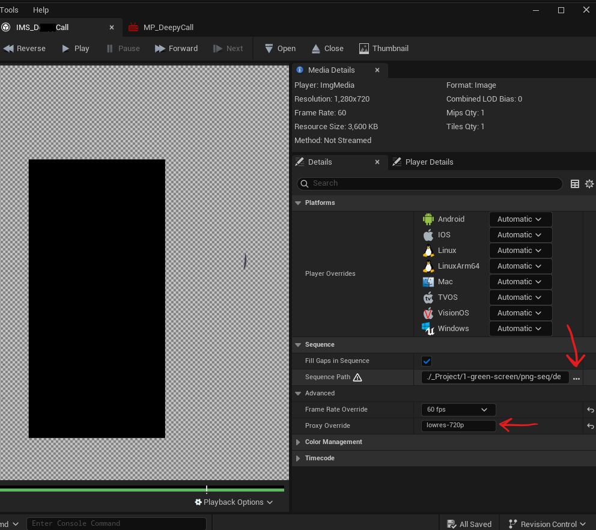
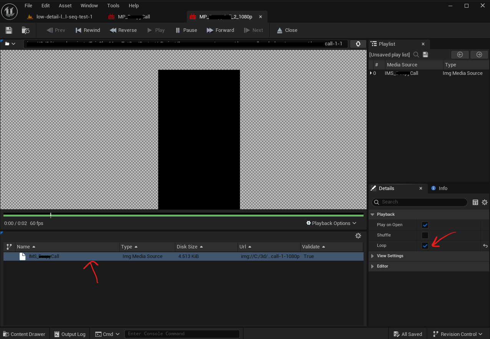
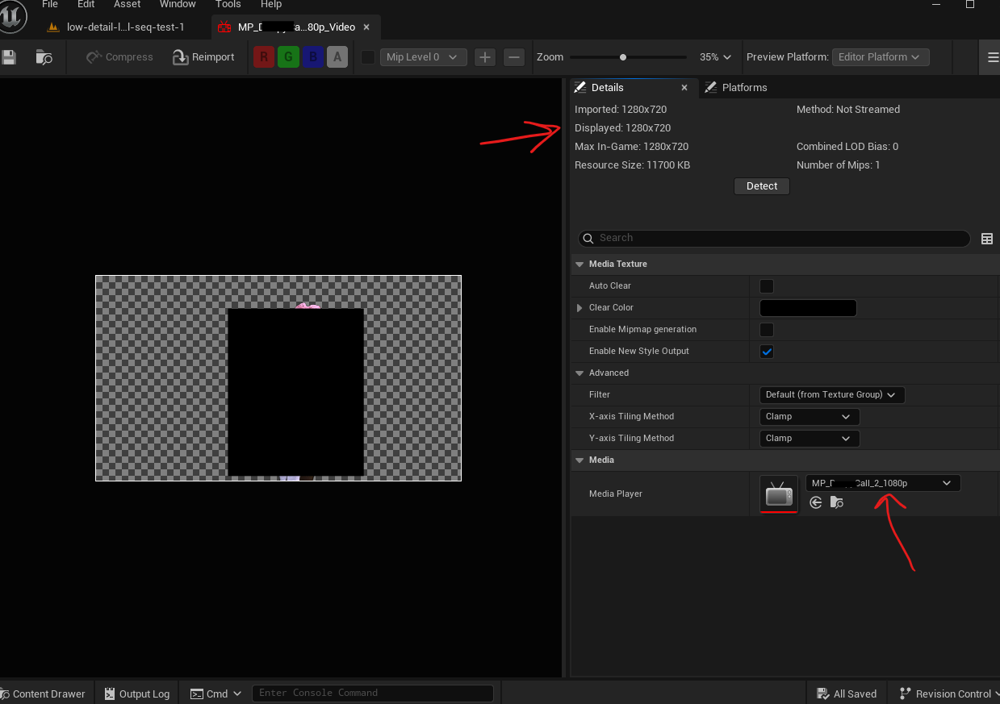
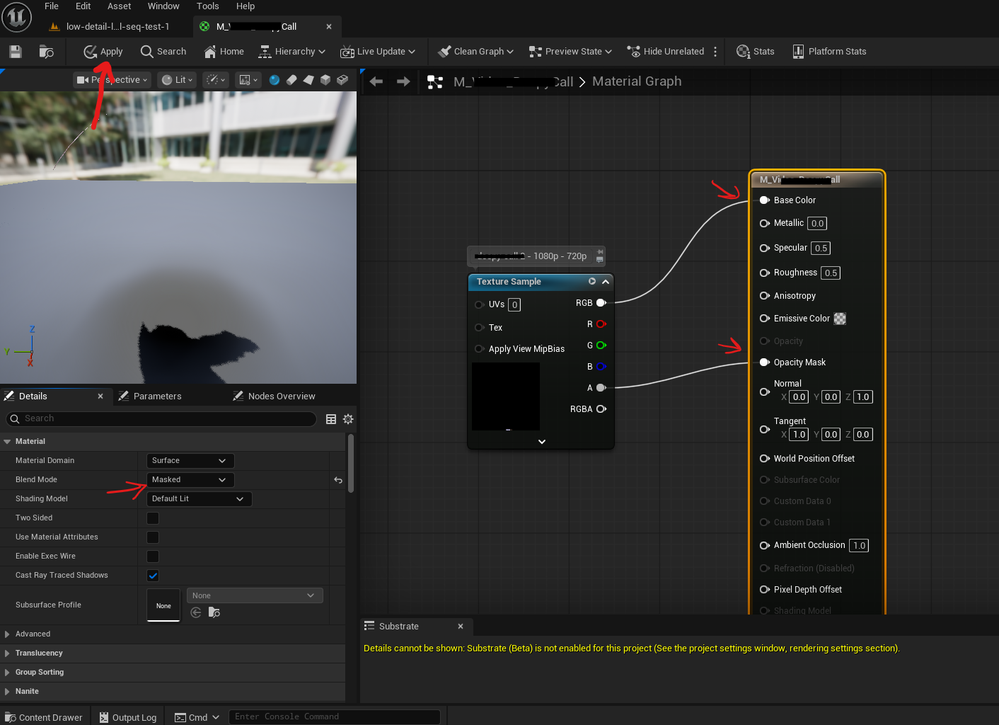
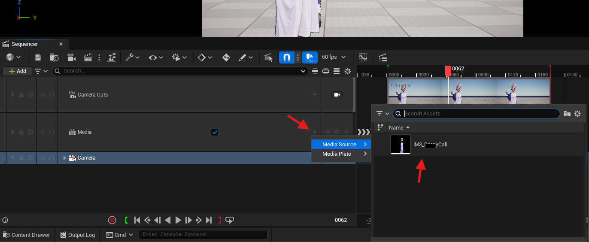
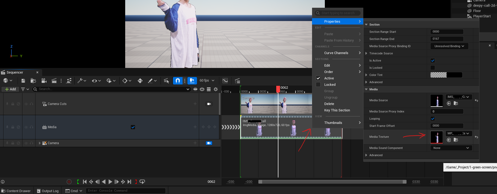

# **Green Screen (Chroma key) in Unreal**

# Import to unreal

## reference articles

### How to play sequence of images

- https://dev.epicgames.com/documentation/en-us/unreal-engine/play-an-image-sequence-in-unreal-engine

### how to create a material out of the image sequence

- https://dev.epicgames.com/community/learning/tutorials/63ra/green-screen-compositing-unreal-engine-5

## prepare the folder

- to import the PNG sequence, we dont have to copy or add all the files to the project
  - i.e. will add the reference to the first frame and unreal automatically picks the rest of the frames
- first create a folder that will have the raw png sequence
- right click the new folder and select "Show in Explorer"
- in the windows file explorer copy the png sequence to this folder
- create one folder under the current folder
  - its good to have low resolution png sequence to work with
  - so create a folder "lowres" in the file explorer and add the same png sequence with 720p resolution
  - **NOTE:** unreal will automatically pick the higher resolution sequence when we will render the final video

## create a player and texture

- in the content browser -> right click -> media -> "img media source"
- 
- in the Sequence path select the png image of first frame
- in the proxy override give the name of low resolution folder which we created earlier ex. "lowres"
- in the content browser -> right click -> media -> media player -> tick "video output media texture asset"
- rename it
- open the media player
- 
    - open the clip
    - tick mark "Loop"
- open the media texture
- 
    - check the image details, it should be 720p or if no proxy folder is specified then it will show high resolution

## create a material

- content browser -> right click -> Material -> Material
- open the material editor (double click on the material)
- 
    - click on Material node
    - set the blend mode to Masked (very important)
    - drag and drop the media texture
    - plug base color and opacity mask
- press the apply button
- close the material editor
- right click on the material -> create a material instance
- in the unreal scene -> add a shape plane
- drag and drop the material instance on it

## play the png sequence

- add a level sequencer
- add media track
- 
    - click on the + button
    - add the img media source
- right click on the clip -> properties -> media texture -> select the right texture
- 
- play the level sequencer

## render the png sequence

- add a camera
- make sure the camera focus is set to "Do not override"
  - [refer camera settings](../sequencer/camera.md#do-not-change-the-focus-settings)
- click the camera and set the resolution
- click "Capture Movie"
