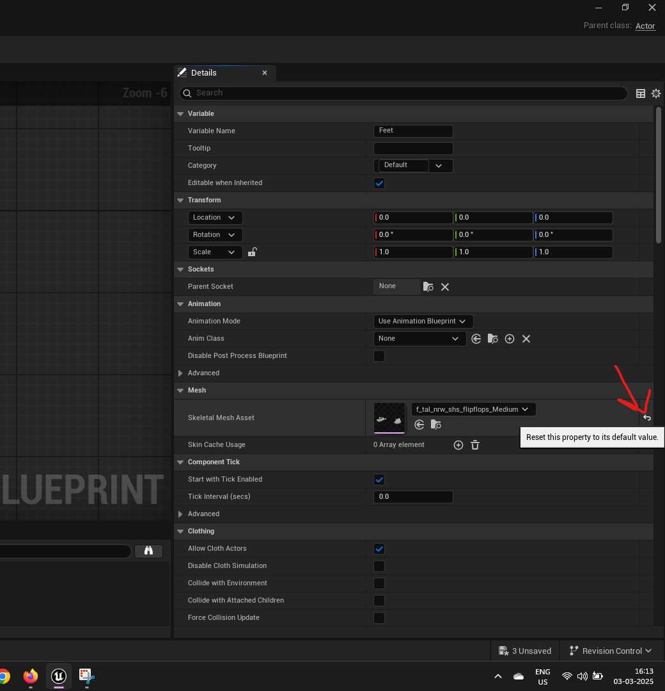

# metahuman

## enable the plugin

- search for metahuman sdk and check it
- restart unreal

## add from quixel bridge

- 
- open quixel bridge -> metahumans -> meta humans
- click on download
- in content browser open Metahumans -> `<your metahuman name>`
- try adding it to the floor mesh
- install all the missing plugins
- restart

## open blueprint

- 

## remove footwear or sandle or chappel

- 
- click on the reset button

## export textures

- 
- locate the face mesh material in content browser
- open material
- 
- locate the color and normal map
  - there should be 4 color and 4 normal (rest 2 ignore)
- 
- locate and download its base body color and normal map

## export mesh

### combined face + body

- add the metahuman to the map (floor)
- reset its location in the details panel
- add a level sequencer
- 
- add the mesh to the sequencer
- 
- right click on `BP_*` -> "Export..."
- 

### seperate (body and face as seperate)

<b>Note: </b> dificult to edit face

- open content browser -> all -> content -> metahumans -> `<your metahuman name>` -> body -> Skeletal Mesh - `*_nrw_body`
- right click -> Asset Actions -> Export
- 
- also repeat for the face - Skeletal Mesh `*_Face_Mesh`

## convert (to retain the shape keys)

- open autodesk fbx convert
- 

## import in blender

### basic face edit (retain the bones)

- import the converted .fbx
- 
- select the "Body"
- add 2 shape keys (Basis and New Key)
- set the Value to 1
- for face add only 1 key
- set the Value to 1
- 
- hide the bones and the uncheck select bones as well

### advanced face editing

- import the converted .fbx
- select the Face.001 mesh
- alt + p -> clear parent and keep transformation
  - so that the mesh do not resize
- remove the armature modifier
- delete all vertex group and shape keys
- delete materials (click on the -ve button)
- to remove the eyelashes
  - in edit mode and in its menu
    - select -> select all by trait -> Non Manifold
      - go into wireframe and x ray mode and unselect all other vertices apart from lashes
- delete eye ball and mouth
- add subdivision modifier and level as 2 and render as 2 and apply
- do add features
- and import as fbx with mesh only

## export to unreal

- export both face and Body seperately

<b>Note: </b> do not change the vertex count and export and later import in the unreal, this can cause even breaking of all the other metahumans even the core ones

### face

- 
- rename both to be root and then ONLY export
- select root (group) and rotate along x axis to 90
- 
- select first root (group) and then `Face.001` and then export
- after export immediate do undo (ctrl + z) to restore auto rotate
  - here the blender might freeze, so undo then wait then undo and repeat

### body

- rename `root.*` to root (as blender will add .001 suffix)
- no need to rotate anything
- select first root (group) and then `Body.001` and then export

### export settings

- 
- Include
  - Limit to "Selected Objects"
  - Object Types
    - Aramature and Mesh
- Armature
  - uncheck "Add Leaf Bones"

### import to unreal

- duplicate Main BP\_\* metahuman blueprint class
- duplicate body and face skeletal mesh class
- open the duplicated body skeletal mesh
- under asset details -> import settings -> Asset import Data -> file path -> source file -> ... -> set the path of .fbx exported from blender
- 
- click on "Reimport Mesh" options -> Reimport Mesh with new file -> selected exported file from blender
- click on the Reimport Mesh with dialog
- 
- check import morph targets
- 
- the new shape key will appear in the morph target preview tab
