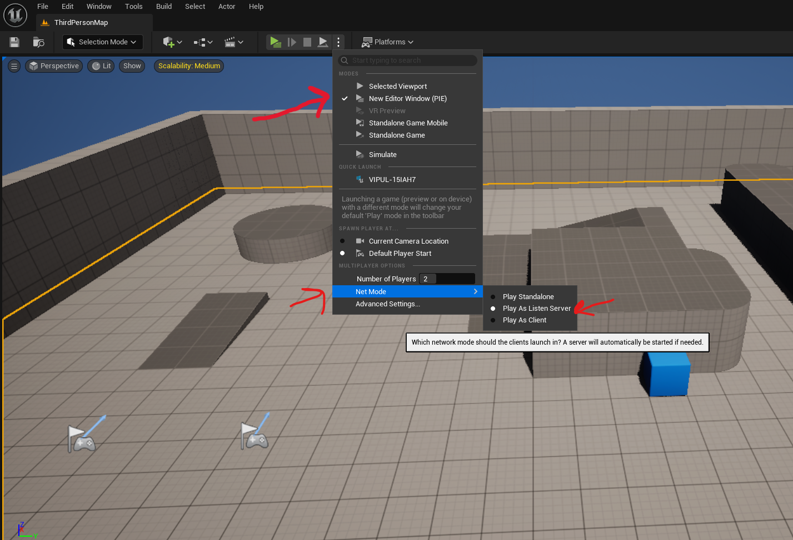
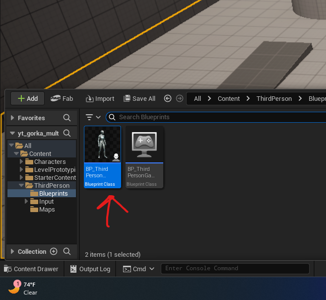
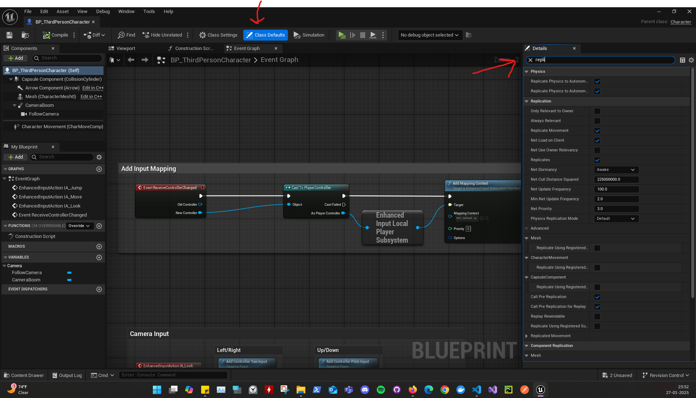
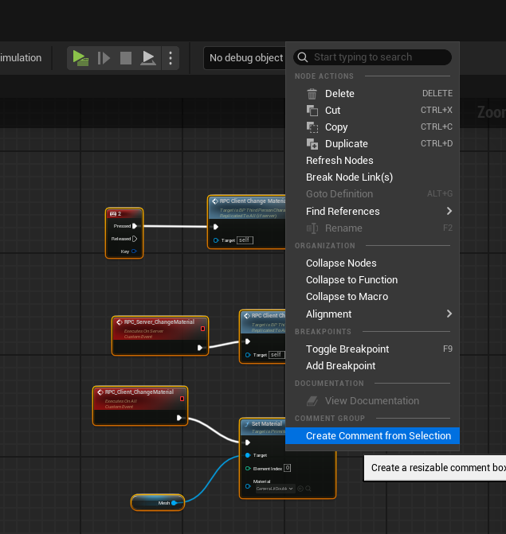
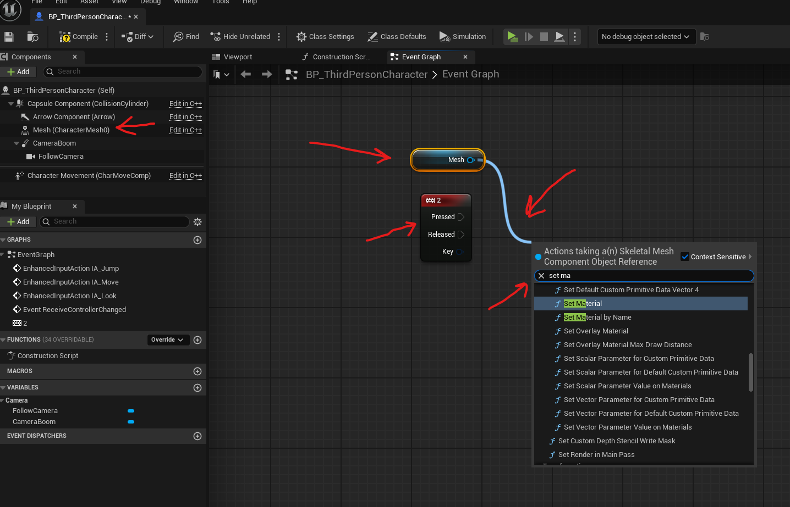
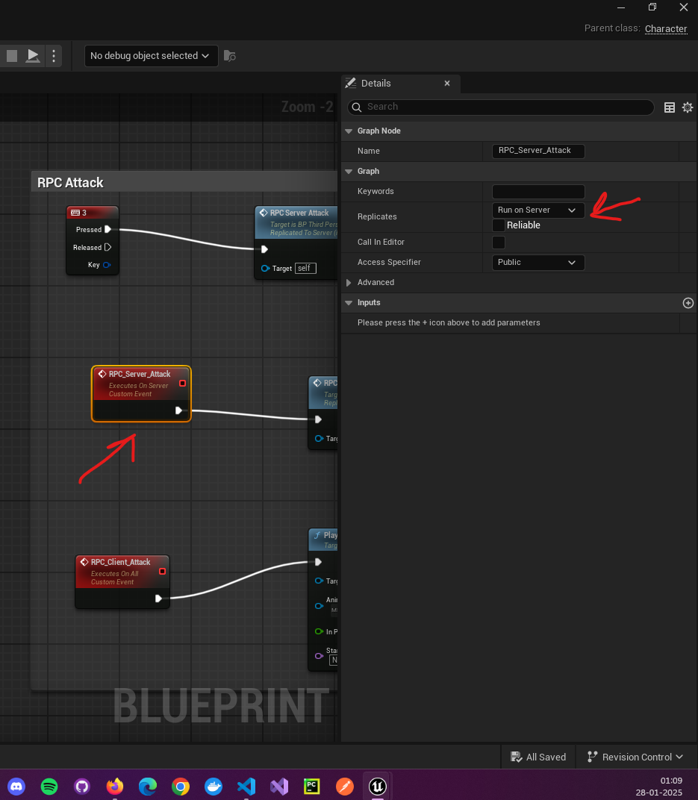
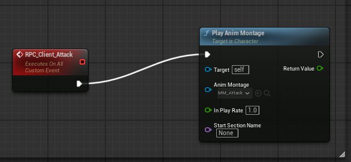
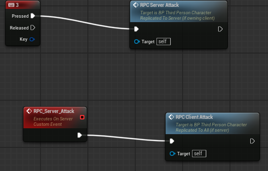
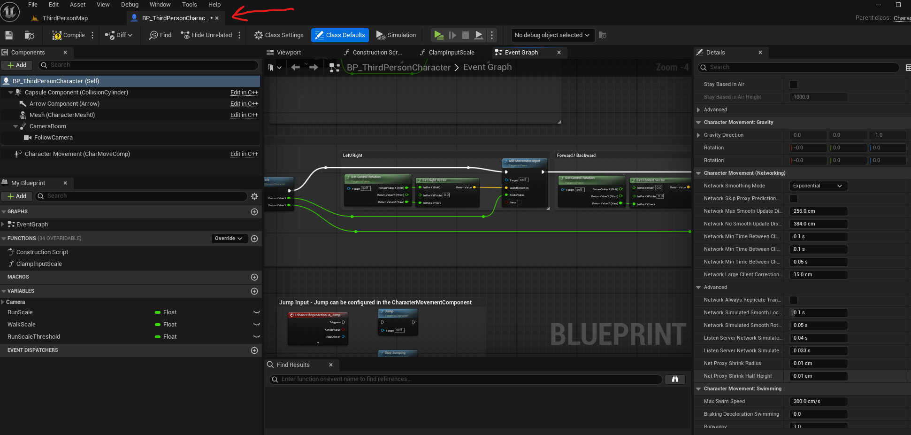
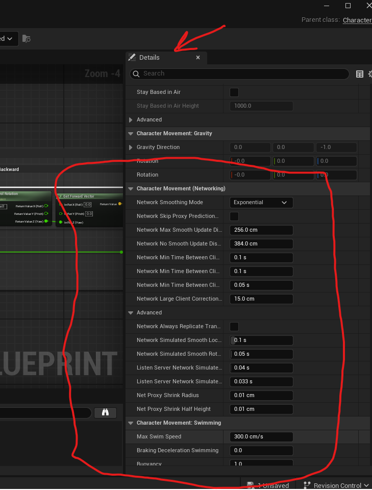

Multiplayer

# viewport

- 

# Blueprint editor

- in the bluprints
- double click the blueprints
- 

## UI

### menu

right click anywhere

### drag and open menu

- click and drag the nodes connector, hold click and right click to pop up the menu

### replication panel

- search replication in the right panel (details panel)
- 

### group

- 

## events

### on key press

- right click -> key 2 (on press of key 2)
- 

### RPC event (to replicate or propagate to other clients or servers)

- right click
- search - add custom events
  - add 2
    - first for server
    - name it as RPC_Server_SomeAction
    - 
        - under replicate - select "run on server"
        - bind to RPC_Client_SomeAction
            - right click and serach - RPC Client SomeAction
    - second for server
    - name it as RPC_Client_SomeAction
      - under replicate - select "Multicast"
      - this will do the action
      - 

<b>Note:</b> add key press or some event that will pass the action to server

- 

# Server

## local server from game

- mode (click on the menu next to the play button)
  - set New Editor window
  - number of players 2
  - Net Mode -> stand alone
- use the create session, find session and join session to join it

## start the server

- create a shortcut for the executable file and in the property -> Target -> Add -log
  - there will be path to the .exe so after the quotes just add -log

## client

- start the client by just clicking on the .exe
  - press ` and type open 127.0.0.1

## Network simulation

- bring up console - press `

- add lag - NetEmulation.PktLag 500
- show corrections - p.NetShowCorrections 1

# blueprint character component

- 

## Networking section

- 

# Override CMC (CharacterMovementComponent.cpp)

- override Movement Mode, Saved moves with packed movement way

## add

- add custom base charactor movement class
  - Tools -> Add new class -> all classes -> CharacterMovementComponent -> name it like "CustomCharacterMovementComponent" or whatever under a "Characters" folder
    - NOTE - when the cpp file is created, it might throw an error coz of #include "Characters/CustomCharacterMovementComponent.h"
      - so just remove the "Characters"
- add another project custom charactor movement class in the "Characters" folder
  - search all classes -> search project name charactor Movement class -> add it as Custom`<project name>`Charactor class
  - correct the included "custom project movement class" file with `../`
- forward declare custom base charactor movement class
  - i.e. copy the class of the newly created custom base charactor movement class
    - example CustomCharacterMovementComponent which will be UCustomCharacterMovementComponent
- add the function in the project custom character header

```cpp
public:
	AMyProjectCharacter(const FObjectInitializer& ObjectInitializer);

	/**
	* Returns CustomCharacterMovementComponent subobject
	*/
	UFUNCTION(BlueprintCallable)
	UCustomCharacterMovementComponent* GetCustomCharacterMovement() const;
```

## how to make efficient network movement

- use bit flag approach is efficient
- using boolean is less efficient

## Properties

- to use replication variables

```cpp
public:
    UPROPERTY(VisibleAnywhere, BlueprintReadOnly, Replicated, Category = "Sprinting")
    bool bIsSprinting;

public:
    //Replication. Boilerplate function that handles replicated variables.
    virtual void GetLifetimeReplicatedProps(TArray<FLifetimeProperty>& OutLifetimeProps) const override;
```

- also add the GetLifetimeReplicatedProps
- below is the defination

```cpp
void UCustomCharacterMovementComponent::GetLifetimeReplicatedProps(TArray<FLifetimeProperty>& OutLifetimeProps) const
{
	Super::GetLifetimeReplicatedProps(OutLifetimeProps);

	DOREPLIFETIME_CONDITION(ThisClass, bIsSprinting, COND_SimulatedOnly);
}
```

- `COND_SimulatedOnly` tells that replicate only on other proxies and not on self (i.e. not on autonomous proxy)
