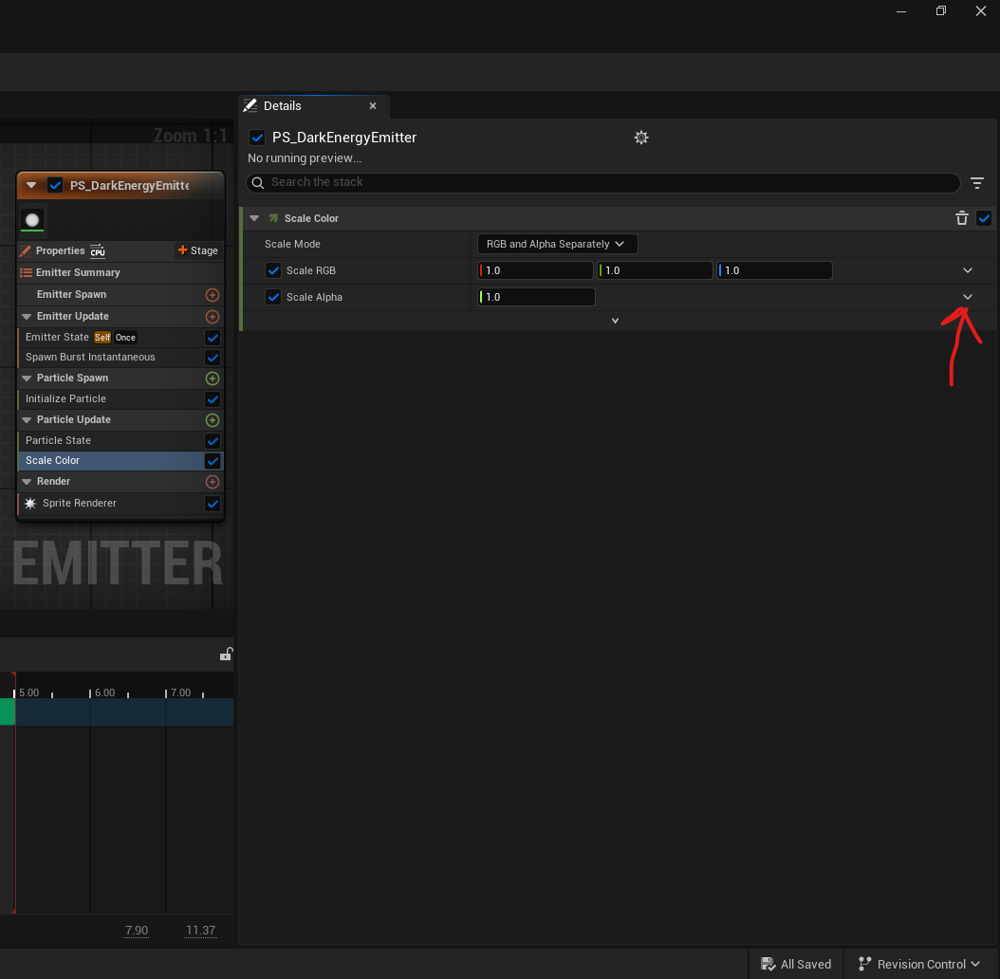
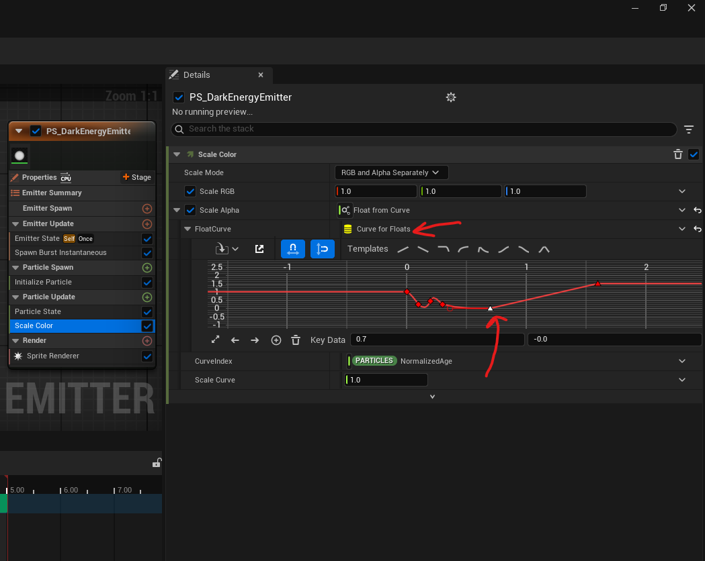
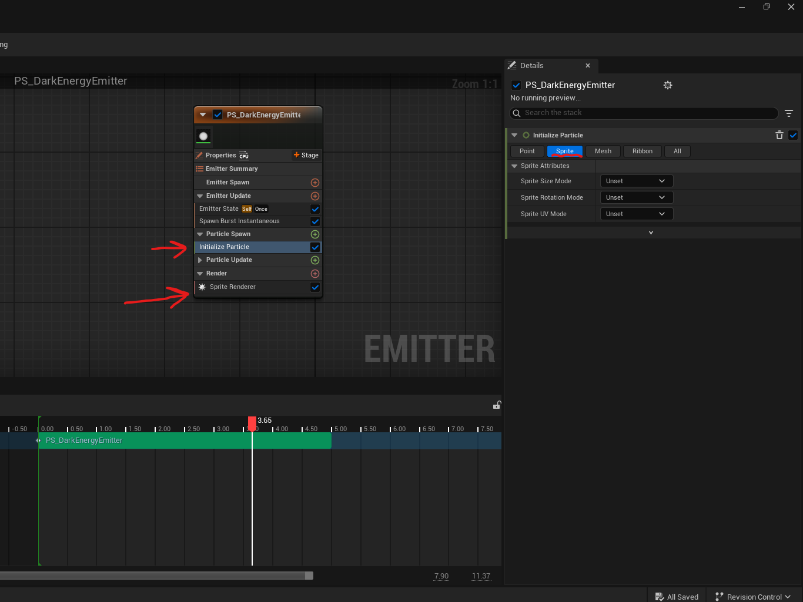
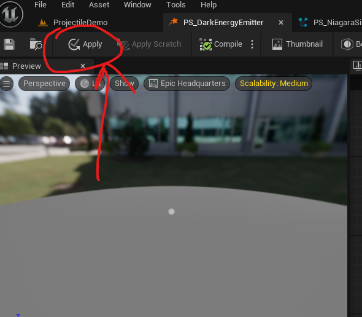

# Niagara Particle System

# Emiiter

## Add or create

- right click in content drawer
- FX -> Niagara Emitter -> Create empty niagara emitter

- its like a stack, i.e. the module at the end will be above all

## Emitter Update

- add Emitter state

### Emitter State (Always add this)

- control timeline
  - lifecycle mode - self
  - loop behavior - once
  - loop duration mode - fixed
  - loop duration - 5 (5 seconds)

### Spawn Rate (preffered mode to create particles)

to actually create some number of particles

- SpawnRate set to 50

### Spawn burst instantaneous

to actually create some number of particles

- Spawn Count
  - 1 to create particle with less density
    - higher count to create more density

## Particle spawn

### initialize particle (default)

- particle duration
  - under Point
    - Point Attributes
      - Lifetime Mode - Direct Set
        - Lifetime - 2s or whatever
- set size of a particle
  - set "Sprite Size Mode" to "Uniform"
    - Uniform Sprite Size - 60 (default is 10)

### Add velocity

to create and start moving the particles in any direction

<b>Note: </b>

- To resolve the unmet dependency of "Solve forces and velocity", either click on "Fix Issues"
- add the "Solve forces and velocity" module to the `"Particle Update"`

#### velocity mode

- linear
  - like a line
- from point
- in cone
  - adjust "Cone Axis" to change the direction in which the particles are spawns

### Shape Location

to contain the particles within the shape

<b>Note: </b>

- increase the SpawnRate in "Emitter Update" -> "Spawn Rate"

#### Shape Primitive

- sphere, torus, cylinder etc

## Particle Update

### particle state

- Kill particles when lifetime is expired - true

<b>Note: </b> Prevent memory leaks - by enabling the "Kill particles when lifetime is expired"

### Scale color (control opacity)

- in the scale alpha dropdown, select "Float from Curve"
- 
- to adjust the curve
  - middle mouse click to add key frame
  - select the keyframe and press 1 to fine tune the graph with tangent
- 

### color (control color, gradient)

- change color curve to "color from curve"
  - gradient
    - double click on the sliders to select colors

## Render

- Sprite Renderer

<b>Note: </b> if the renderer is sprite then in the "particle spawn" set only for sprite and vice versa

- 

# Niagara System

## add or create

- right click in content drawer
- FX -> Niagara System -> Create as empty or from any template

### import emitter

- press e
- right click -> add emitter and saerch for the existing emitter

<b>Note: </b> make sure you have press the apply and compile at the top left corner for the emitter

- 
