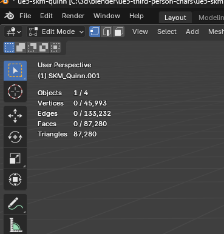
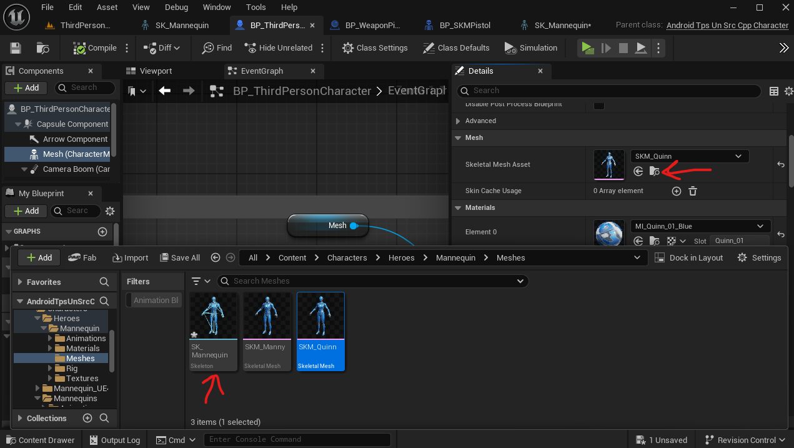
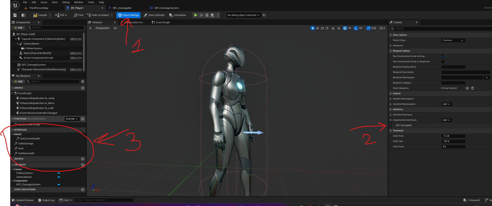
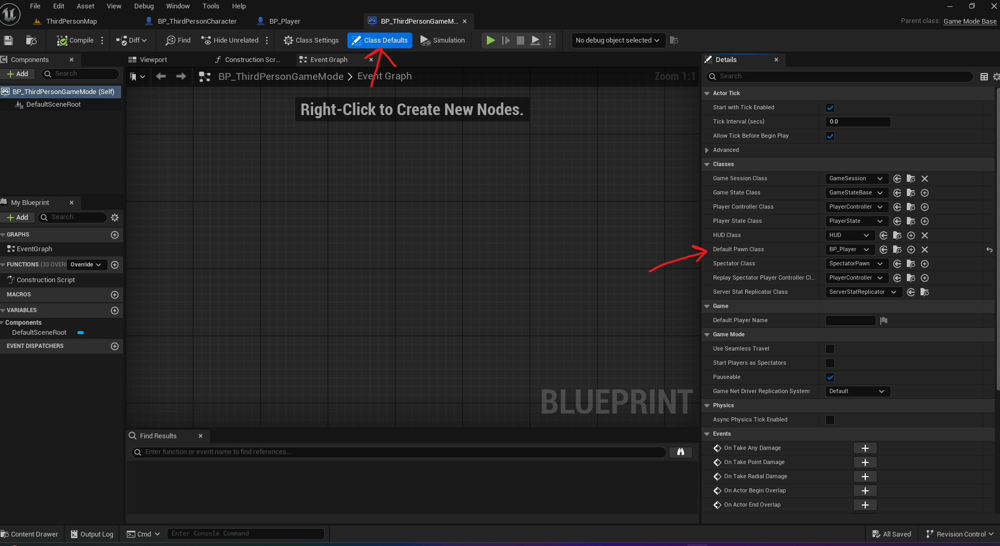
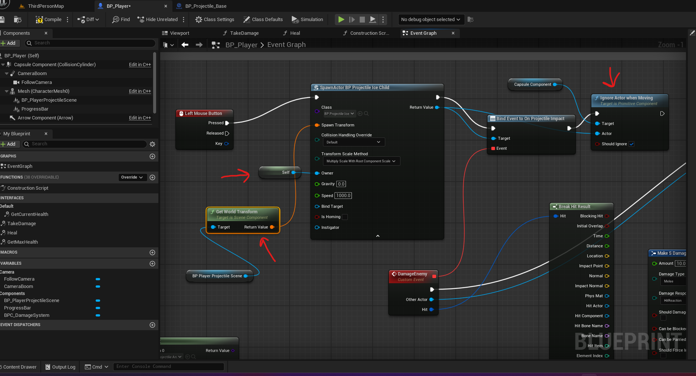
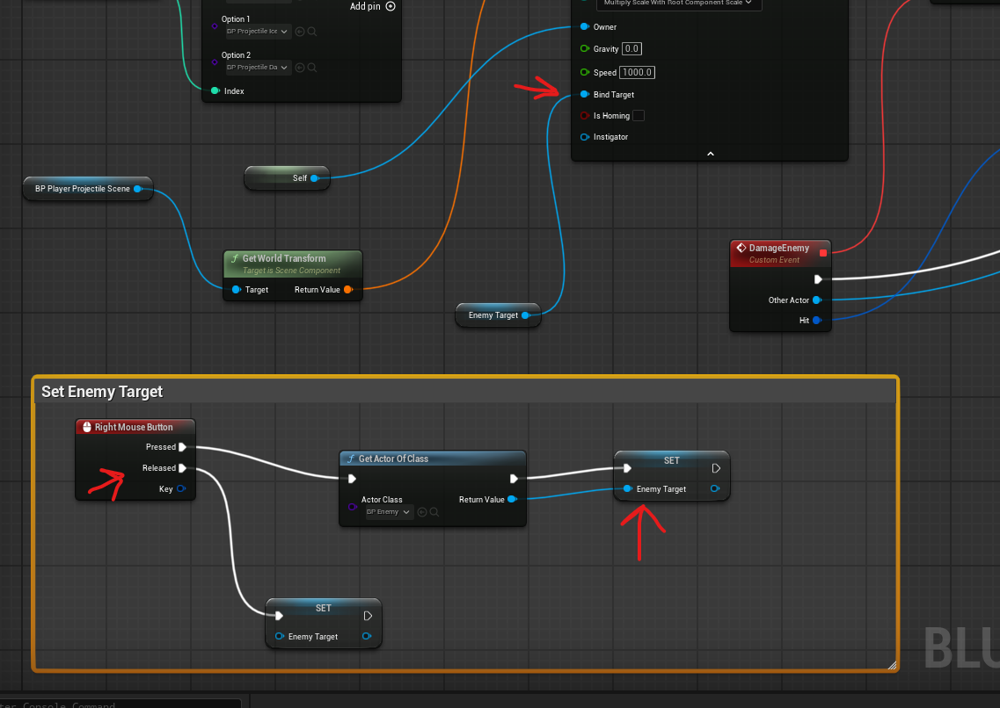
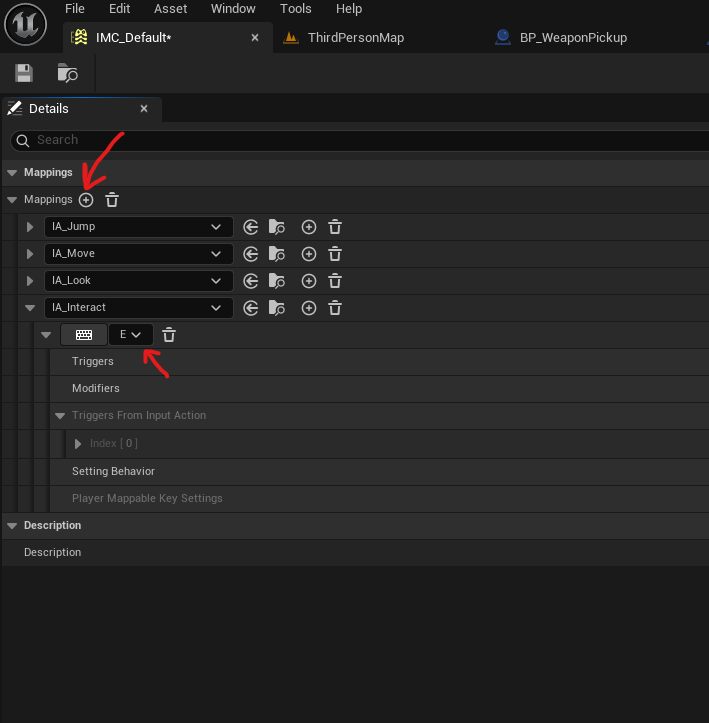

Player

# Character Class

## third person character

### mesh

- contains skeleton mesh [here](./player.md#skeleton)

#### polycount
- 

# skeleton

- 
- any sockets should be attached to this mesh and not to the anim mesh skeletal mesh
  - NOTE: the animation class could point to a different skeletal mesh

# configs

## Default starter player

- in Blueprint Project
  - Open `BP_ThirdPersonGameMode` -> Class Defaults
  - 

## Add custom interface to player (attach custom blueprint)

- to replace the existing blueprint class of a player, create a blueprint class -> character
- 
- in the BPThirdPersonGameMode, add it to the "Default pawn class"
- 
  - in the class default -> details panel

# player abilities

## crouch

- in BP_ThirdPersonCharacter component blueprint edit
- in details search
  - can crouch - checked
  - camera lag - checked
  - camera lag speed - <= 10

## spawning weapons

- 
- first add an key press event
  - then on press select actor spawn
    - add the class of the actor that we want to spawn
    - set owner to self
      - coz this later is used in the spawned actor to get
  - for the player main mesh (CapsuleComponent) set the ignore when moving with "Should Ignore" to true
- attach the on projectile impact event
  - add a custom event to this and call the take damage

## set target

- 
- create variable (no need to expose it)
- set a target using "Get actor of class"
- and set the variable
  - this variable is usaully the one taken up by the actor doing the damage for its target

# Player Inputs

- in content browser -> right click -> Input -> Input Action

## Trigger

- under Action -> Triggers -> click on `+`
- From dropdown select
  - Hold
    - threshold in seconds (ex. 0.5)
    - Is One Shot - checked

### Add to the IMC_Default

- 
- click `+`
- select the newly `IA_<new action>`
- select the keyboard key

# Mesh (BP_ThirdPersonCharacter Mesh)

## find mesh's skeleton

- locate the mesh the content browser
- right click -> Skeleton -> Find Skeleton
