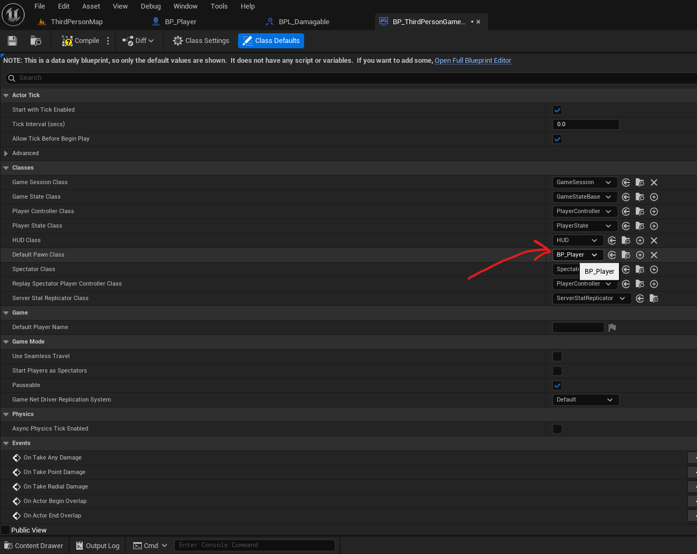
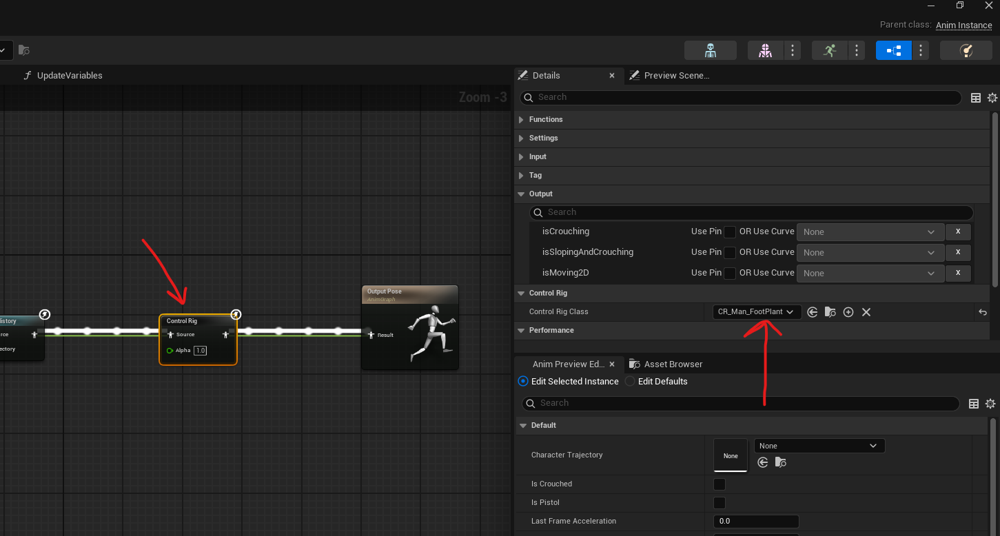

Player

# configs

## Default starter player

- 

## Add custom interface to player (attach custom blueprint)
- to replace the existing blueprint class of a player, create a blueprint class -> character
- 
- in the BPThirdPersonGameMode, add it to the "Default pawn class"
- 
  - in the class default -> details panel

# player abilities

## crouch
- in BP_ThirdPersonCharacter component blueprint edit
- in details search
  - can crouch - checked
  - camera lag - checked
  - camera lag speed - <= 10

## spawning weapons

- 
- first add an key press event
  - then on press select actor spawn
    - add the class of the actor that we want to spawn
    - set owner to self
      - coz this later is used in the spawned actor to get
  - for the player main mesh (CapsuleComponent) set the ignore when moving with "Should Ignore" to true
- attach the on projectile impact event
  - add a custom event to this and call the take damage

## set target

- 
- create variable (no need to expose it)
- set a target using "Get actor of class"
- and set the variable
  - this variable is usaully the one taken up by the actor doing the damage for its target

## Fix IK (foot position )
- locate the Control rig for the mesh
  - like CR_Mannequin_FootPlant
- open it -> in the "Rig Hierarchy" -> select all bones and right click -> refresh -> select the new mesh
- go to the Anim Graph of the animation blueprint
- between pose history and output pose add the control rig (right click -> misc -> control rig)
- 