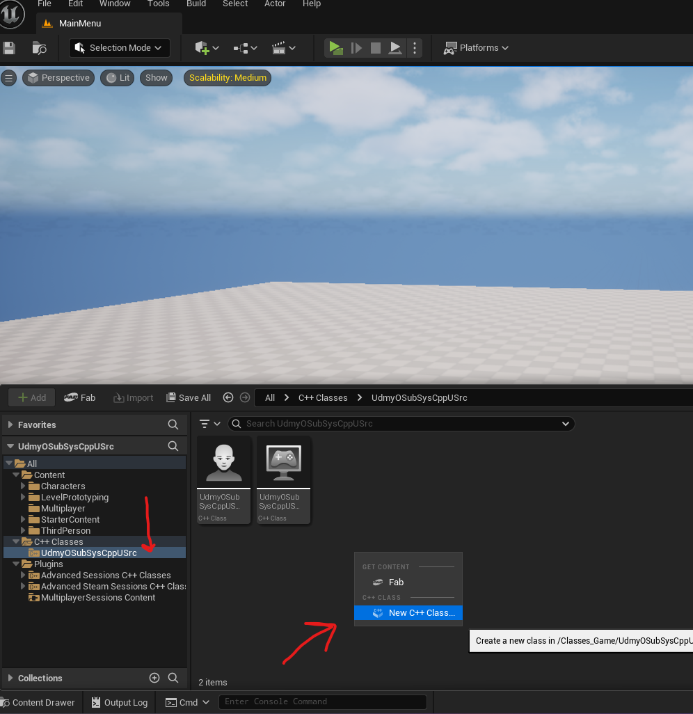
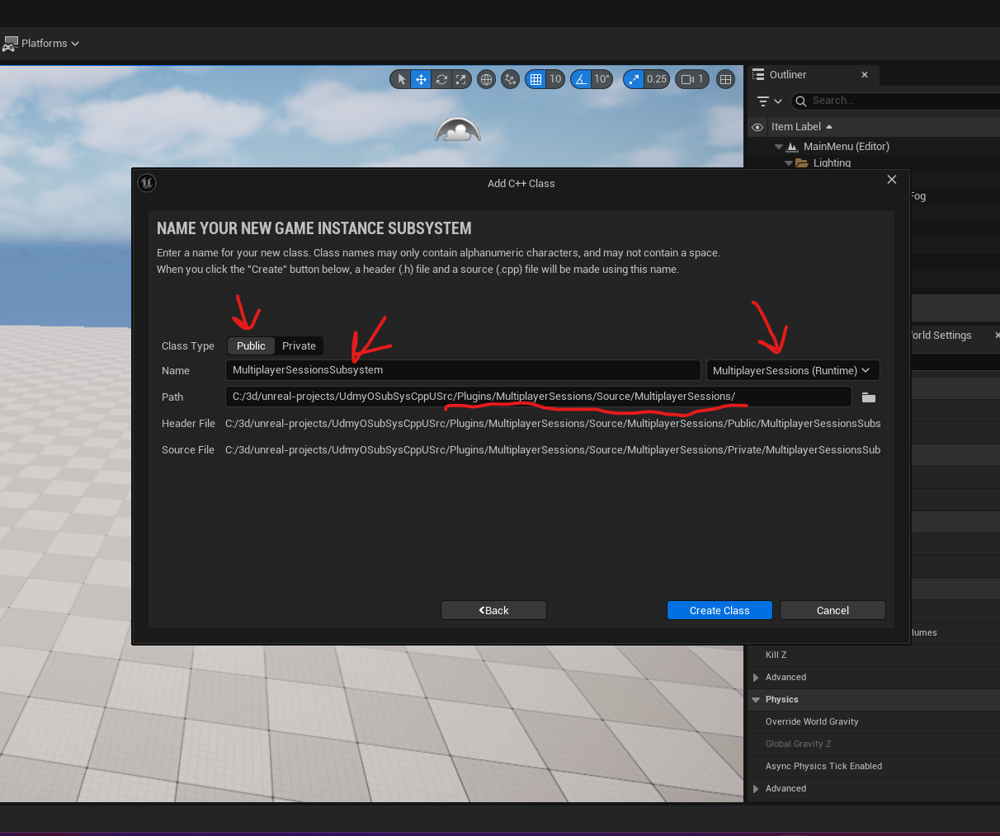

# plugin

a plugin in unreal project is a module, inside it can have more plugins

# new plugin

from the top unreal menu, go to edit -> plugins -> `+ Add` -> blank -> add author and description -> create

## add dependencies

- in the `<added plugin name to the project>.Build.cs`, under PublicDependencyModuleNames.AddRange
  - add "OnlineSubsystem", "OnlineSubsystemSteam"
- generate project files by right clicking on `<added plugin name to the project>.Build.cs`

### add in the `.uproject`

```json
{
  "FileVersion": 3,
  "EngineAssociation": "{BDC638EC-45BA-5023-6885-0BA624E5EF33}",
  "Category": "",
  "Description": "",
  "Modules": [
    {
      "Name": "UdmyOSubSysCppUSrc",
      "Type": "Runtime",
      "LoadingPhase": "Default",
      "AdditionalDependencies": ["Engine"]
    }
  ],
  "Plugins": [
    {
      "Name": "ModelingToolsEditorMode",
      "Enabled": true,
      "TargetAllowList": ["Editor"]
    },
    {
      "Name": "OnlineSubsystem",
      "Enabled": true
    },
    {
      "Name": "OnlineSubsystemSteam",
      "Enabled": true
    },
    {
      "Name": "AdvancedSessions",
      "Enabled": true
    },
    {
      "Name": "AdvancedSteamSessions",
      "Enabled": true
    },
    {
      "Name": "LiveLinkControlRig",
      "Enabled": true
    },
    {
      "Name": "AppleARKitFaceSupport",
      "Enabled": true,
      "SupportedTargetPlatforms": ["IOS", "Win64", "Mac", "Linux", "Android"]
    }
  ]
}
```

## add class to the project

- 
- then select `all classes` -> UGameInstanceSubsystem
- 
