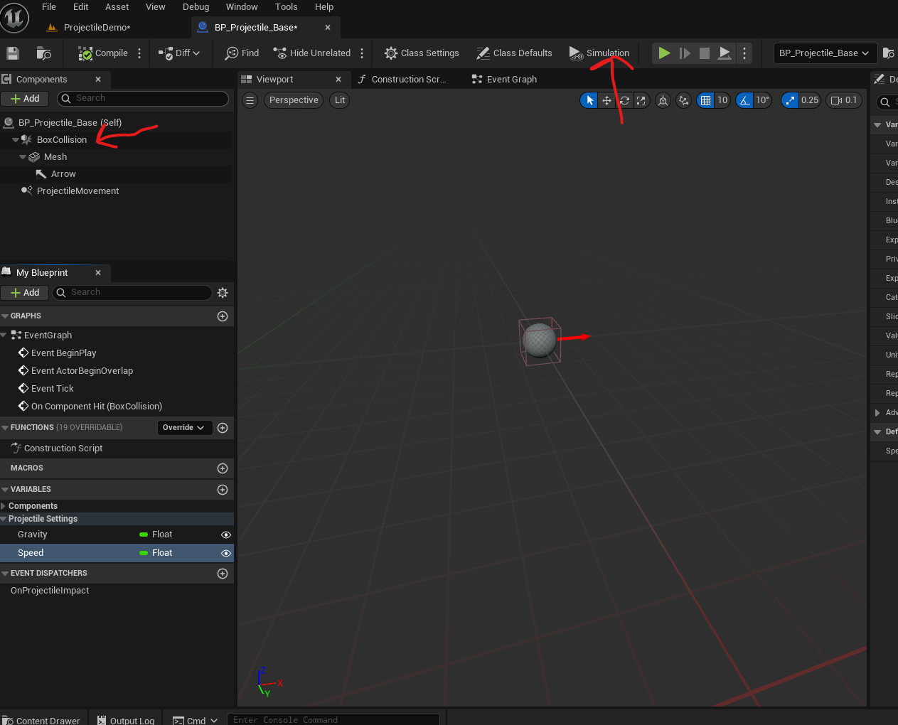
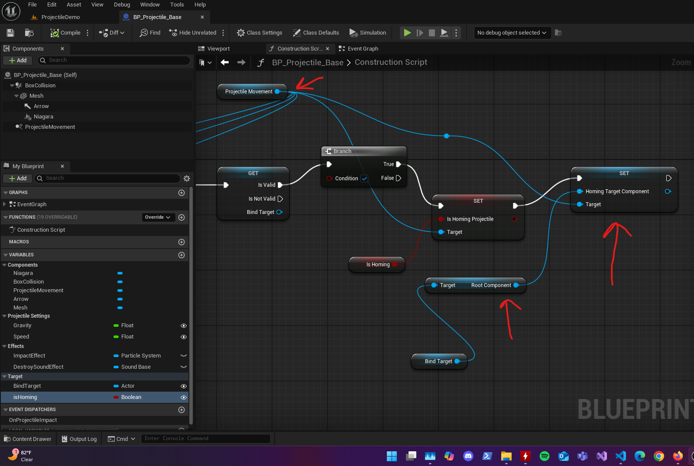
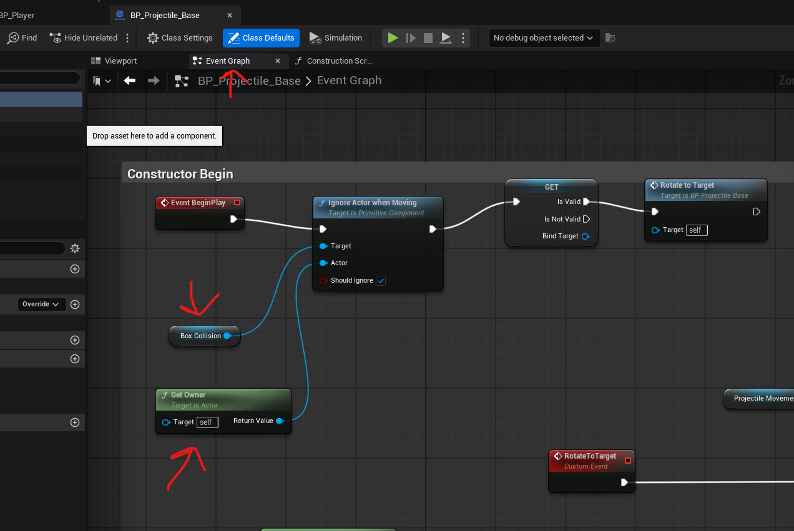
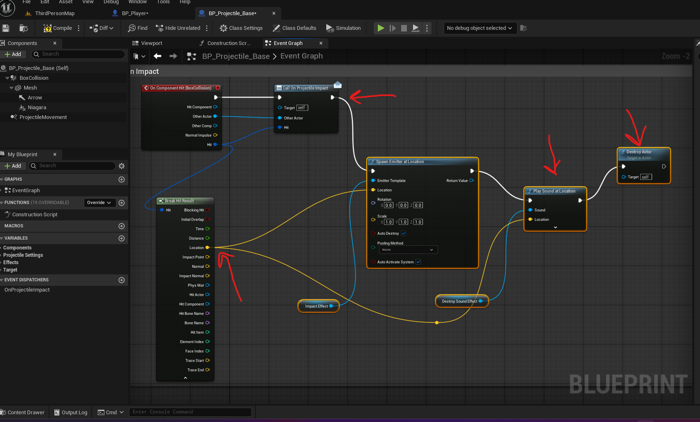
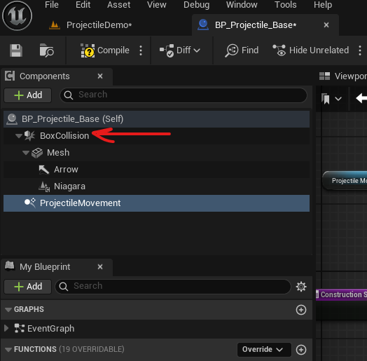

Projectiles

# Get started

- add blueprint class

# for Projectile Movement and collision

- add box collision
  - add mesh and arrow under it
- add ProjectileMovement
- press "Simulation"
- 

## make it moving horizontly

- click on ProjectileMovement
- in details section
  - Projectile
    - Initial speed - 500
    - Max Speed - 500
    - Projectile Gravity Scale - 0

## make the object follow rotation (rotate while falling down)

- click on ProjectileMovement
- in details section
  - Projectile
    - Rotation follows velocity - true

## make the projectile follow a moving target

- click on ProjectileMovement
- in details section
  - Homing
    - is homing projectile - true
    - homing acceleration magnitude - to 2000
      - otherwise projectile's speed will be 0

<b>Note: </b>

- 
- the ProjectileMovement homing requires the root of the target, that is the Map

## make the projectile not collide with the spawner

- 
- start by dragging the collision detect module
- once the "collision detect module", drag the connector out of it and search "Ignore actor when moving"
  - select the correct mesh which has collide detection (usually BoxCollision)
- get and set the owner
  - this function will return the spawner (i.e. owner)
- (optional) - get and set the instigator
  - TODO: need to find out how
- set "Should Ignore" to true

## on impact do damage

- on box collision -> details -> events -> on Component hit -> click on +
- 
- add the function "call on projectile impact"
  - we can directly attach a Destroy actor here
    - but we add the particle that will appear on impact and sounds here
  - get the location of impact using "Spawn emitter at location"
    - this location can be retreived using "Break hit result"

# Enable collsion

- on box collsion -> Details - collision -> set the collsion preset to "BlockAllDynamic"

<b>Note: </b>

- if there is a mesh inside the collision box then set "NoCollision" on the mesh
- also make sure the BoxCollision module is at the root (is default) in the blueprint class
- 
