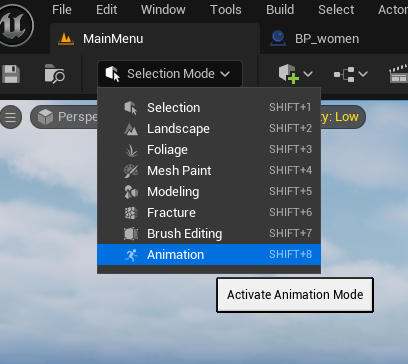
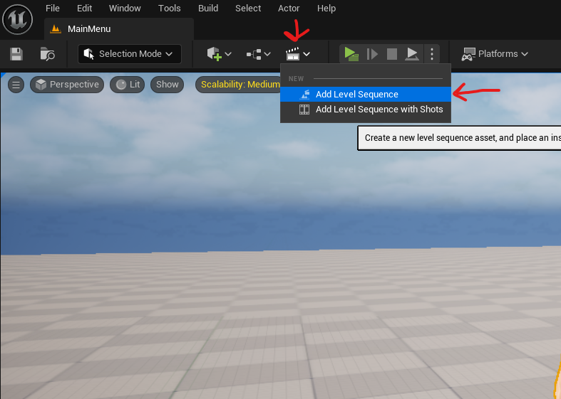
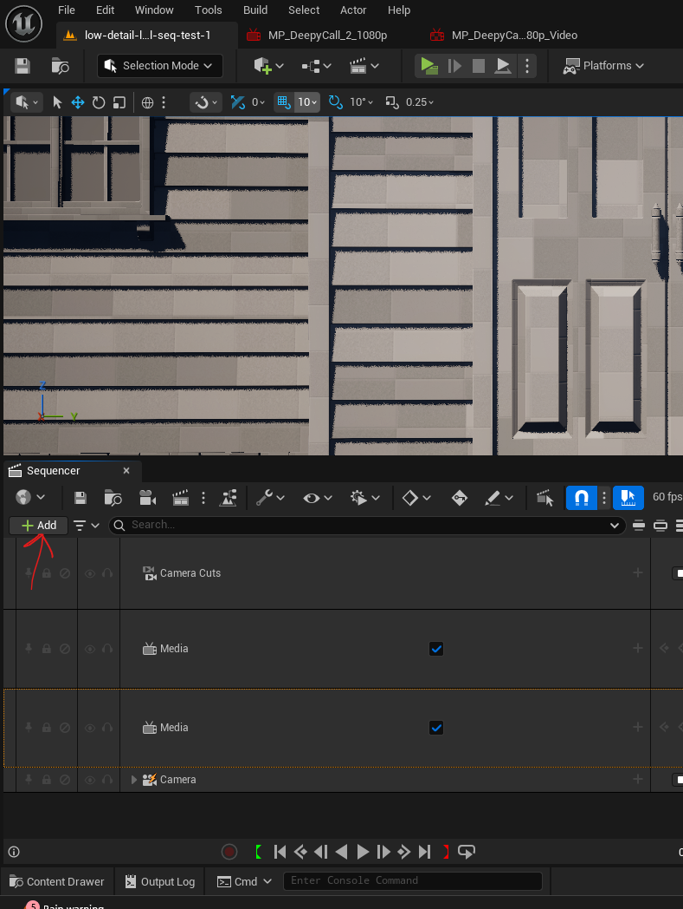
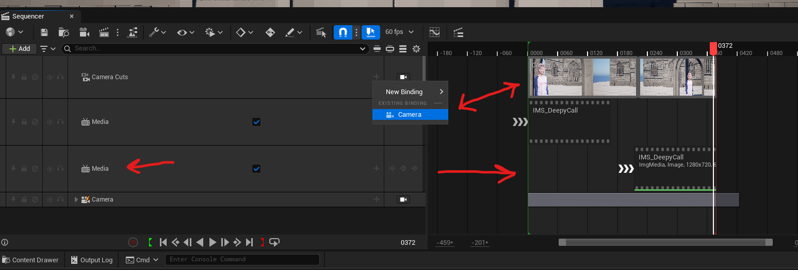

# level sequencer

## switch to animation

- 

## add

- 
- create a folder called "Sequencer" or anything
- give name and save it and open it
- 
- click on add
  - to add sequencer components such as media, camera etc

### media

- 
- media `+` button -> select the image media source
- right click on the media track -> properties -> add texture

### camera

- for new media add camera cuts
  - so that the camera cut track wont be empty
  - if left empty then while rendering the movie, the clip will not form
- 
