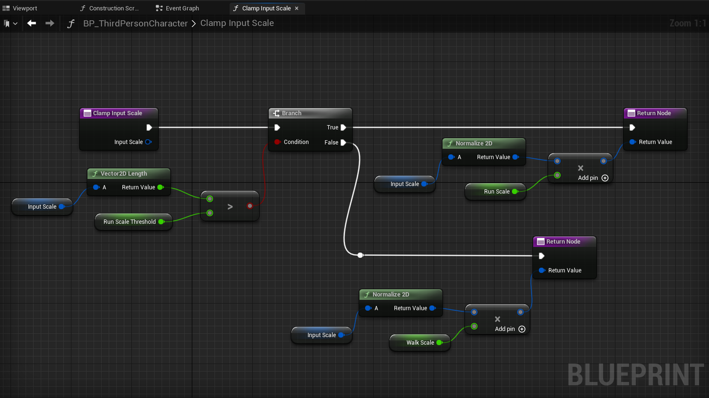
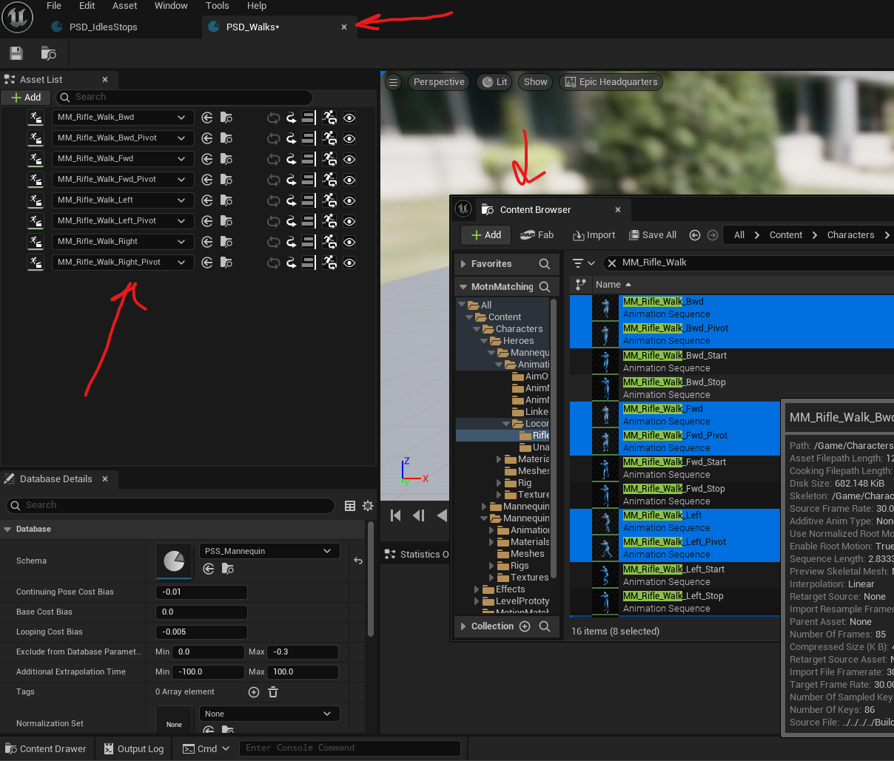
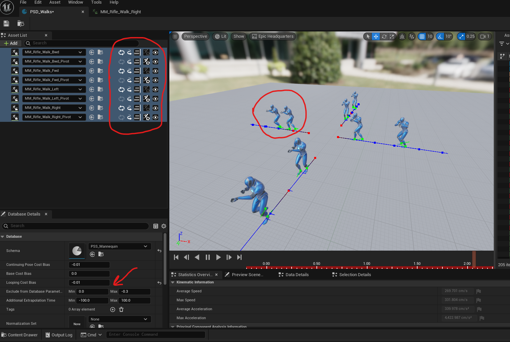
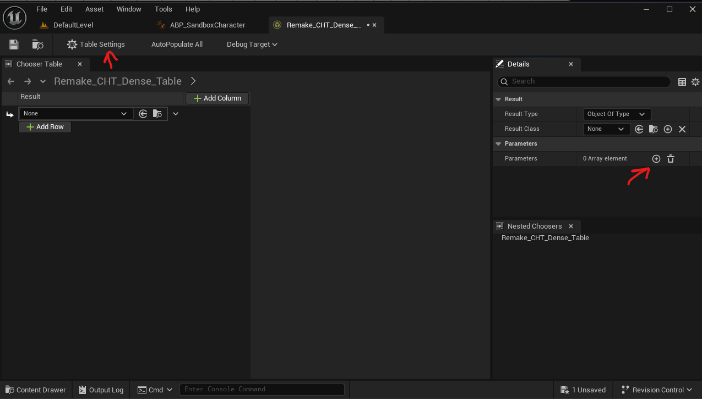
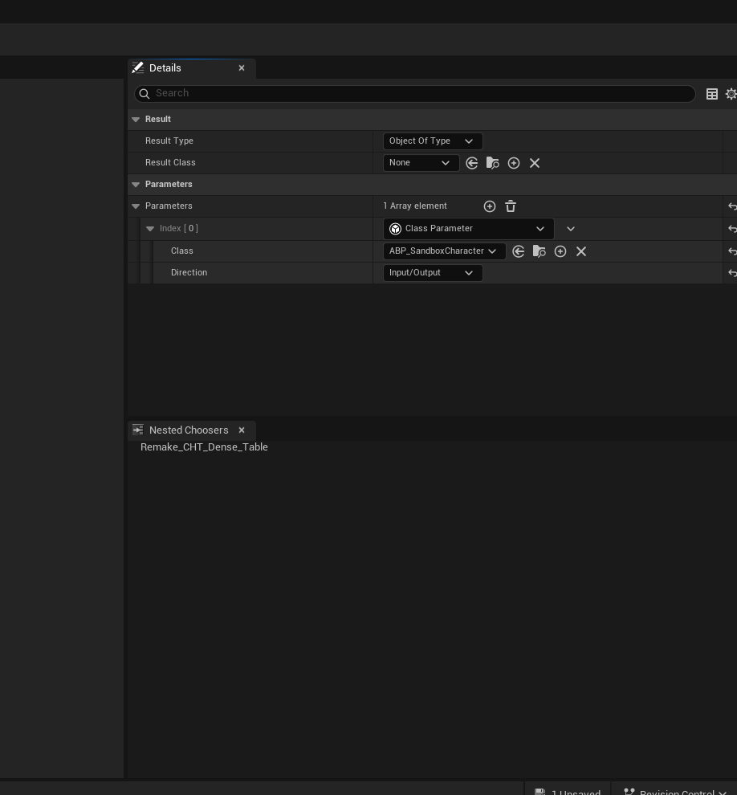
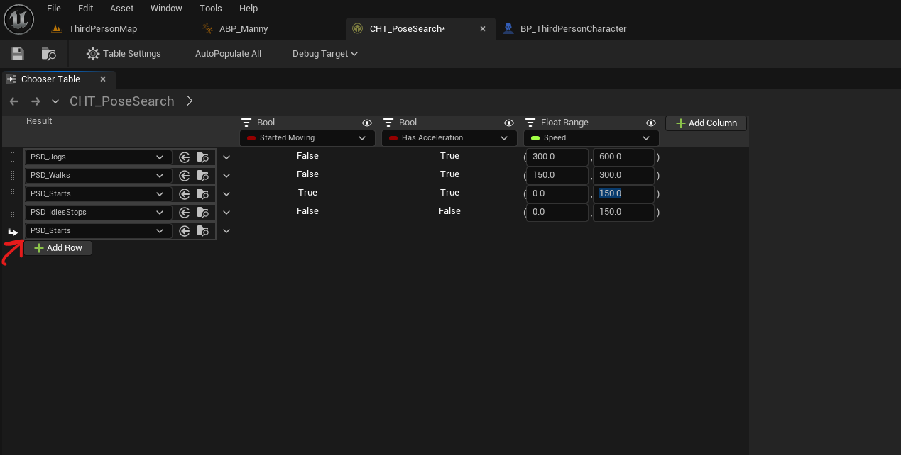
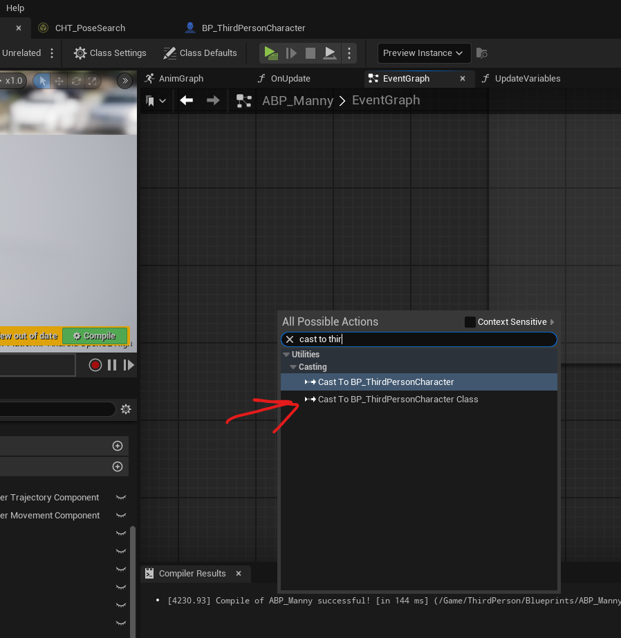
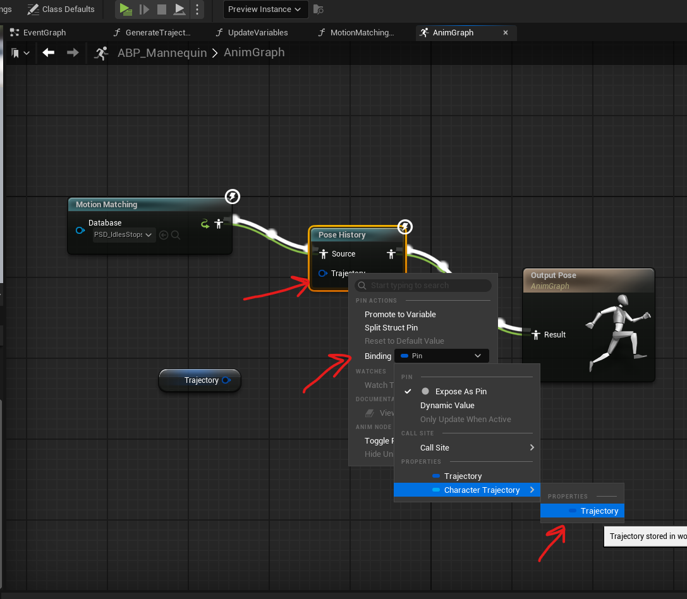
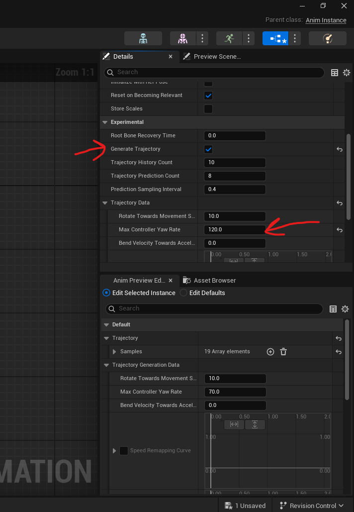

# tutorial

- https://dev.epicgames.com/community/learning/tutorials/lwlG/unreal-engine-your-first-60-minutes-with-motion-matching

# prerequisite

- unreal editor plugins - Pose Search, Chooser, Animation Insights, Animation Warping

# init in character component (BP_ThirdPersonCharacter)

- Use Controller Rotation Yaw - checked
- Orient Rotation To Movement - unchecked
- set Max Acceleration = 800.0
- Max Walk Speed = 600.0
- Min Analog Walk Speed = 300.0
- in content brower - `IMC_Default`
  - IA_Move
    - Gamepad Left Thumbstick 2D-Axis Section
      - Modifiers -> `Index[1]` -> set Scalar values to 1,1,1
- add 3 variables
  - RunScale - float - 1.0
  - WalkScale - float - 0.5
  - RunScaleThreshold - float - 0.75
- create this function `ClampInputScale`
  

# Motion Matching Assets

## trajectory

- to debug or show the trajectory in the game console

  ```
  a.AnimNode.PoseHistory.DebugDrawTrajectory 1
  ```

## prepare animation sequences

### Enable root motion and root look

- select all animation sequences
- right click -> asset actions -> edit selection in property matrix
- check EnableRootMotion and ForceRootLock

## Schema

- content browser -> right click -> animation -> motion matching -> pose search schema
  - Select skeletal
    - example - SKM_Manny

<b>Note:</b>

- split databases for walk, jog, idles + stop so that mation match can correctly select frames

## db

- content browser -> right click -> animation -> motion matching -> pose search database
  - Select Pose search schema

### Add animations assets

- 

### configs

- 
- right click on the added non pivot "Animation Sequences" -> Disable the ‘Reselection of Poses’
- open the "Animation Sequences" in the "Asset Details" -> check loop
- in "Database Details" set the "Looping Cost Bias" to -0.01

## choosers

- in content browser -> right click -> miscellineous -> chooser -> dont select any class or struct
- 
- table setting is global settings for chooser table
  - other settings in details are displayed when any row or their columns are selected
- under result -> type should be "Object of Type" and result class should be "PoseSearchDatabase"
  - this lets us select out created pose search databases for the rows
- add animation blueprint class under parameters
- 
  - whatever that we select here will be the type for the columns in chooser table

<b>Note: </b> never keep the last row empty

- 

## animation blueprint

### event graph

- use the cast to character movement component to use it as ref in other functions
- 

### anim graph

#### pose history

- 
- right click on the trajectory and set binding
  - only variable of type `Pose Search Query Trajectory` and `Character Trajectory Component` will show
- select pose history and in the "Details" tab set following settings for the generate trajectory
- 

#### motion matching

- add and select motion matching
- in the "Details" tab
- under Settings - database -> pin
  - change the pin to the dynamic pin and uncheck "Expose as pin"
- under functions
  - on Update dropdown -> create binding
    - this create a OnUpdate function automatically

##### on update

- add evaluate chooser
  - in details set the pose search chooser
- add search data to search, convert to motion matching
- interupt value to be set as follows (first promote it as variable)
  - if HasAcceleration
  - is true then "Do not interrupt"
  - else interrupt is "interrupt of database change and invalidate continuing pose"
