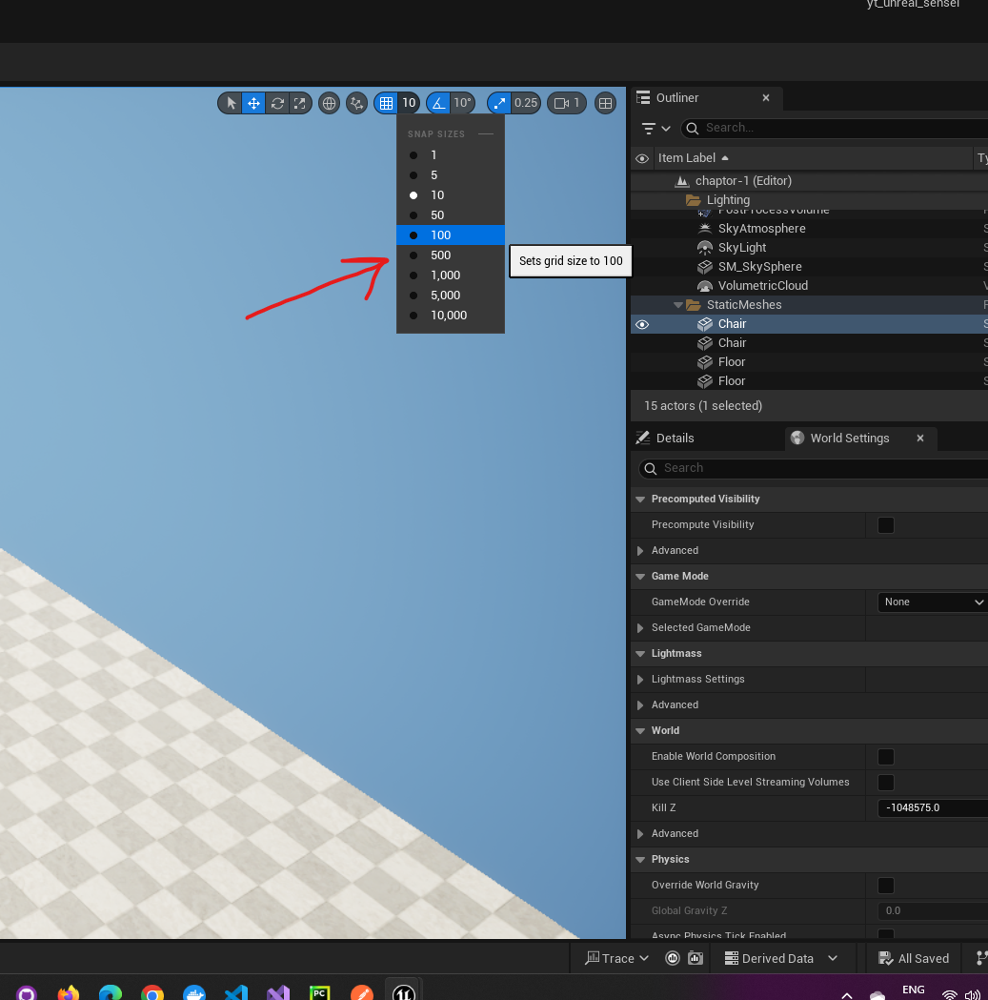
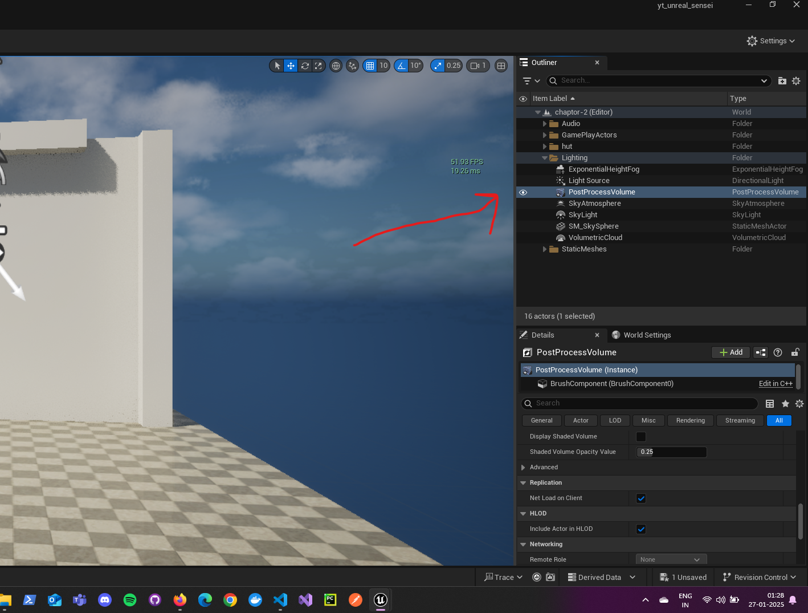
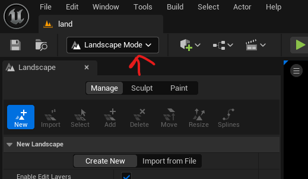

Unreal Engine Basics

# Performance

- change the settings
- 
- disable the volumetric cloud
- 

# project

## start the project with starter content

- while naming the project
- check the "Starter content"

## minimum default map

### chair, table and floor

- 

## add the content starter

- 
- in the popup -> content -> select "starter content" -> "Add to Project"

# Editor UI

## basics

- enable framerates
  - ctrl + shift + h

## default settings

- 

## tabs

- right click and hide it, else click on the blue button
- 

## content drawer

to open press ctrl + space

### filter

- 

## world settings tab

- 

# camera

- right click and then the following
- 

- right click + z - wider POV
- right click + c - smaller POV

## speed

- 
- ritgh click + scroll up or down

## focus on object

- select object
- press f

### rotate around the object

- alt + left click and move mouse

### slowly zoom in\out on the object

- alt + right click and move mouse

# objects

- view object

  - select
  - go to asset management -> double click on the asset

- hide all widgets - press G

- hide/show objects
- 

## move, scale, rotate

- 

### snap

- movement
- 

- rotate
- 

- scale
- 

### snap to another object (object below it or the floor / ground)

- select object
- press end

### lock and move

- 

## duplicate

- ctrl + d
- drag and duplicate
  - press w to switch to movement
  - alt + click on any axis

### duplicate in a content drawer

- copy and paste there only
- or ctrl + d

## add and drag

- 
    - click and drag where you want to drop the shape

# multiple

- shift + click
- ctrl + click (unselect multiple)

# lock camera while moving

- shift and drag

# Post process

- select post process volume
- 
- in details tab
- 

## volume settings

- keep post processing within cube or extend it to entire world
  - post process volume settings -> infinte extent
  - this is global illumination ()

## auto exposure

- Lens -> Exposure -> Metering Mode -> Auto Histogram or Auto Basic
  - also enable the Exposure Compensation

## disable game view

- this disables the light exposure
- 

# level

- file -> new level -> basic level

## open level blueprint

- 

# landscape mode (shift + 2)

- refer - https://dev.epicgames.com/documentation/en-us/unreal-engine/landscape-technical-guide?application_version=4.27

- 
- after adding double click on the new level

- switch to landscape mode
- 

- hit create
- 

## lights

### create sky

- add -> lights -> Sky Light, Directional Light
  - Directional Light
    - Details -> Transform -> Mobility -> Movable
  - Sky Light
    - Details -> Light -> Real Time Capture
- add -> Visual Effects -> Sky Atmosphere, ExponentialHeightFog
  - ExponentialHeightFog
    - move the ExponentialHeightFog up or down to inrease / decrease fog

### brush

- select any -> click to draw and shift + left click to deform

## Material

- double click on the meterial (in content drawer) to open the node editor

- right click in any folder of "Content Drawer"
  - add Material
- 

#### Landscape layer blend

- 
- add texture nodes from "Content Drawer" -> Starter Content -> Textures
- 
- press apply

#### adjust sun direction

- press and hold ctrl + l and move the mouse

# packaging

- pack and create executable files
- 

## Android
- java openjdk 17 for 5.5+
- https://dev.epicgames.com/documentation/en-us/unreal-engine/advanced-setup-and-troubleshooting-guide-for-using-android-sdk

## launch
- follow - [link](https://dev.epicgames.com/documentation/en-us/unreal-engine/setting-up-unreal-engine-projects-for-android-development)
  - setup the phone (enable developer mode and usb debugging)
- 
  - package for android and use .bat file
    - ex. `Install_AndroidTpsUnSrcCpp-Android-Shipping-arm64.bat`

<b>Note: </b> The development mode of launching doesnt work, so package and use .bat file to install in the plugged in android phone