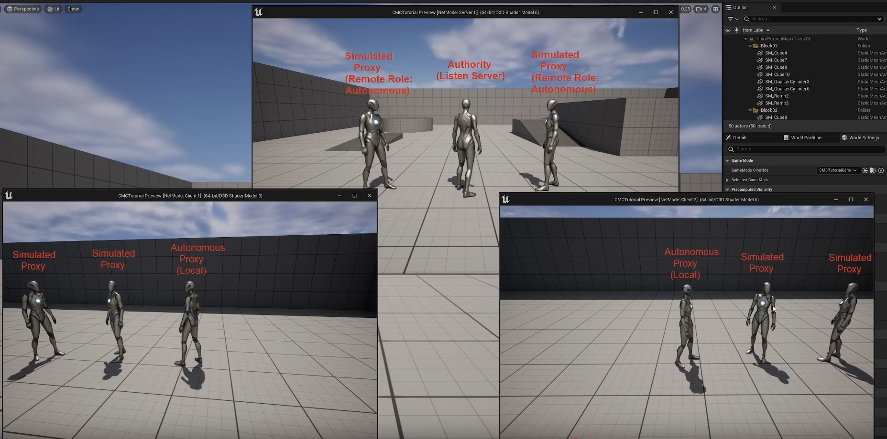

# refer
- overwatch multiplayer - https://www.youtube.com/watch?v=vTH2ZPgYujQ&t=0s

# CharacterMovementComponent.cpp

## tick 

-  CharacterMovementComponent.cpp
- `void UCharacterMovementComponent::TickComponent(float DeltaTime, enum ELevelTick TickType, FActorComponentTickFunction *ThisTickFunction)`

### LocalRole 
- what is my role locally
    - could be authority in case i have host a listen server
    - else could be autonomous proxy for joing a server

### RemoteRole
for other players connected to the same server that i have joined, in their view im a simulated proxy

### refresh rate
- 60 hz on server, while 72hz on client
- client are ahead of time

- 

net-modes-roles.png

### smoothing - `void UCharacterMovementComponent::SmoothClientPosition(float DeltaSeconds)`

# CharacterMovementComponent.h

## chnageble functions
- virtual void ClientAdjustPosition_Implementation

## FSavedMove_Character::CompressedFlags

### enum CompressedFlags
- the bitrate here needs to reduced as much as possible at every single tick
    - 1 Byte - 8 bit - 8 Flags
    - https://www.youtube.com/watch?v=TuHFeS_eBe8&t=0s

# Movement
- client sends say supose 5 moves to the server
- but server checks its state and if server finds incorrect state then it replays the client

# correction
- unreal out of the box has location correction and no rotation correction