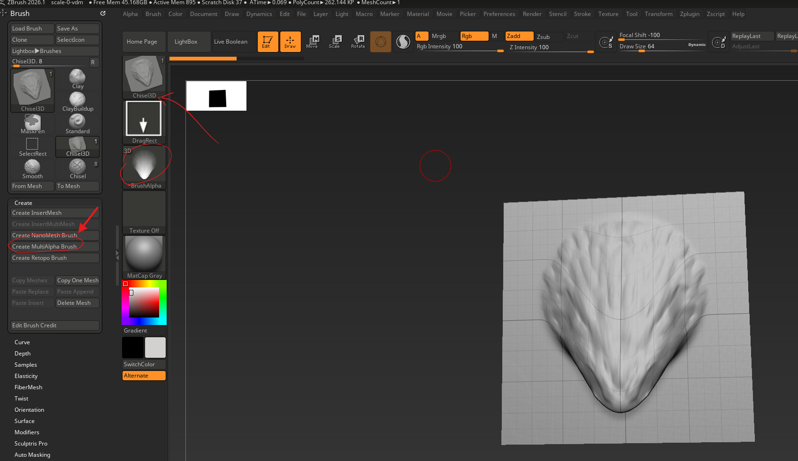
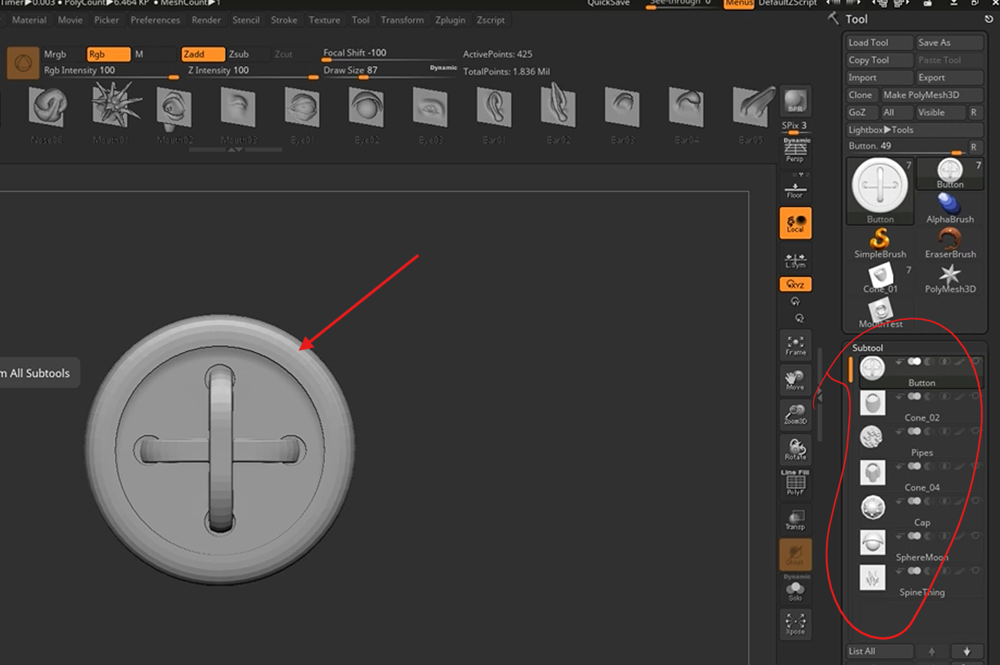
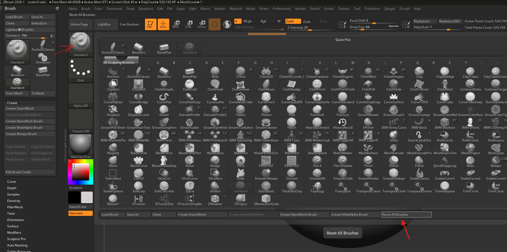
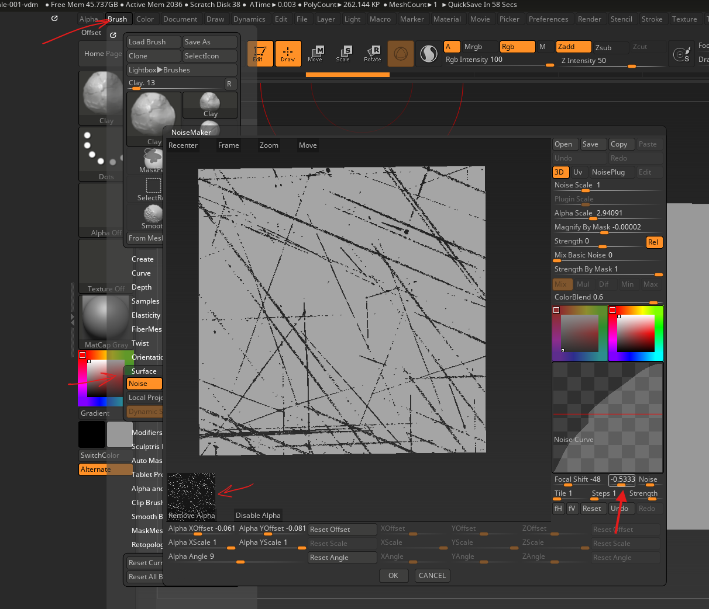

# **Brush**

## prevent backface sculpt

- brush -> auto masking -> backfaceMask

# VDM

- [refer video here](https://www.youtube.com/watch?v=FB07uGbFje8)

## create

- LightBox -> projects -> misc -> Brush3DTemplate.ZPR
- scuplt details and make sure the edges are flat
  - you can mask the edges
  - tool -> deformation -> Morph to grid -> move to 100% -> `then the slider automatically resets to 0`
- 
    - select the Chisel3D brush
    - go to brush -> create -> create MultiAlpha Brush
    - also position the plane facing straight, there should not be any misalignment w.r.t to the canvas
    - make sure the BrushAlpha has only the extruded or scultped area as white gradient
    - also the alpha should have 3D on it, otherwise there the undercut details will be lost
        - this can happen if we try to generate the brush from NON grid plane
        - 

## create icon

- from tool select Sphere3D
- tool -> make PolyMesh3D
- add subdivs (ctrl + d) -> of half millions
- with new VDM alpha for chisel3D brush draw
- position the model on the canvas
- brush -> SelectIcon

## save brush

- brush -> save as
- `C:\Program Files\Maxon ZBrush 2026\ZData\BrushPresets`
- save as `.zbp`
- note that the brush pallete will now replace the Chisel3D with new brush
- 

# Noise Maker

lets us create procedural patterns

- brush -> Surface
- 
- most important setting is offset, set it negetive
- adjust curves (histogram) as required
