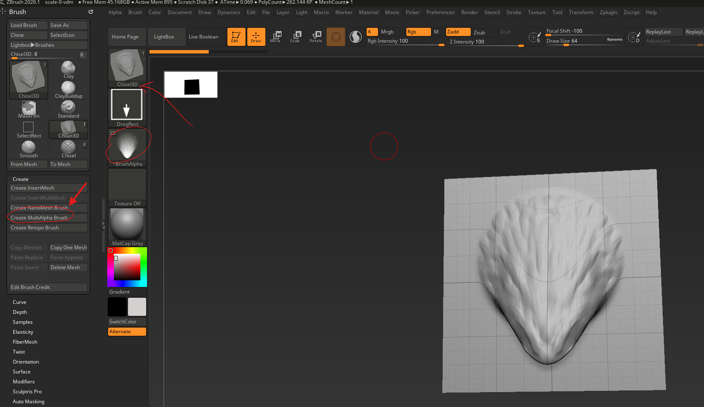
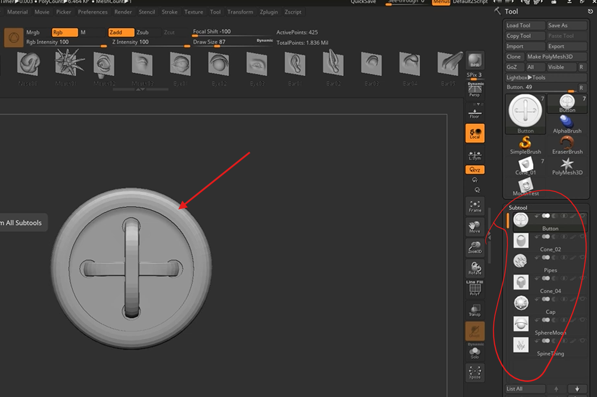
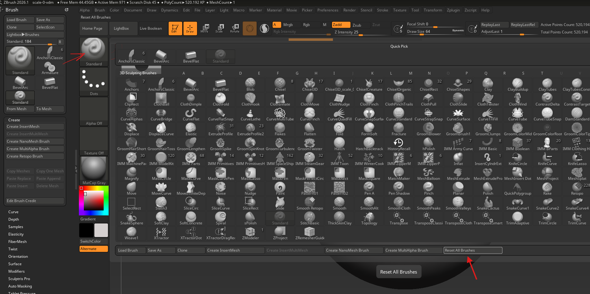
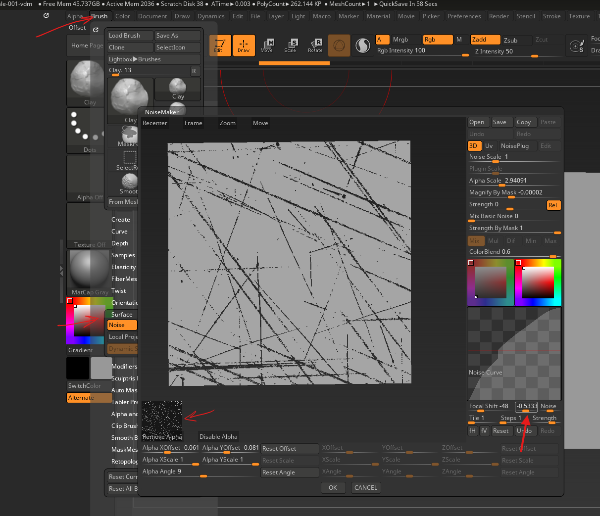
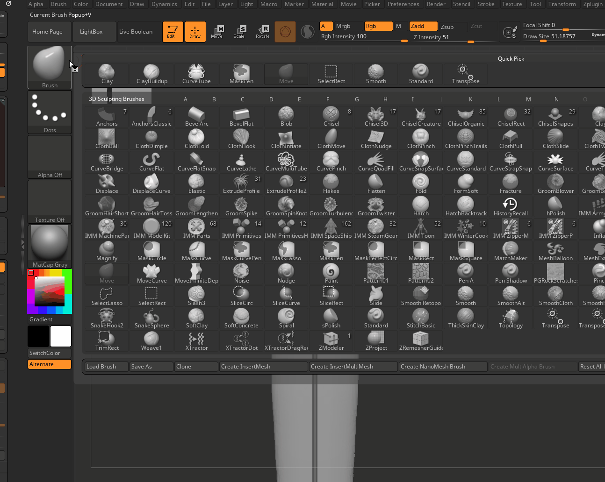
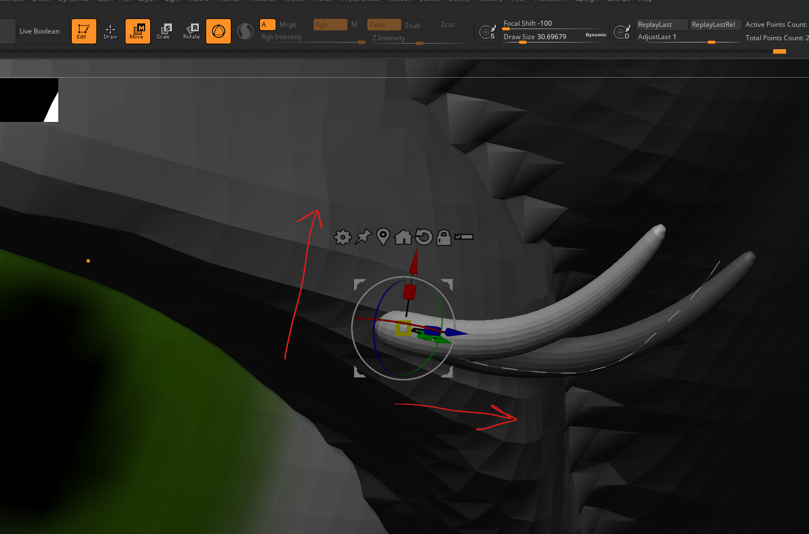

# **Brush**

## prevent backface sculpt

- brush -> auto masking -> backfaceMask

# VDM

- [refer video here](https://www.youtube.com/watch?v=FB07uGbFje8)

## create

- LightBox -> projects -> misc -> Brush3DTemplate.ZPR
- scuplt details and make sure the edges are flat
  - you can mask the edges
  - tool -> deformation -> Morph to grid -> move to 100% -> `then the slider automatically resets to 0`
- 
    - select the Chisel3D brush
    - go to brush -> create -> create MultiAlpha Brush
    - also position the plane facing straight, there should not be any misalignment w.r.t to the canvas
    - make sure the BrushAlpha has only the extruded or scultped area as white gradient
    - also the alpha should have 3D on it, otherwise there the undercut details will be lost
        - this can happen if we try to generate the brush from NON grid plane
        - 

## create icon

- from tool select Sphere3D
- tool -> make PolyMesh3D
- add subdivs (ctrl + d) -> of half millions
- with new VDM alpha for chisel3D brush draw
- position the model on the canvas
- brush -> SelectIcon

## save brush

- brush -> save as
- `C:\Program Files\Maxon ZBrush 2026\ZData\BrushPresets`
- save as `.zbp`
- note that the brush pallete will now replace the Chisel3D with new brush
- 

# Noise Maker

lets us create procedural patterns

- brush -> Surface
- 
- most important setting is offset, set it negetive
- adjust curves (histogram) as required

# Curve Tube

- once the curve is drawn the rest of the mesh is masked to avoid contact, fusing
- use smooth (add operation) to make it smaller
- use smooth (subtract) to make it big
- use move elastic brush for smoother bending the tube

## create tube on mesh with sub div (trick)

- place a dummy cube
- tool -> intialize -> QCube
- picker -> cont Z
- with the `dummy qube` selected, if we try to draw on the actual mesh with sub div, the curves will follow the `sub div` mesh

## snap distance or join or contineous

- 
- stroke -> curve modifier -> Curve snap distance

## multi curve and edit the size

- 
- keep the curve active (i.e. do not bake or cancel by clicking outside the curves)
- stroke -> curve modifiers
- enable size
- adjust the graph and click on the active curves

## create new tube (cancel the curve)

- 
- after drawing the tube click outside on the parent mesh
- or go to stroke -> curve function -> delete
- now u can drag a new tube

## seperate or split the tubes as a seperate mesh

- tool -> sub tools -> split -> splits to similar parts

## duplicate curve tubes

- adjust the gizmo
- press control and drag to make another
- 
- make sure transpose all is off

## Issues

### sticking to the surface

- picker -> depth -> once z

### if the tubes are bigger

- make sure the mesh is big enough
