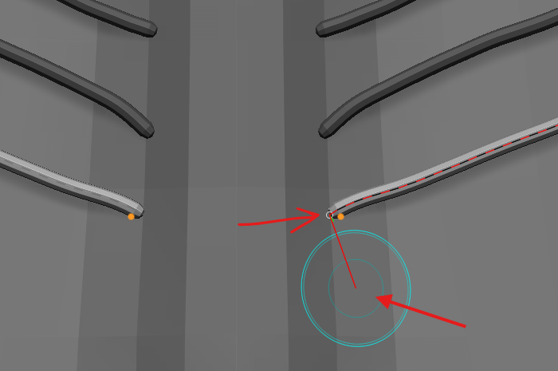

# Curve Tube

- once the curve is drawn the rest of the mesh is masked to avoid contact, fusing
- use smooth (add operation) to make it smaller
- use smooth (subtract) to make it big
- use move elastic brush for smoother bending the tube

## create tube on mesh with sub div (trick)

- place a dummy cube
- tool -> intialize -> QCube
- picker -> cont Z
- with the `dummy qube` selected, if we try to draw on the actual mesh with sub div, the curves will follow the `sub div` mesh

## snap distance or join or contineous

- 
- stroke -> curve modifier -> Curve snap distance

## multi curve and edit the size

- 
- keep the curve active (i.e. do not bake or cancel by clicking outside the curves)
- stroke -> curve modifiers
- enable size
- adjust the graph and click on the active curves

## create new tube (cancel the curve)

- 
- after drawing the tube click outside on the parent mesh
- or go to stroke -> curve function -> delete
- now u can drag a new tube

## reedit the tube (partial re edit)

- use lightbox -> brushes -> curves -> CurveEditable.ZBP

## seperate or split the tubes as a seperate mesh

- tool -> sub tools -> split -> splits to similar parts

## duplicate curve tubes

- adjust the gizmo
- press control and drag to make another
- 
- make sure transpose all is off

## Issues

### sticking to the surface

- picker -> depth -> once z

### if the tubes are bigger

- make sure the mesh is big enough
