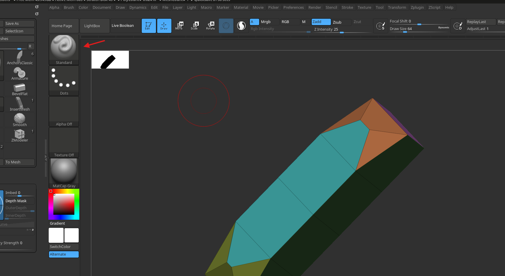
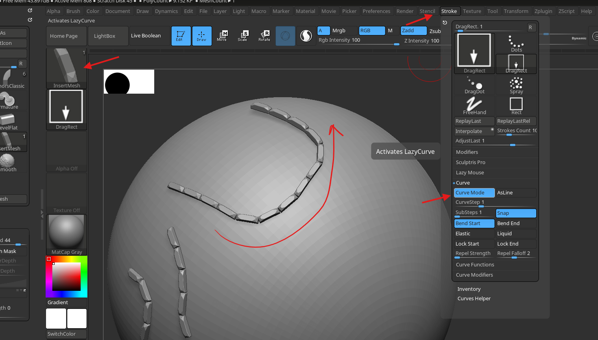
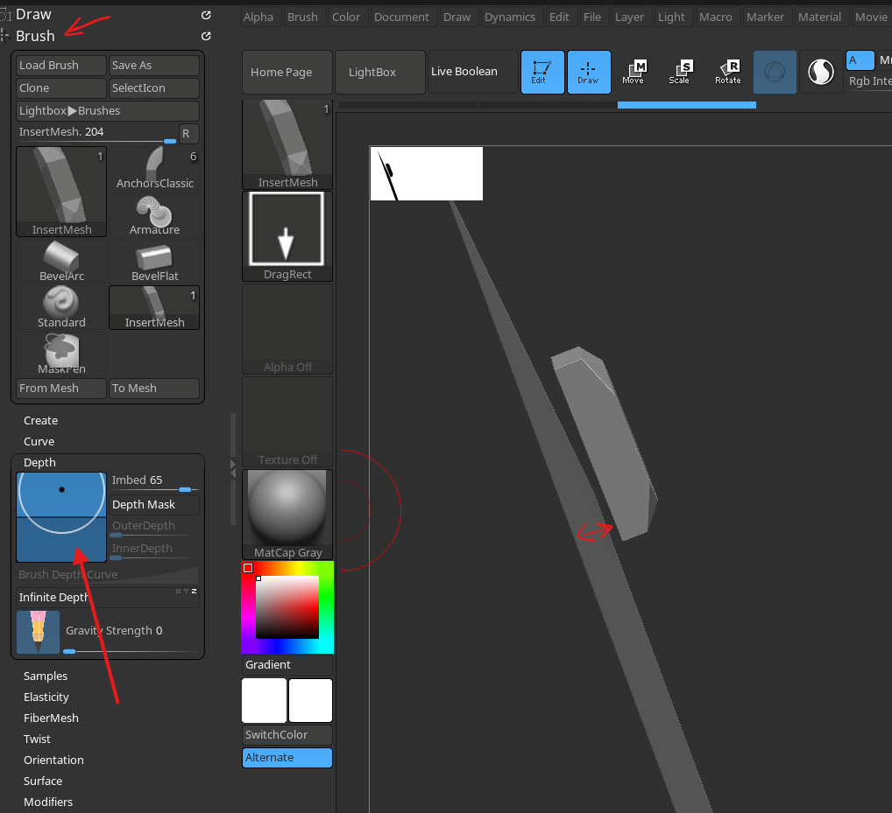
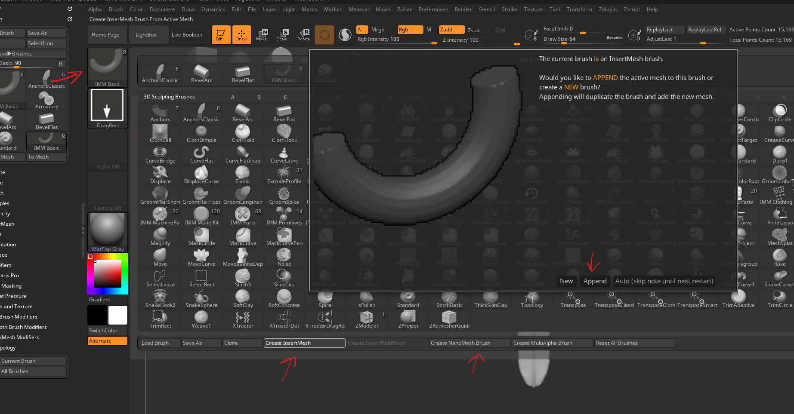

# **Mesh as brush**

# InsertMesh

## create insert mesh brush

- create and align the subtool facing the canvas perpendicularly
  - the subtool should also have clean topology
- switch to "IMM basic brush"
- open brush menu
- 
- bottom "Create InsertMesh" (NOT "Create InsertMultiMesh")
- in the popup select append
- new if new IMM brush is needed

## curve mode 

- stroke -> curve -> curve mode
- 

## depth

- brush -> depth -> imbed
- 

# Nano Mesh

## create a nano brush

- 
- click on create "nano mesh brush"

## usage

- nano brush works on topologized subtool
- once hover on the subtool, click and drag

## create mesh

- tool -> nano mesh -> inventory -> one to mesh
