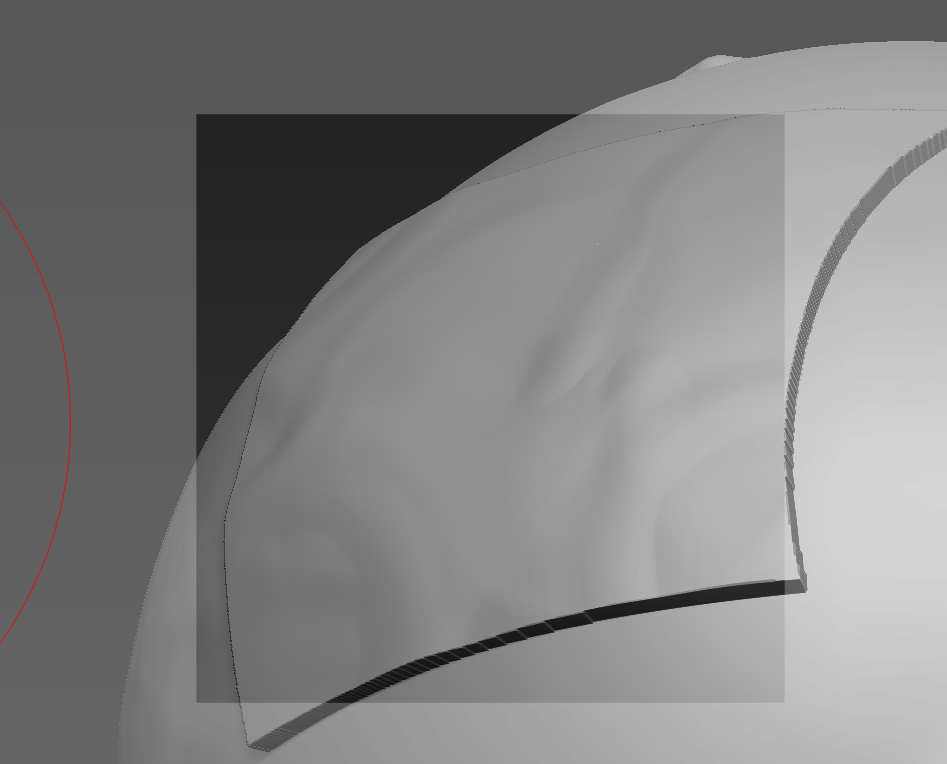
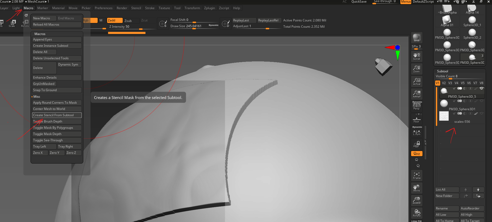

# Stencil

## load

- import the alpha into brush pallete
- stencil -> from alha -> select the alpha image
- to control stencil
  - hover over the stencil and press space

## create stencil from subtool

note that it only captures the outline of the subtool not its

- select the subtool
- align it on the canvas
- macros -> misc -> Create Stencil from subtool
- 
