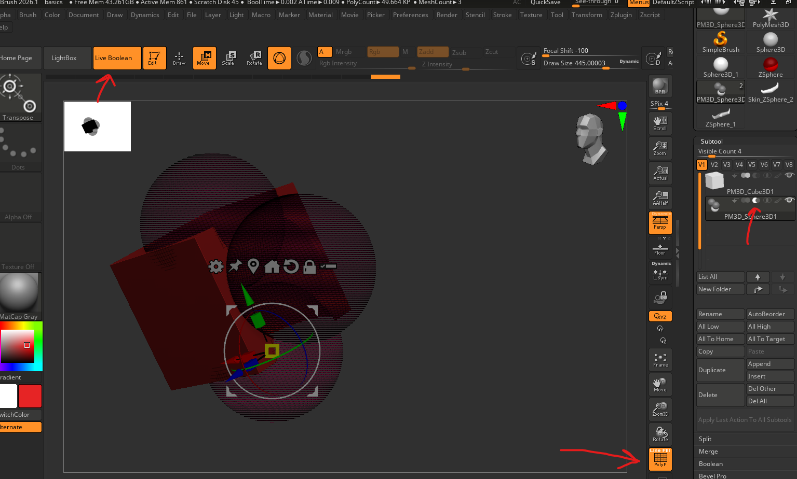

# **Live Boolean**

## enable

- 
- enable "Live Boolean"
- keep the boolean operation on the base mesh same
- on the boolean mesh (cutter mesh)
  - click on the "Intersection" boolean operation to hide the mesh
- enable the polyframe to see the hidden mesh in both base and boolean mesh

**NOTE:**

- Make sure the both mesh are in same folder, otherwise it wont work
- switch from intersection to union to intersection if the mesh was moved from other folder, its a zbrush glitch

## create/apply boolean mesh

- subtool -> boolean -> make boolean mesh
- creates a new subtool group
