# Viewport

## select multiple polygons

- press `alt` and click on multiple polygons
- hold and drag to select more

## proportional edit

- pressing `shift` while doing some actions, kind of does proportional edit
- 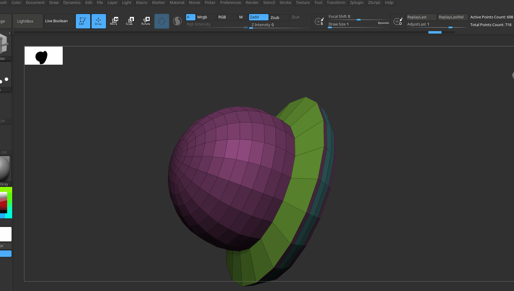

## duplicate

- while dragging a polygroup, pressing `ctrl` seperates it

## assign polygroup color

- while doing the action press `alt`

## repeat last action

- after say inset is set, just click on any other polygon

## delete polygon

- push the polygon inside all the way towards the other side
- 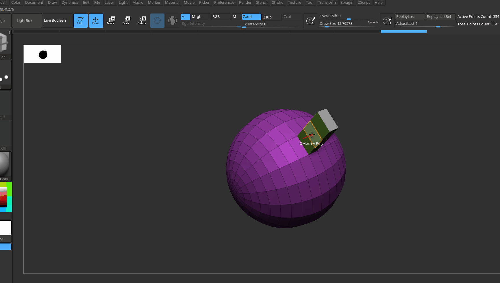

## How to select edges, polygon

- edges - hover over edges
- polygons - hover in the middle of the face (polygon)

# Actions

## insert polyloops

- 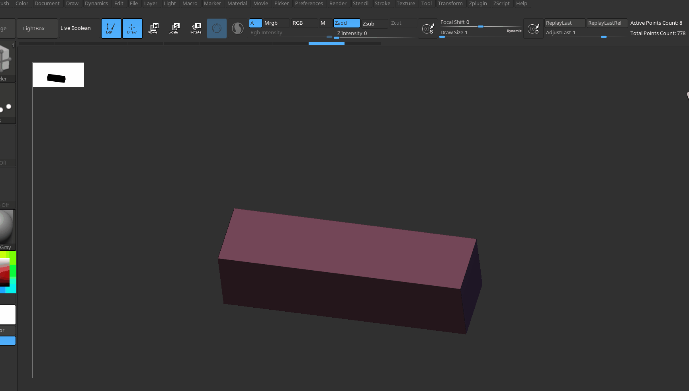

## crease

- creases preserve flatness when the subtool is subdivided
- 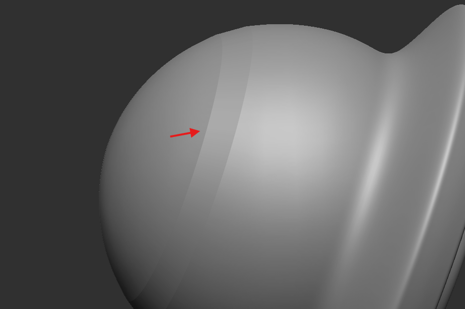

### remove

- alt + click on edges

**Note:** Creases can be added from geometry -> Crease menu

## Qmesh

- the polygons are snapped together
- 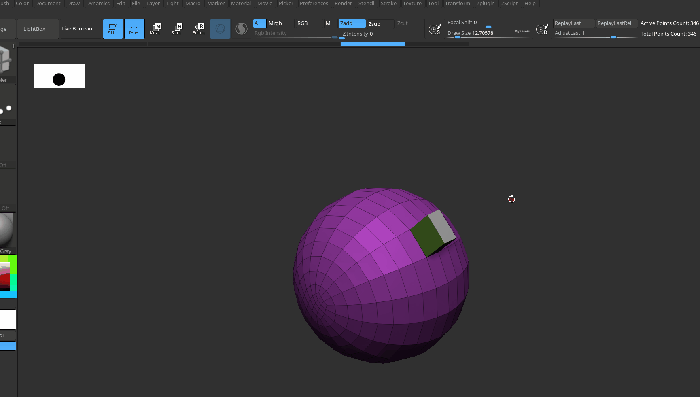
- has all type of mesh targets (poly. quads, etv)
- 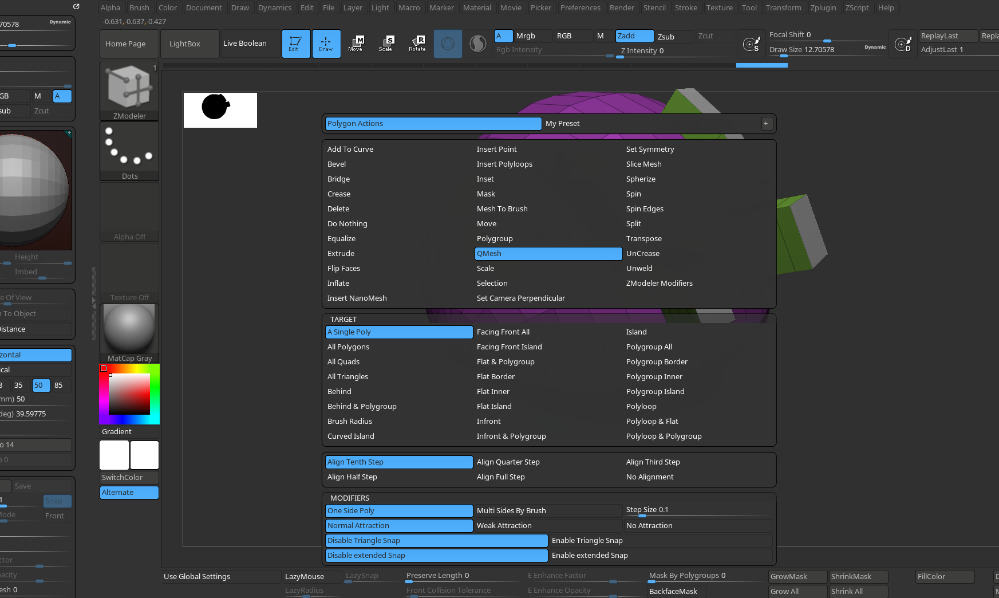

## Extrude

### merge 2 edges at the center of symmetry

- turn off symmetry
- zmodeler -> press space -> extrude
- 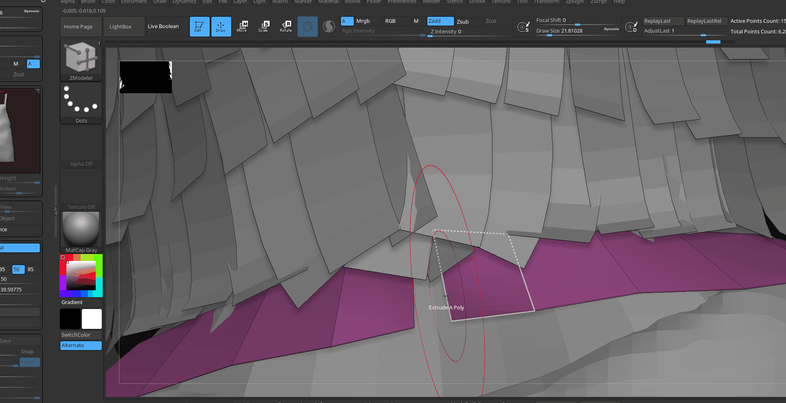
- drag the edge and zbrush will auto jon them

### edgeloop

- hover over edge -> space
- target -> edgeloop (instead of edge/edgeloop)

## Inset

### add polyloops

- select action as `inset`
- select target as `polyloop`
- 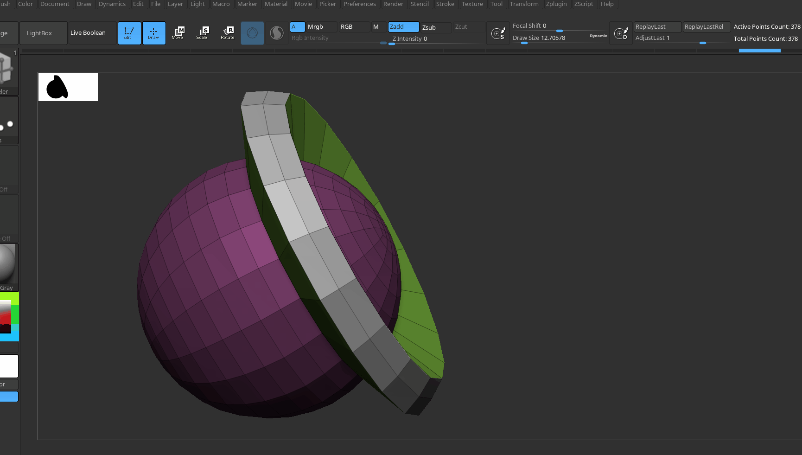

### modifiers

#### Inset Each Poly

- 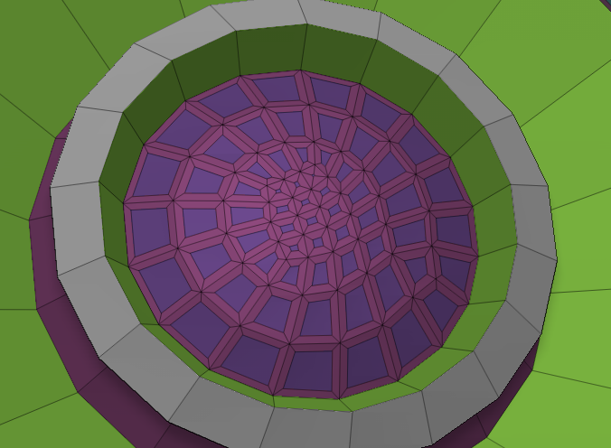

## bridge

### same poly

- click and drag, kind of creates a arc

### seperate poly

- 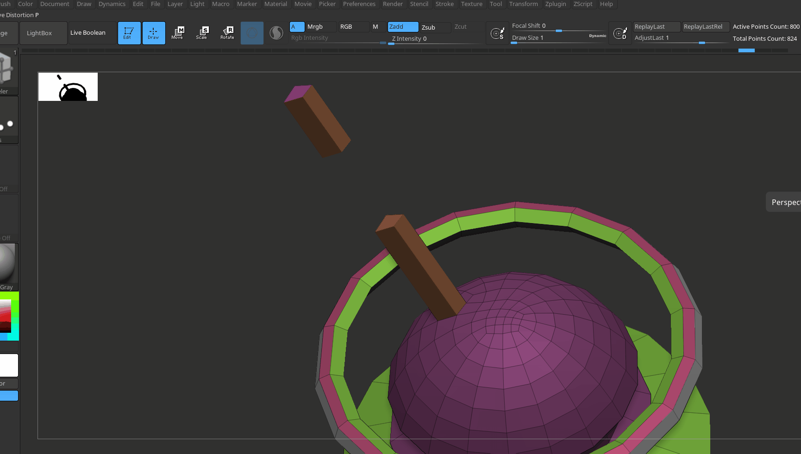

## Bevel

- 
- edge bevel
- Target - edge complete loop

## Point - Split

- to draw a low poly circle
- 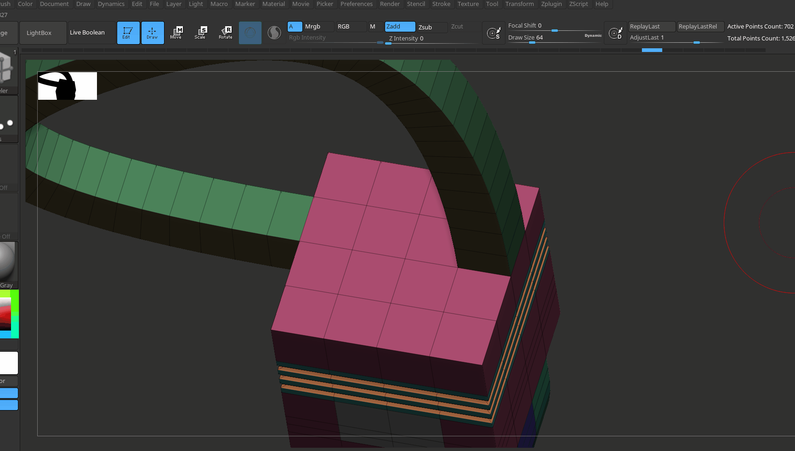

## Point - stich

### join 2 vertices

- 
- make sure there are no faces in between
- hover over point -> select action as stich

# Steps (snapping steps)

- press space
- 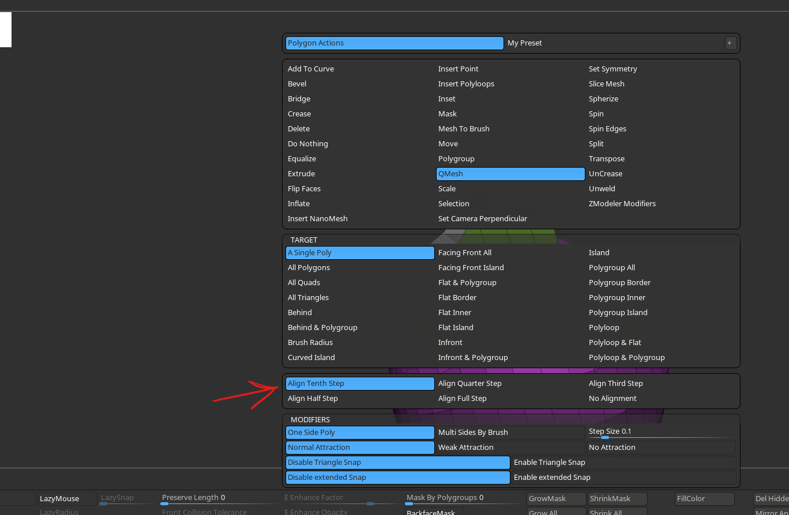

# Target

## Polyloop

- kinda like edge loop from blender
- 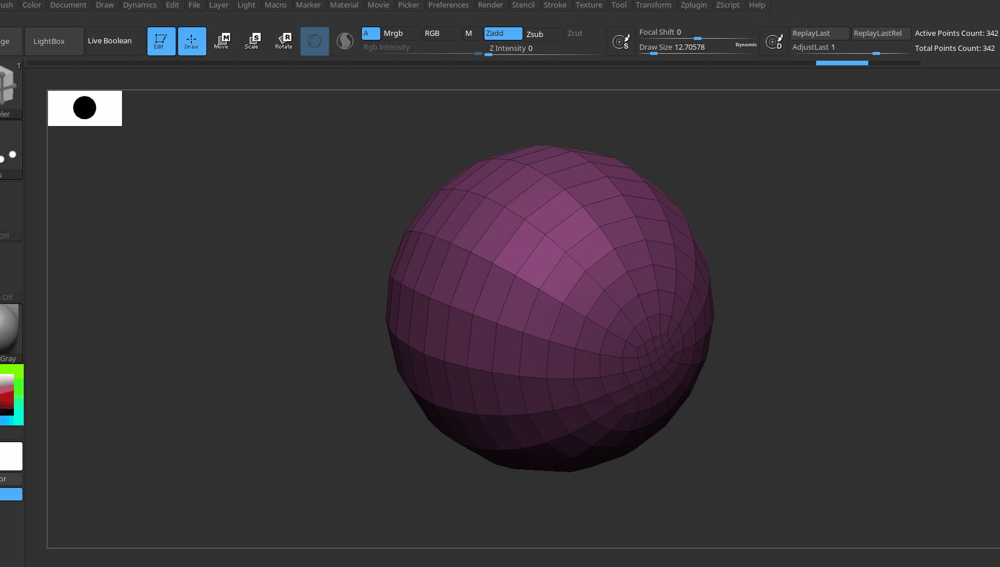

## island

- connected polygons - like linked in blender

## polygroup island

- same color polygroup seperated by other polygroup
