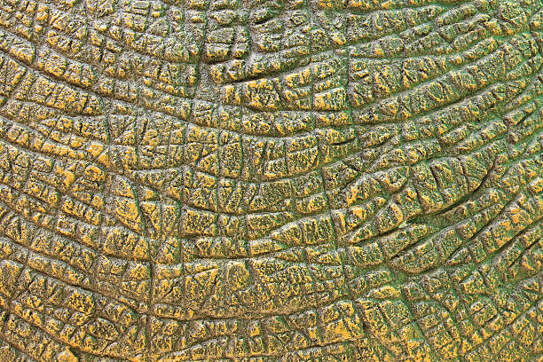

# close cracked skin

- 
- record layer with intensity of 1
- first mark the heavy lines i.e. vertical and horizontal lines with dam standard brush
- pinch them together
- increase the layer intensity to 1.3-1.5
