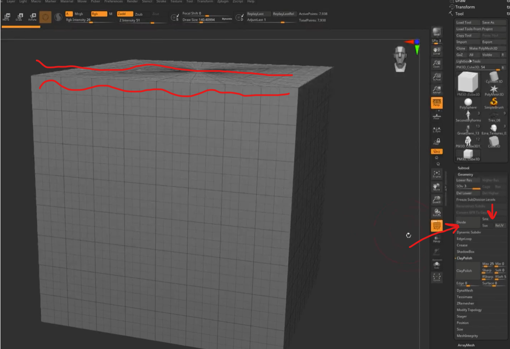
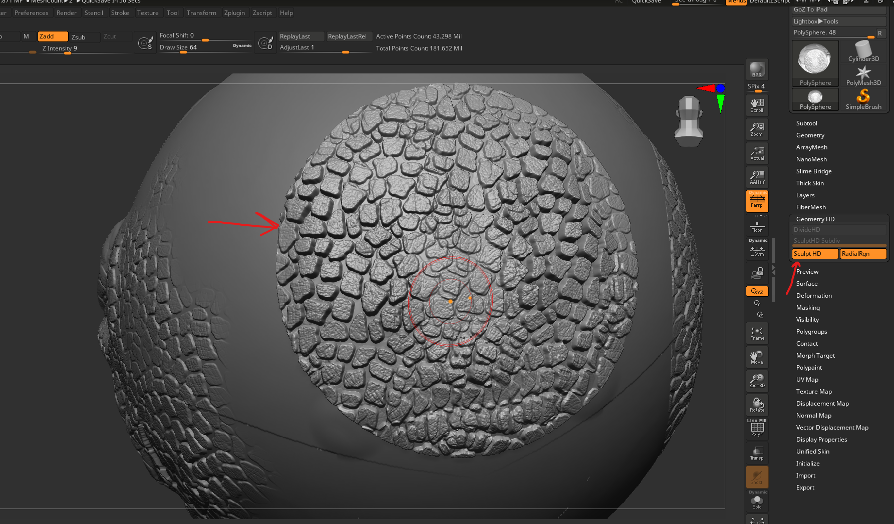
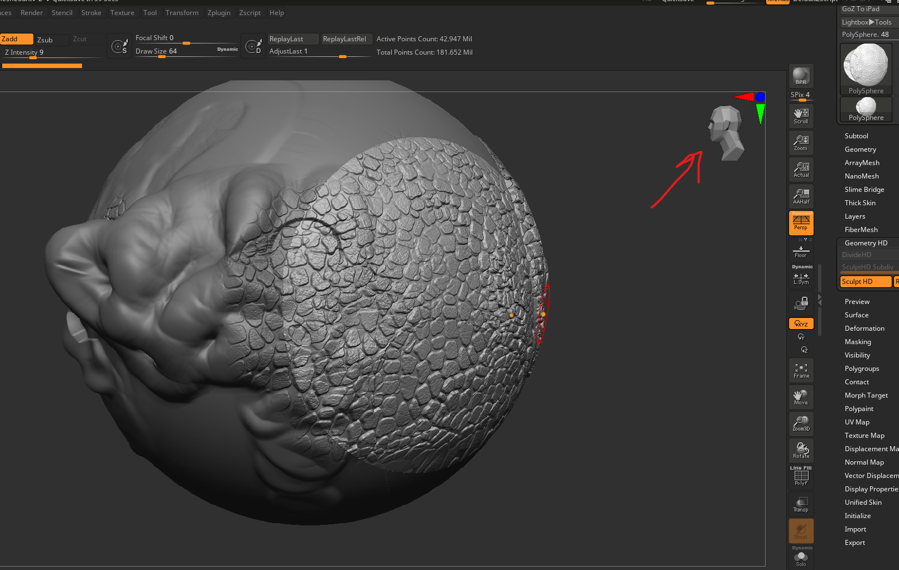
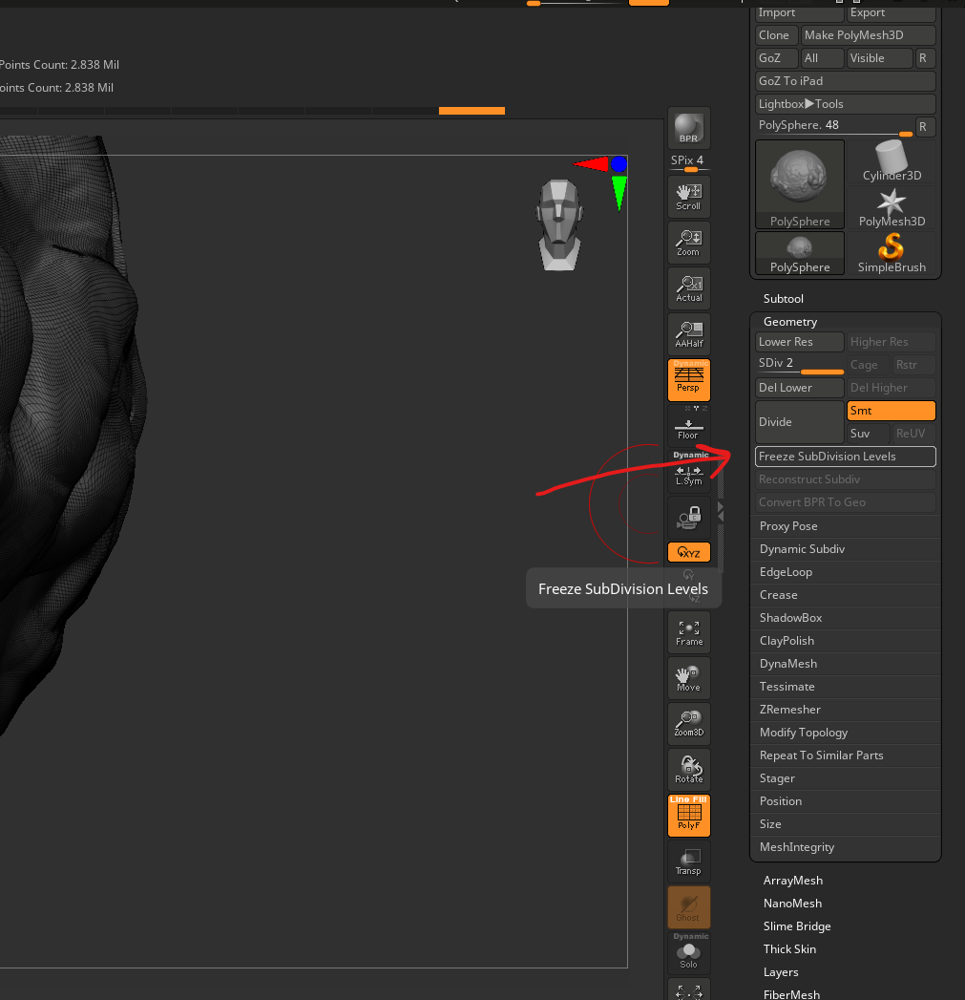
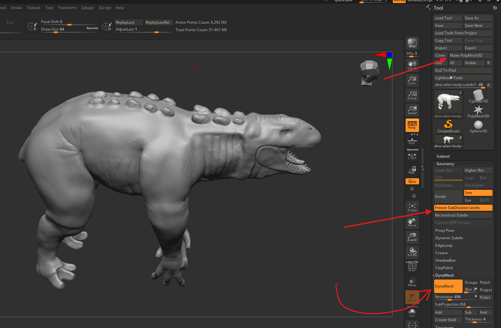

# **Subdivisions**

# Dynamic subdivisions

- just a preview of sub div
- once applied automatically applies the equivalent levels of `normal sub div`

# Sub divisions

- brush effect applied at any level is carried forward and backward
  - i.e select low res where mesh has high levels, apply smoothing
  - go to low res and makes changes to low res
  - increase the level to high, ull see the changes made in low res in high res

## no smooth edges

- 
- geometry -> in sub div pallete -> disable smt

## go beyond 100M polygons (HD Geometry)

- first exhaust max subdivs
- go to tool -> geometry hd
- first do divide HD
- then hover over mesh and press a
- 

### maintain symmetry

- switch the camera to the side
- hover over the area
- 
- press a

### maintain `HD Geometry` while rendering

- render -> render properties -> HDGeometry

## how to use dynmesh or zmesher after applying subdivs

- first uncheck `Freeze sub division levels`
- 
- now we are ready to apply dynamesh and apply it (watch tutorial - https://zclassroom.com/zclassroom/lesson/subdividing - 02:48)
- check `freeze sub division levels`
  - now the zbrush should recalculate or merge the details

### unfreeze

- make sure the polycount of dynamesh is not more than 3 Millions
- then click on `Freeze sub division levels`

#### discard unfreeze

- 
- use tool -> PolyMesh3D

#### unfreeze crashes with dynamesh

- lower the dynamesh resolution

## dynamesh

used for blockout, same as remesh in blender

- enable from tool -> geometry -> dynamesh -> dynamesh
- later hold ctrl and drag and release mouse

### maintain polygroups without merging

- enable tool -> geometry -> dynamesh -> groups
