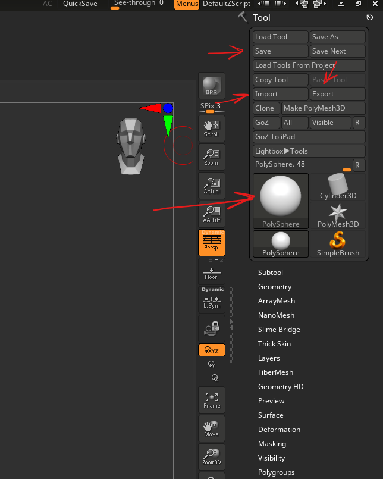
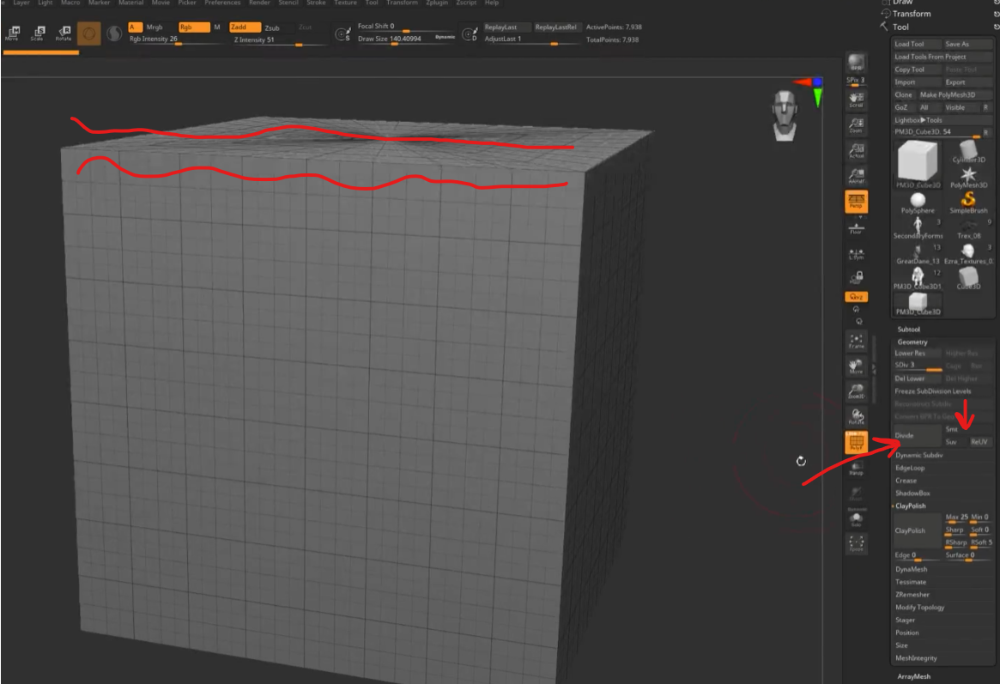
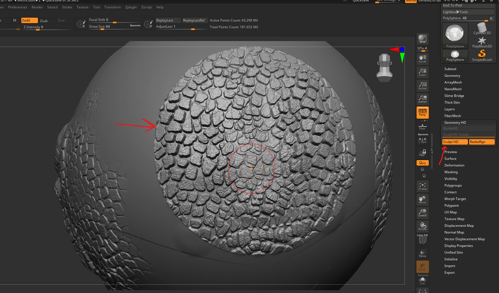
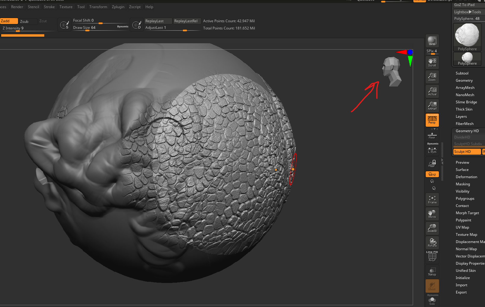
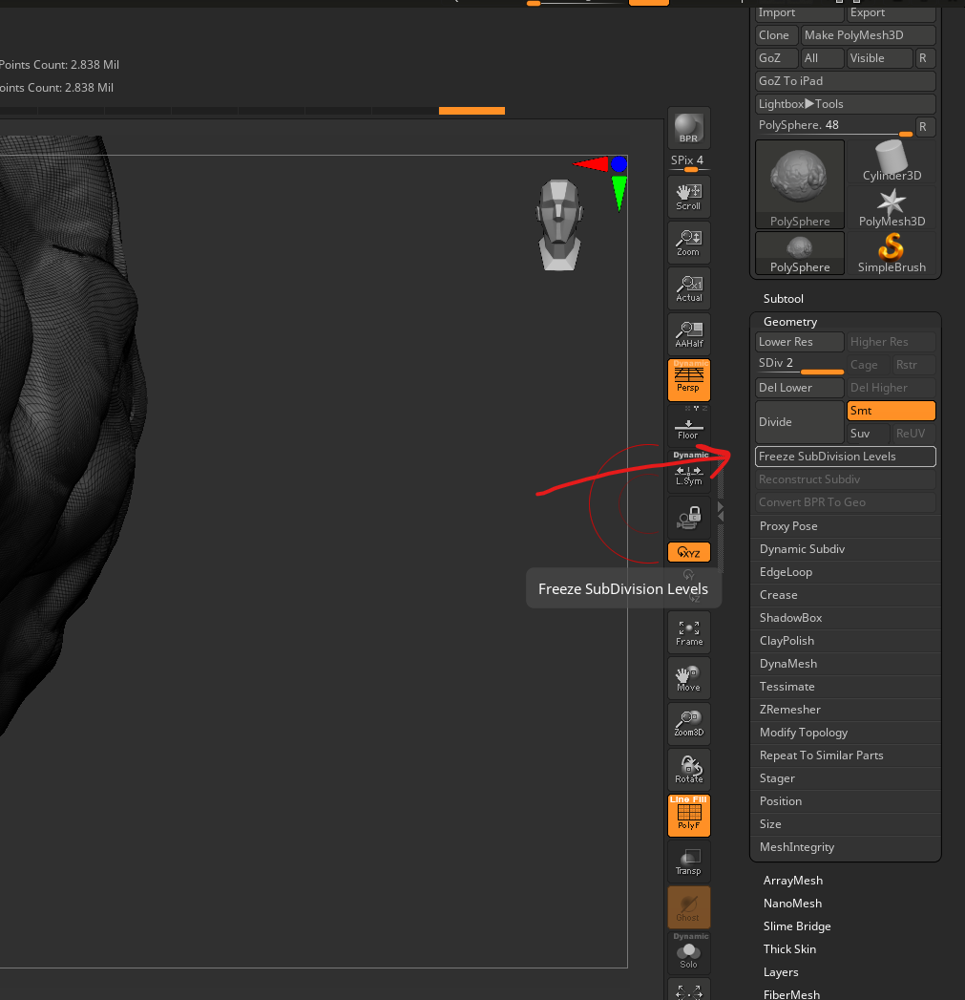
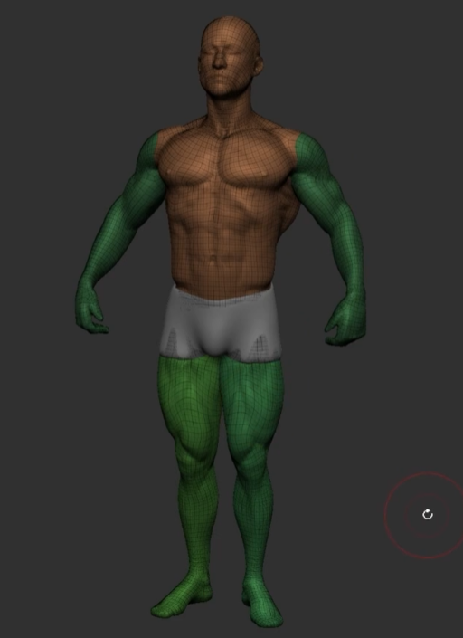
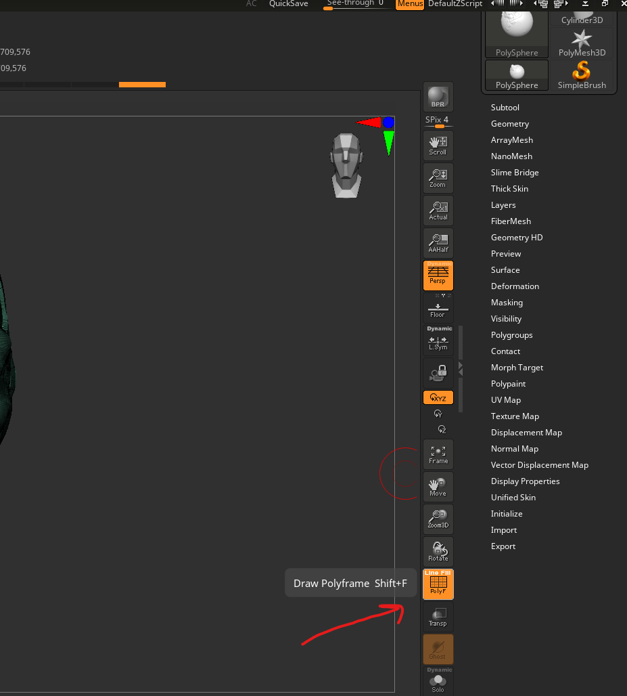
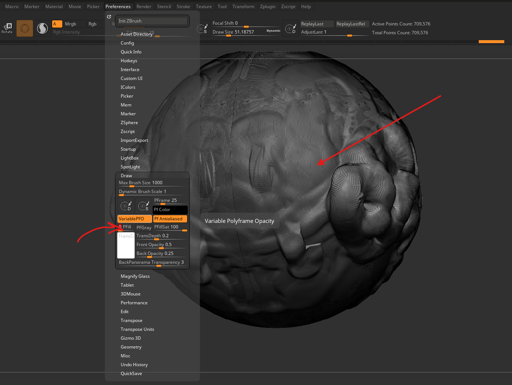
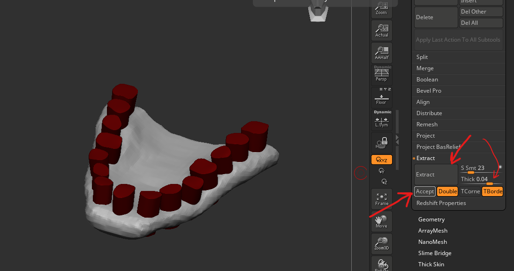

# **Tool**

# sub div

- brush effect applied at any level is carried forward and backward
  - i.e select low res where mesh has high levels, apply smoothing
  - go to low res and makes changes to low res
  - increase the level to high, ull see the changes made in low res in high res

### no smooth edges

- 

### enable 100M polygons

- first exhaust max subdivs
- go to tool -> geometry hd
- first do divide HD
- then hover over mesh and press a
- 

#### maintain symmetry

- switch the camera to the side
- hover over the area
- 
- press a

#### maintain hd geometry while rendering

- render -> render properties -> HDGeometry

### how to use dynmesh or zmesher

- first uncheck `freeze sub division levels`
- 
- now we are ready to apply dynamesh and apply it (watch tutorial - https://zclassroom.com/zclassroom/lesson/subdividing - 02:48)
- check `freeze sub division levels`
  - now the zbrush should recalculate or merge the details

### dynamesh

used for blockout, same as remesh in blender

- enable from tool -> geometry -> dynamesh -> dynamesh
- later hold ctrl and drag and release mouse

#### maintain polygroups without merging

- enable tool -> geometry -> dynamesh -> groups

# masking

- ctrl + drag

## menu (like blender shift + a)

- menu for the masks is under tool -> masking -> menu

## avoid pass through effect of masking

- while painting a mask, the mask will be applied even at the back
- to avoid it first apply [selection](./zbrush.md#selection), paint a mask and then proceed

# selection

- ctrl + shift and drag mouse
- to undo selection -> ctrl + shift click outside

# polygroups

- 

## enable

- 

## menu

- tool -> polygroup

### reset or paint single polygroup

- tool -> polygroup -> group visible

## paint polygroup

- first paint mask
- ctrl + w
- to isolate - ctrl shift click on polygroup, same for invert

### see only wireframe

- 
- prefereneces -> draw -> poly fill -> lower the slider

# seperate or extract

- apply mask
- tool -> subtool -> extract
- to prewiew "Extract"
- 
- press accept
