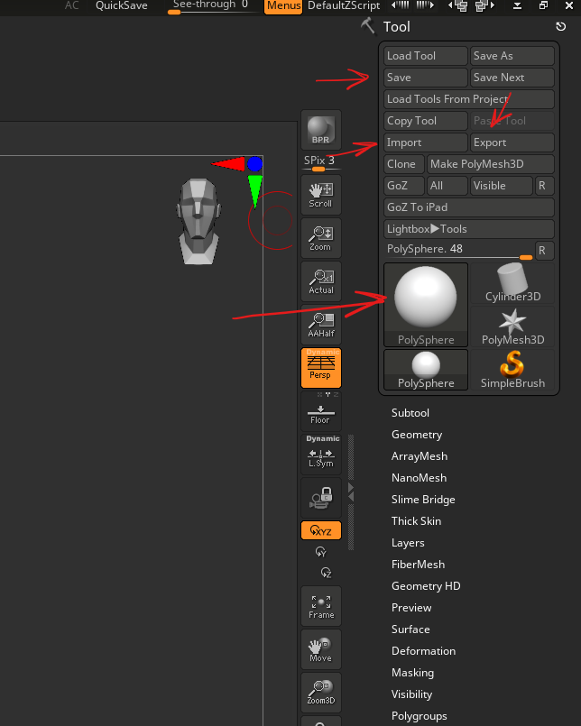
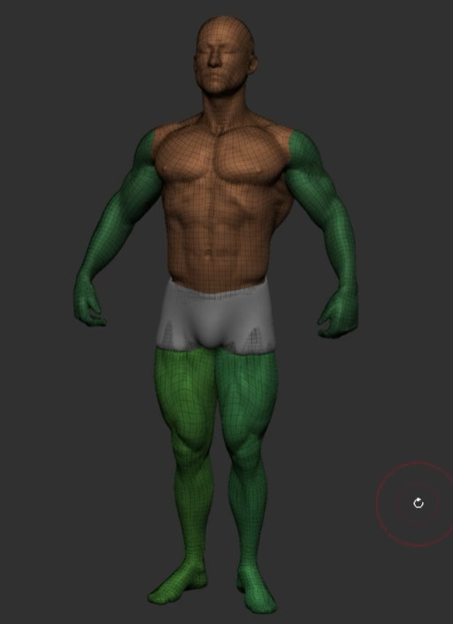
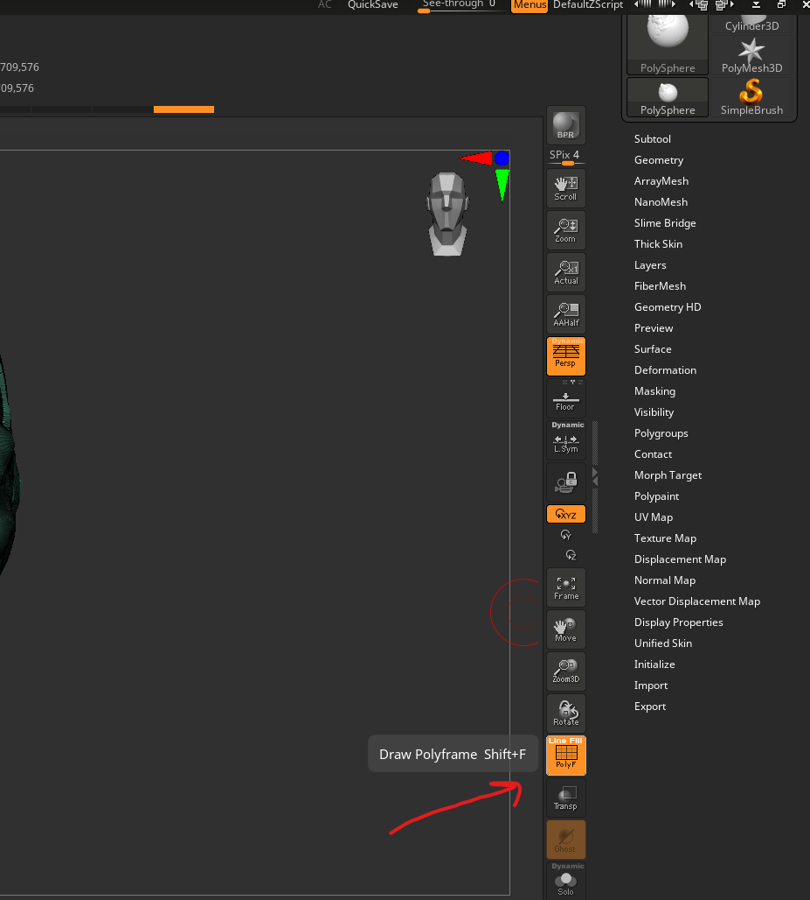
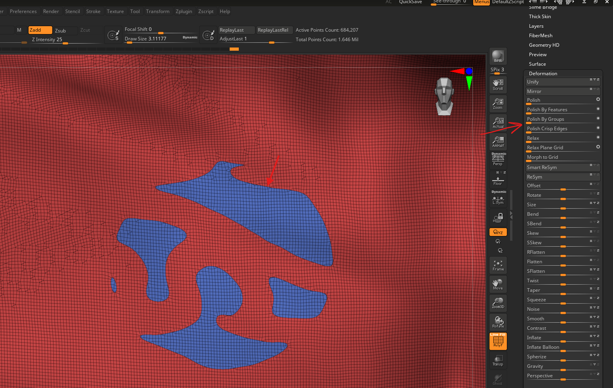
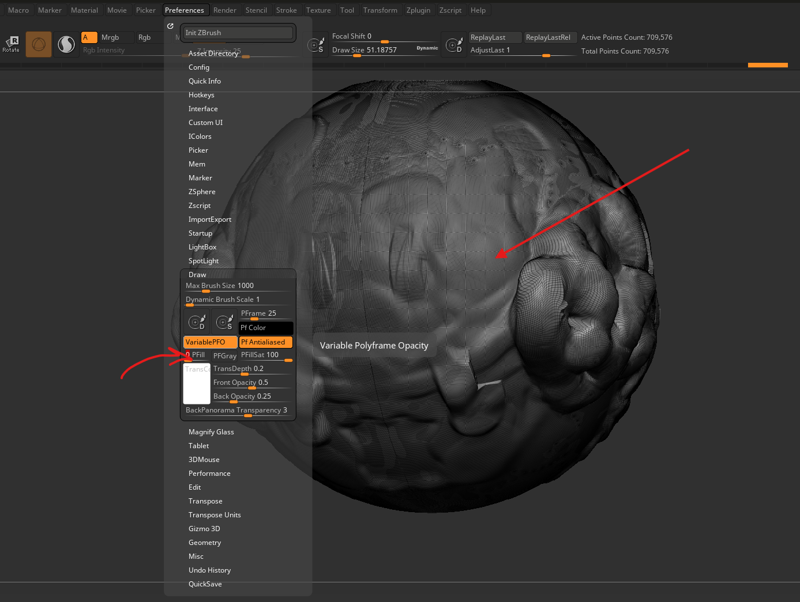
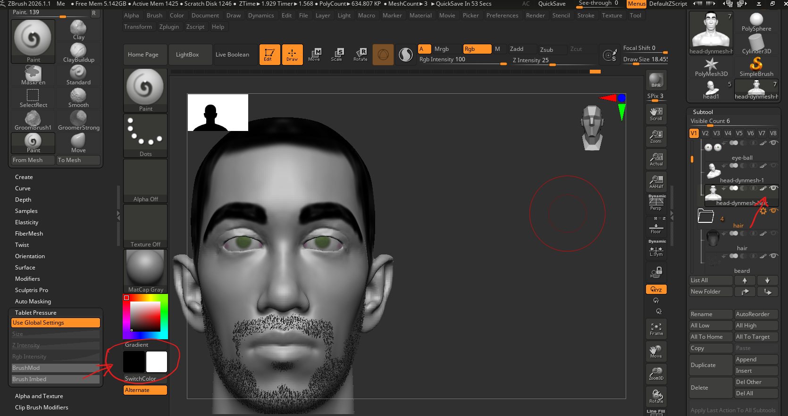
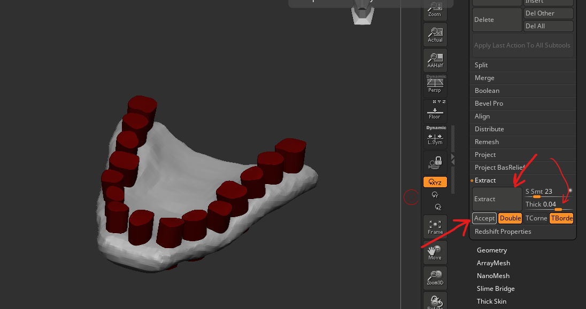
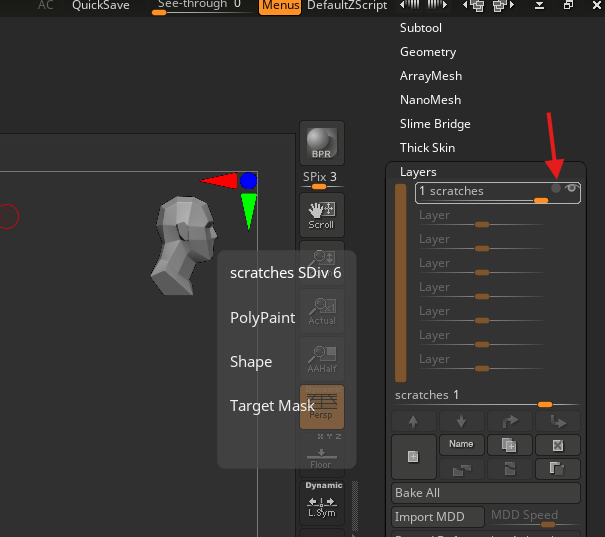

# **Tool**

# subtools

## switch

- N

# masking

- ctrl + drag

## menu (like blender shift + a)

- menu for the masks is under tool -> masking -> menu

## avoid pass through effect of masking

- while painting a mask, the mask will be applied even at the back
- to avoid it first apply [selection](./zbrush.md#selection), paint a mask and then proceed

## mask polygroup

- switch to gizmo mode
- ctrl + shift click on any polygroup

# selection

- ctrl + shift and drag mouse
- to undo selection -> ctrl + shift click outside

# polygroups

- 

## enable

- 

## menu

- tool -> polygroup

## hide polygroups

- click on any polygroup - this make clicked polygroup only visible
- click on it again - this will hide it and will make rest all visible
- click on the polygroups which needs to be hidden
- now keep only the ones are needed

## group 2 polygroups

- refer - [hide polygroups](./tool.md#hide-polygroups)
- tool -> polygroups -> group visible

### reset or paint single polygroup

- tool -> polygroup -> group visible

## paint polygroup

- first paint mask
- ctrl + w
  - this creates a polygroup from painted mask area
- to isolate - ctrl shift click on polygroup, same for invert

### smoothen polygroup

- 
- use tool -> deformation -> polish by groups

#### use smooth groups

- lightbox -> brushes -> smooth -> smooth groups

### see only wireframe

- 
- prefereneces -> draw -> poly fill -> lower the slider

# Polypaint

## hide / show

- 
- set the gradient, so that we can switch
- now in the tool right side panel in sub tool section, enable the paint and paint
- then press on the paint button, the mesh if turned black then press 'v' to switch

# merge

- subtool -> merge
- select the top most subtool
- merge down

## merge visible

- to merge all and create a new group

# seperate or extract

- apply mask
- tool -> subtool -> extract
- to prewiew "Extract"
- 
- press accept

# delete

- shift + ctrl and select the area that is to be kept
- Go to Tool > Geometry > Modify Topology > Delete Hidden

# layers

## start

- tools -> layers -> new
- pause recording, adjust the intensity
- press record to resume
- 

## Bake

- stop recording of all layers then only apply "Bake All"
