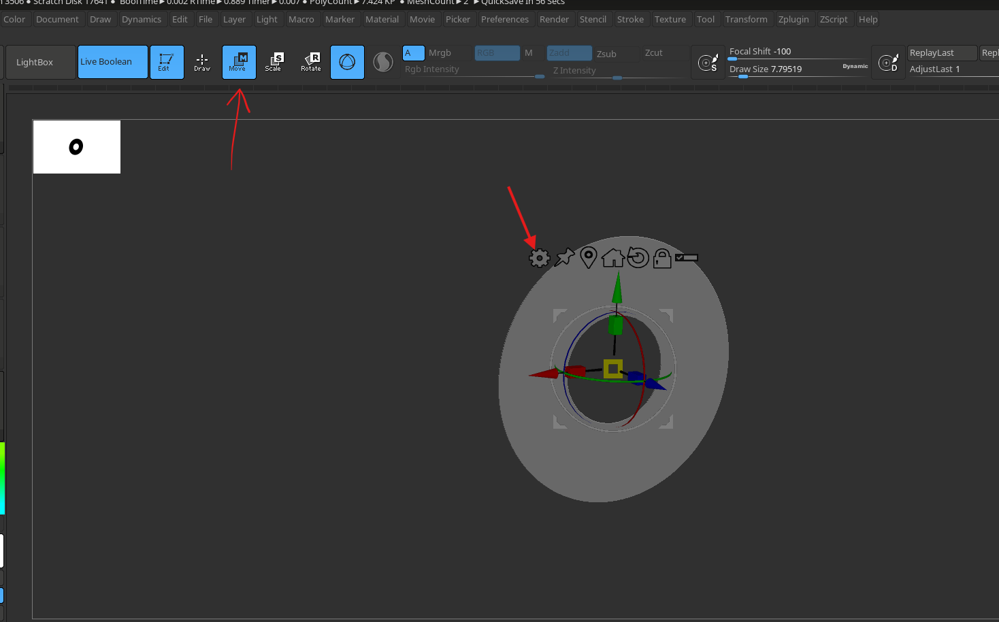
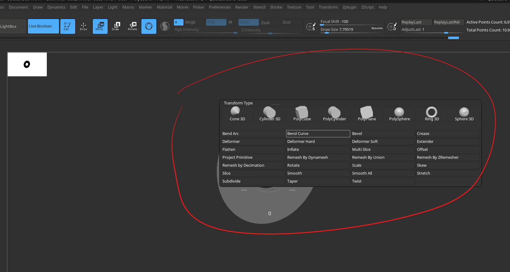
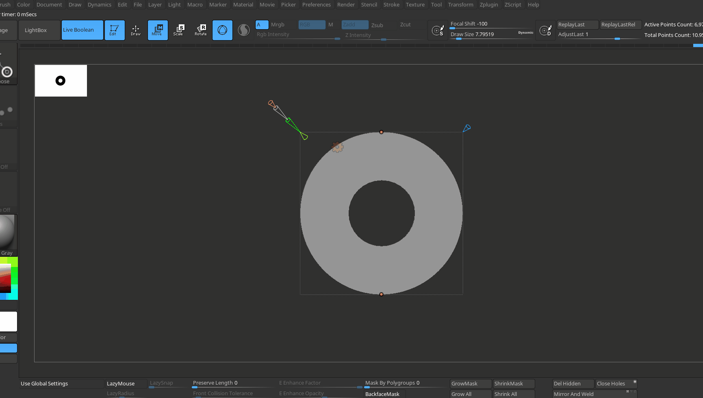
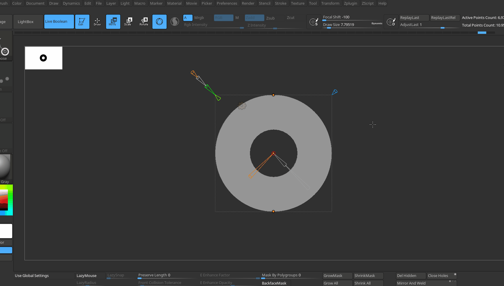

# Transform Type

- 
- switch to gizmo -> click on gear
- 

# bend curve

- resolution and axis (x, y, z - `1 at a time`)
- 
- adjust resolution
- set axis - we can modify 1 axis only at a time
- 
- control the smoothness

## apply

- open gear menu and "Accept"
