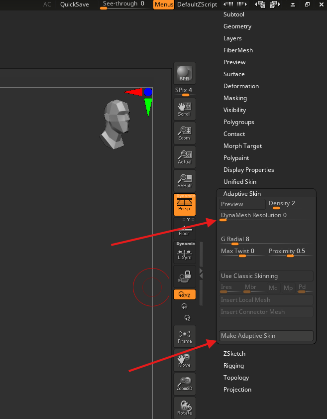
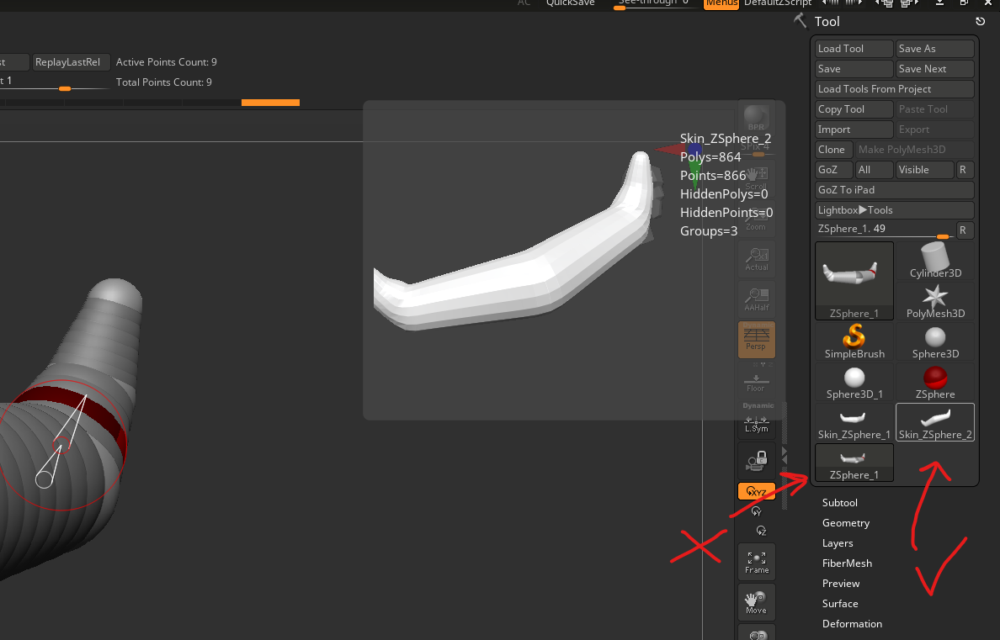

# **ZSphere**

## add

- draw mode - Q
- click on any zsphere

## remove

- draw mode - Q
- press alt and click on any zsphere

## move

- press w and click and drag any sphere
- click to get the armature bones as well

## select center

- draw mode - Q
- enable symmetry - x
- move the move to the center so that red cursor turns green and click
- 

## preview mesh

- press a

## make mesh

- 

### use right one

- 
