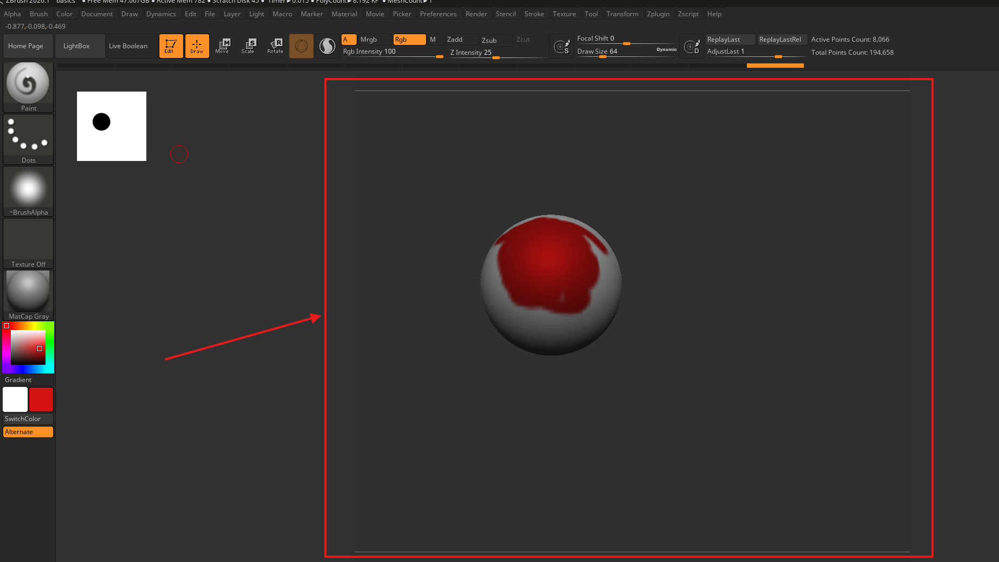
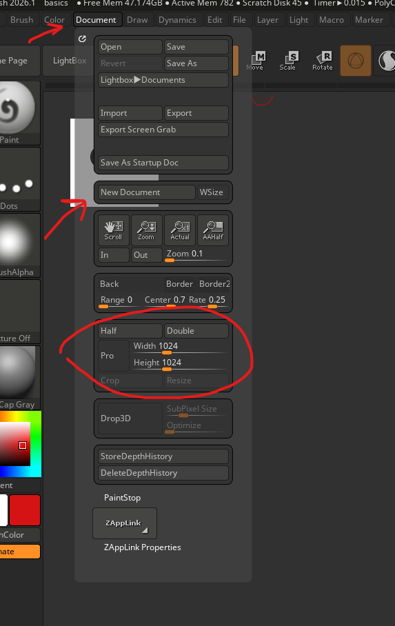
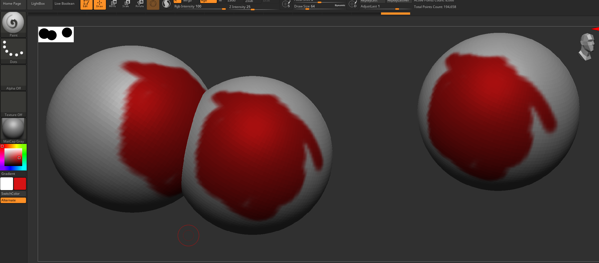
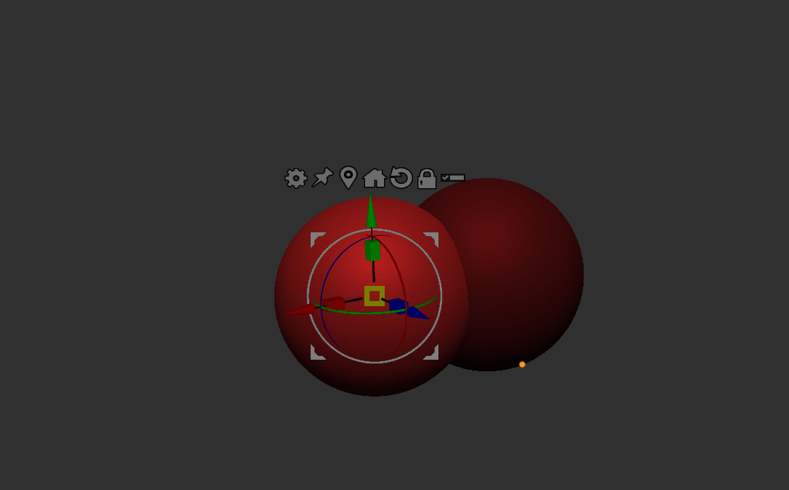
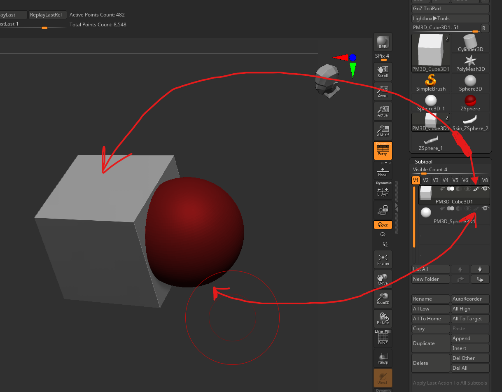
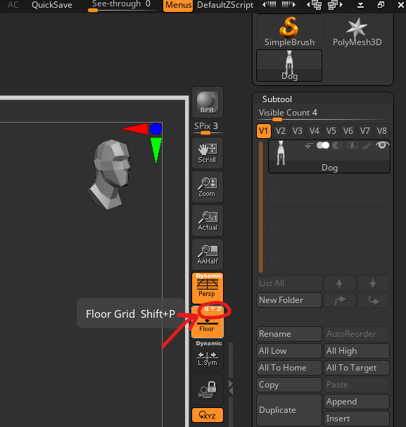
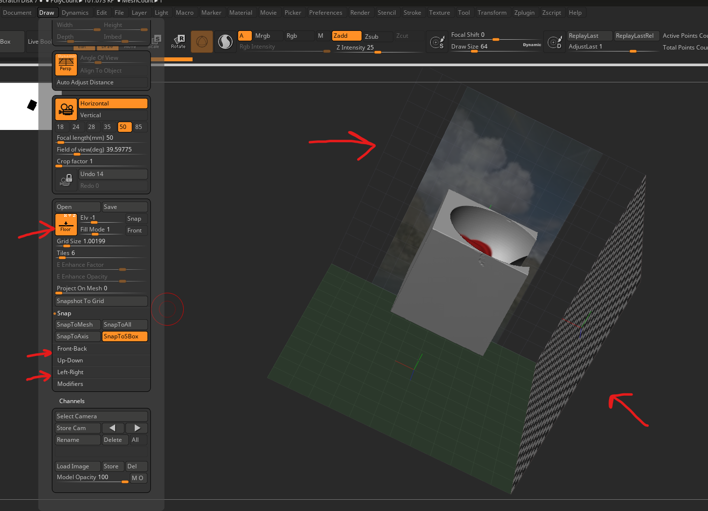
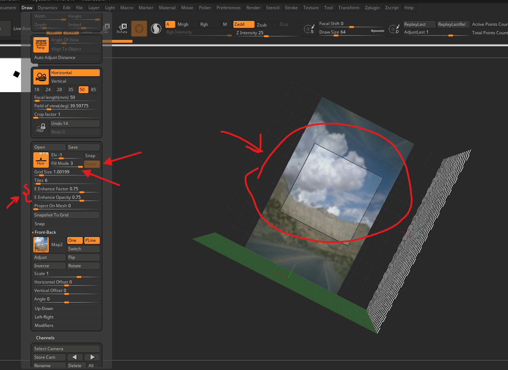
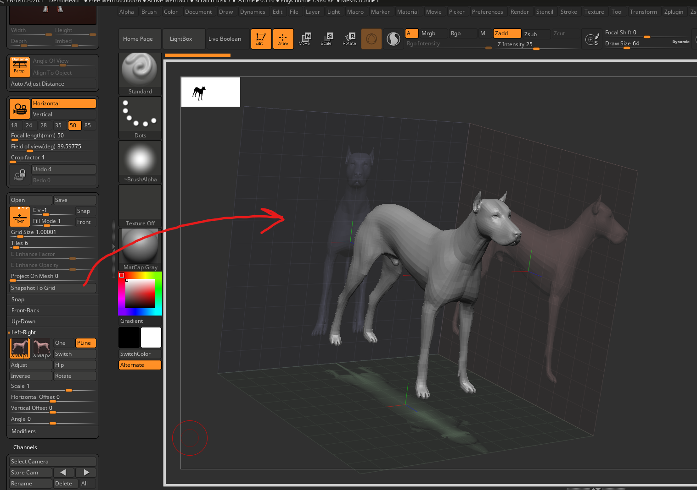

# **Zbrush**

# shortcuts

- o -> adjust brush focal length
- s -> brush size
- u -> intensity

# document

- 

## size

- 

## screenshots

- 
- shift + s

### clear or document -> new document

- ctrl + n
- click and drag the mouse
  - to insert mesh
- make sure edit mode is on

# Interface

## save config

say we have menus set as tray in zbrush and want to retain it everytime zbrush is opened

- preferences -> config -> save configs
- 

## zoom

press alt and click and let go alt

## change brush settings

like strength or size, also works with smooth brush

- press space

## symmetry

- 

### transfer symmetry

- tool -> geometry -> modify topology -> mirror and wield

### flip symmetry

- tool -> deformation -> mirror

### local symmetry

its for the tool level symettry, otherwise its global

- 
    - example of without local symmtry

## gizmo

- 

### snap or move

- 
- press and hold alt and click
- or unlock gizmo and move
- and press the lock again

### snap gizmo at center

- press alt and click on home
- without alt it will snap the mesh as well

### reset gizmo

- press alt and click on round arrow
- without alt it will reset the mesh as well

### move all subtools

- first select any mesh
- click on list button
- ctrl shift click on the other mesh to move

### snap the gizmo to the world

- pin button

### duplicate

- 
- press ctrl and drag along any axis

## mesh paint

- 

# floor

## switch x y or z axis

- 

## reference images

- 
- under draw menu enable the floor
- add the front Back and left right reference images
- adjust as required (crop)
- you can also use snap -> snap to mesh
  - to adjust the size of the reference images to mesh

### see same image even from behind

- draw -> front back -> one

### see image at the front and fill mode

- 
- enhanced fill mode is enabled once the fill mode is set to 3
- it also enables the front projection of images

### snapshot images to grid

- 
- select all or any of [floor axis](./zbrush.md#switch-x-y-or-z-axis)
- draw -> "Snapshot to grid"
- produces images for the floor

# help

- hover over any tool and press ctrl

## link

- [Cineversity](https://cineversity.maxon.net/en/learn?filter=Tutorials)
- [#AskZBrush](https://pixologic.com/zbrushlive/category/askzbrush/)
- [zbrush.info](https://zbrush.info)
- [zbrush.live]
