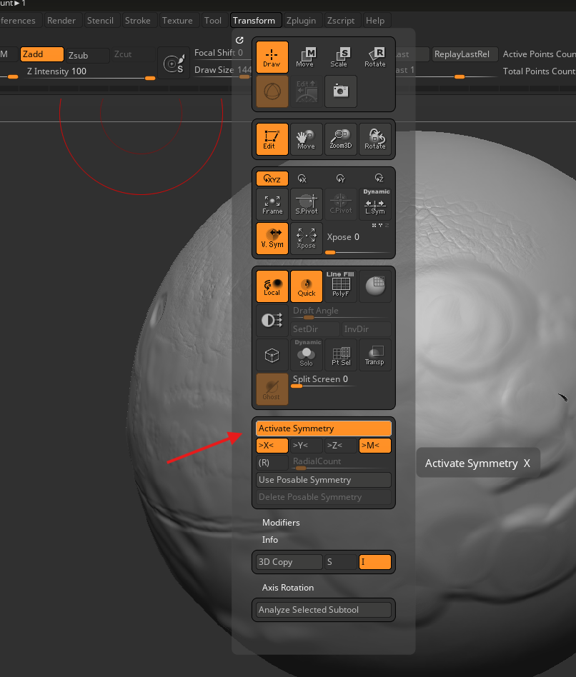
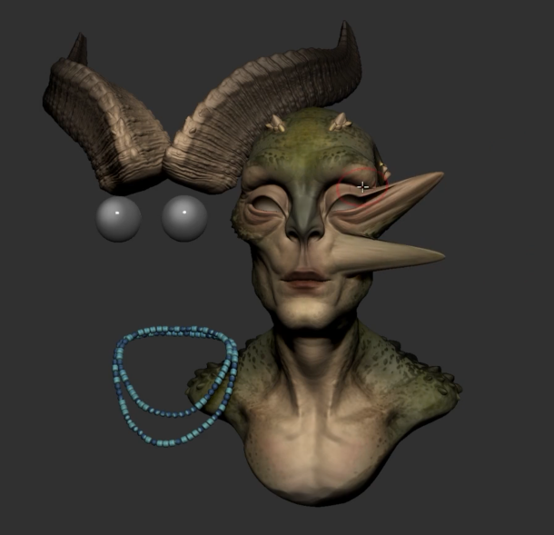

# **Zbrush**

# shortcuts

- o -> adjust brush focal length
- s -> brush size
- u -> intensity

# Interface

## zoom

press alt and click and let go alt

## change brush settings

like strength or size, also works with smooth brush

- press space

## symmetry

- 

### transfer symmetry

- tool -> geometry -> modify topology -> mirror and wield

### flip symmetry

- tool -> deformation -> mirror

### local symmetry

its for the tool level symettry, otherwise its global

- 
    - example of without local symmtry
