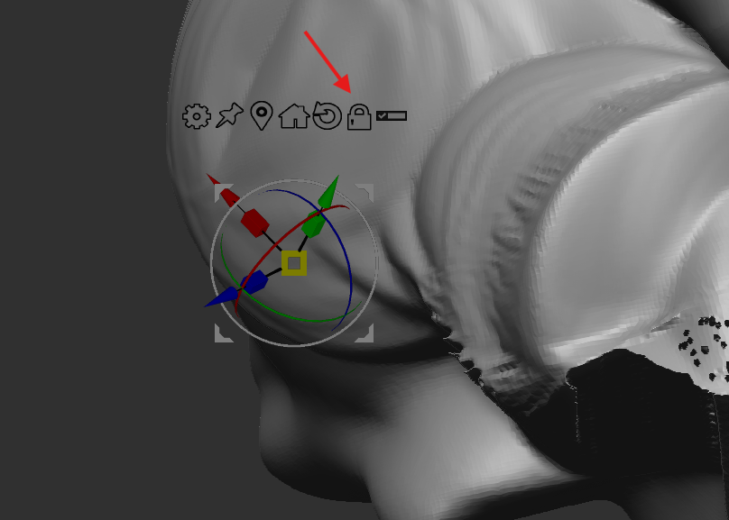
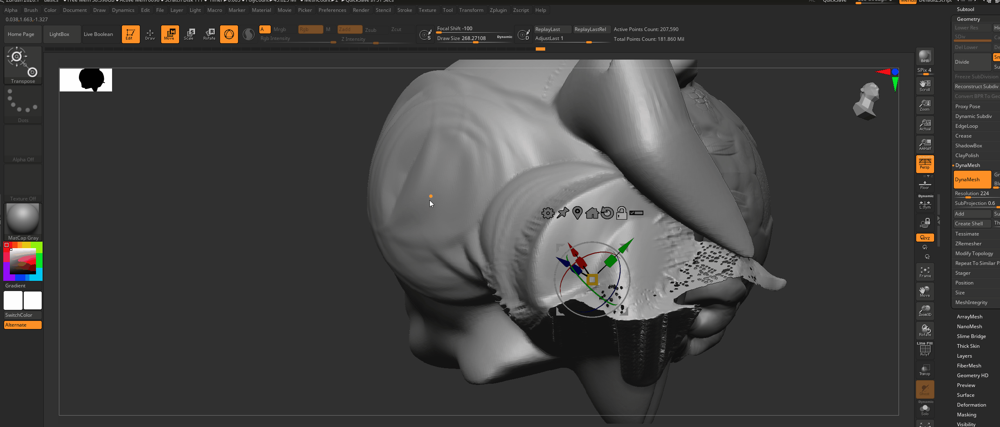

# **Zbrush**

# shortcuts

- o -> adjust brush focal length
- s -> brush size
- u -> intensity

# Interface

## zoom

press alt and click and let go alt

## change brush settings

like strength or size, also works with smooth brush

- press space

## symmetry

- 

### transfer symmetry

- tool -> geometry -> modify topology -> mirror and wield

### flip symmetry

- tool -> deformation -> mirror

### local symmetry

its for the tool level symettry, otherwise its global

- 
    - example of without local symmtry

## gizmo

- 

### snap or move

- 
- press and hold alt and click
- or unlock gizmo and move
- and press the lock again

### snap gizmo at center

- press alt and click on home
- without alt it will snap the mesh as well

### reset gizmo

- press alt and click on round arrow
- without alt it will reset the mesh as well

### move all subtools

- first select any mesh
- click on list button
- ctrl shift click on the other mesh to move

### snap the gizmo to the world

- pin button

# help

- hover over any tool and press ctrl

## link

- [Cineversity](https://cineversity.maxon.net/en/learn?filter=Tutorials)
- [#AskZBrush](https://pixologic.com/zbrushlive/category/askzbrush/)
- [zbrush.info](https://zbrush.info)
- [zbrush.live]